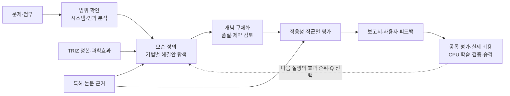

# TRIZ Studio

**기술 문제를 정리하고, 해결안을 만들고, 근거와 제약을 함께 검토합니다.**

[서비스 열기](https://trizstudio.online) · [문서 모아보기](docs/README.md) · [프런트엔드 저장소](https://github.com/equipment0226/triz_front)

문제를 입력하면 대상 시스템과 모순을 확인하고, TRIZ 기법으로 해결안을 탐색합니다. 사용자는 필요한 지점에서 범위와 보류안을 확인하며, 결과를 보고서로 읽고 다음 분석에 쓸 피드백을 남길 수 있습니다.

이 저장소는 **백엔드·TRIZ 지식·프롬프트·검증·AX/Q-learning·보고서**를 담습니다. 웹 화면과 로그인 프록시는 별도 프런트엔드 저장소에서 관리합니다.

## 한눈에 보는 흐름



학습은 저장된 평가와 실제 실행 기록을 사용합니다. 충분한 자료와 활성 정책이 없으면 명시된 규칙으로 동작합니다. 학습 코드의 존재가 비용 절감이나 품질 향상을 입증하지는 않습니다.

## 필요한 문서부터 읽어보세요

| 목적 | 안내 |
|---|---|
| 제품의 목표와 지원 범위 | [기획안](docs/PRODUCT.md) |
| API·MCP·노드·DB 연결 이해 | [전체 설계](docs/ARCHITECTURE.md) |
| Stage별 입력·출력·중간 검증 확인 | [13개 Stage 흐름도](docs/STAGES.md) |
| 실제 분석의 Stage·하위 처리 데이터 확인 | [실행 사례와 샘플 데이터](docs/sample-data/README.md) |
| 코드 위치와 모듈별 책임 확인 | [모듈 세부 설계](docs/MODULES.md) |
| 보상·quality·가중치·학습 적용 확인 | [피드백과 학습](docs/LEARNING.md) |
| 빠른·표준·심층 비교 | [모드별 흐름도](docs/MODES.md) |
| 화면·보고서·피드백 사용 | [사용 안내](docs/USAGE.md) |
| 개발 환경·설정·배포·중단 복구 | [운영 안내](docs/OPERATIONS.md) |
| 검증 범위와 최근 변경 | [검증 기록](docs/VALIDATION.md) · [변경 기록](docs/CHANGELOG.md) |

## 분석 모드

현재 신규 AX 실행의 기본 계약은 다음과 같습니다. 과거 실행은 저장된 모드 계약을 유지할 수 있습니다.

| 화면 | API 값 | 탐색 방식 |
|---|---|---|
| 빠른 탐색 | `LITE` | A/B/E/H 중 Q 정책 또는 규칙으로 선택 |
| 표준 분석 | `FULL` | A/B/C/E/F/G/H 중 Q 정책 또는 규칙으로 선택 |
| 심층 분석 | `DEEP` | ARIZ를 포함한 등록 기법 전체를 수행하도록 계획 |

허용된 기법과 매번 실행하는 기법은 다릅니다. 입력 부족·적용 불가·예산 중단도 따로 기록합니다. 모든 모드에 품질·제약·근거·평가 절차가 있으며, 미완료 검토를 통과한 것으로 바꾸지 않습니다.

## 로컬에서 시작하기

Python 3.11을 준비하고 **백엔드 저장소 루트**에서 실행합니다. 다음은 Windows PowerShell 예시입니다.

```powershell
py -3.11 -m venv .venv
.venv/Scripts/python.exe -m pip install -r pilot/requirements.txt
Copy-Item pilot/.env.example pilot/.env
.venv/Scripts/python.exe pilot/run.py
```

처음 한 번만 예제 환경 파일을 복사하고, `pilot/.env`의 모델 API와 로컬 저장 경로를 설정하세요. 서버는 기본 `http://127.0.0.1:8000`에서 실행됩니다. `/docs`에서 API를 볼 수 있고 `/healthz`는 DB 연결을 확인합니다. 분석 시작과 LLM 연결 점검은 모델 호출을 발생시킬 수 있습니다. 웹 UI 실행과 운영 구성은 [운영 안내](docs/OPERATIONS.md)를 따릅니다.

## 저장소 구성

```text
pilot/
  api/          웹 API·인증·조회·재개
  triz/         파이프라인·노드·검증·AX·MCP·보고서
    knowledge/  TRIZ 정본과 과학효과
    prompts/    실제 호출 프롬프트
    ax/         버전 원장·예산·정책·학습
  config/       실행 설정·역할·검증 기준
  templates/    보고서 템플릿
  patent_draft/ 특허 초안 작성 모듈
  scripts/      실행·운영·검증 도구
  tests/        회귀 테스트
docs/           기획·설계·흐름도·사용·운영 안내
deploy/         배포 안내와 n8n 워크플로
services/       연결 서비스
```

76표준해의 번호·조건·하위 방법은 [원전 검토 기록](docs/TRIZ76_SOURCE_REVIEW.md)에 연결되어 있습니다. Introduction의 일반 도식과 보고서의 실제 적용 도식은 구분하며, 미확인 조건은 보고서와 학습 기록에 그대로 남깁니다.

문서 갱신: **2026-09-30** · 모델·정책·예산의 실제 적용값은 각 실행에 저장된 bundle과 호출 기록을 기준으로 확인합니다.
