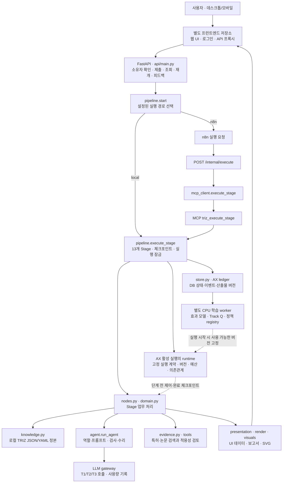
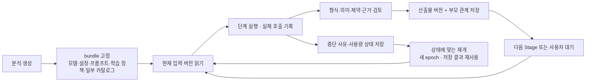

# 전체 설계

기준일: 2026-09-30. 함수별 설명은 [모듈 설계](MODULES.md), 실행 순서와 데이터는 [Stage 흐름](STAGES.md)을 함께 보세요.

## 시스템 구성

현재 백엔드는 FastAPI와 선택적으로 내장하거나 별도로 실행하는 MCP 서비스로 구성됩니다. `pipeline.start()`가 로컬 실행기 또는 n8n 전달을 선택하고, 두 경로 모두 `pipeline.execute_stage()`에 도착합니다. n8n이 TRIZ의 다음 사고 단계를 모델에게 다시 고르게 하지는 않습니다. AX 활성 여부와 관계없이 단계 업무 함수는 같은 Python 프로세스에서 직접 호출됩니다.

## MCP와 내부 함수 호출

`nodes.py`의 `.schema` import는 Pydantic 데이터 모델입니다. `knowledge` import는 로컬 지식 로더입니다. 둘 다 그 자체로 MCP 네트워크 호출은 아닙니다.

예를 들어 Track A는 `_track_a()` 안에서 `K.param_name()`과 `K.params()`를 호출해 정본 정의를 프롬프트 변수로 넣습니다. `params(scheme: str = "ENG_39")`의 `str`은 인수 타입, `"ENG_39"`는 기본 인수값입니다. `BIZ_31`이면 `params_biz_31.json`, 그 외에는 `params_39.json`을 읽습니다.

MCP는 외부 실행기가 기능을 호출하는 경계입니다. `triz_execute_stage`는 파이프라인을 진행하고, `triz_s*`로 등록되는 직접 프롬프트 도구는 산출물을 반환하되 Stage를 자동 진행하지 않습니다. 도구 수는 프롬프트 등록 목록과 `TRIZ_MCP_MODULE`에 따라 달라집니다. 과거의 고정된 도구 수를 현재 계약으로 사용하지 않습니다.

근거: [MCP 클라이언트](../pilot/triz/mcp_client.py), [MCP 서버](../pilot/triz/mcp_server.py), [지식 로더](../pilot/triz/knowledge.py), [데이터 모델](../pilot/triz/schema.py).

## 실행 데이터와 저장

| 층 | 데이터 | 저장 위치와 역할 |
|---|---|---|
| 실행 상태 | `GlobalState`의 intake, confirm, analysis, definition, solve, concepts, constraint_checks, evidence, evaluation, report, feedback | `run_states.state_json`; 단계 재개에 쓰는 현재 상태 |
| 실행 목록 | 소유자, 제목, 모드, 상태, 현재 단계, 비용 | `runs`; 목록과 상태 조회 |
| 호출 기록 | 입력, 출력, 역할, 프롬프트, 등급, 검증 결과, 모델, 토큰, 비용 | `steps`, `llm_calls`; 실제 호출과 검토 추적 |
| 이벤트 | 단계 진행, 대기, 오류, 사용자 결정 | `run_events`; SSE의 재조회 가능한 원본 |
| AX 원장 | 고정 bundle, 산출물·부모 버전, snapshot, 평가, 행동, 비용, 학습 이벤트 | `ax_*` 테이블; 인과관계와 학습 출처 추적 |
| 피드백/RAG | 제출 평가, 최신 피드백 사례, 사용 이력 | `feedback_logs`, `rag_docs`; 수정 이력과 활성 사례 관리 |
| 파일 | 첨부, 원문, 보고서, 추적용 보관본 | `STORAGE_DIR`; DB와 함께 보존해야 함 |

DB는 운영 MySQL과 로컬 SQLite를 지원합니다. MySQL에서는 실행별 advisory lock을 추가로 사용합니다. `stage_index`와 `execution_epoch`가 맞는 작업만 현재 실행을 진행할 수 있습니다.

근거: [store.py](../pilot/triz/store.py), [pipeline.py](../pilot/triz/pipeline.py), [AX ledger](../pilot/triz/ax/ledger.py).

## 버전과 재개

실행 도중 설정 파일을 바꿔도 이미 고정된 bundle이 새 설정으로 자동 교체되지는 않습니다. 다만 소스 해시를 기록하는 것이 Python 실행 코드 전체를 보관·재실행한다는 뜻은 아닙니다. 코드 배포와 실행 계약 버전은 따로 관리해야 합니다.

산출물이 바뀌면 의존하는 검토·선택·보고서를 무효화하고 다시 확인합니다. 이전 산출물을 지워 새 결과처럼 보이게 하지 않습니다. 전송 오류 뒤 사용량을 알 수 없는 호출은 무조건 재청구하지 않고 복구 상태로 남깁니다.

근거: [AX runtime의 DEPENDENCIES/OUTPUTS/bundle/checkpoint](../pilot/triz/ax/runtime.py), [usage_recovery](../pilot/triz/ax/usage_recovery.py).

## 추론과 검증

`run_agent()`는 입력과 역할을 묶어 호출하고, JSON/도메인 검사와 설정된 독립 검증을 수행합니다. 모든 함수가 LLM을 호출하거나 모든 산출물이 동일한 검증기를 거치는 구조는 아닙니다.

- T1은 문제 추출·역질의·역할 구성·요약 등에 라우팅됩니다.
- T2는 분석·모순·기법·개념·제약·순위 등 주 추론에 라우팅됩니다.
- T3는 독립 검증과 직군별 평가에 사용됩니다.

T1/T2/T3는 코드의 역할 등급입니다. 실제 모델명·endpoint·가격은 환경설정과 실행 bundle에서 확인합니다. 저장소 기본 모델명은 셋 모두 `deepseek-chat`이므로 등급명만 보고 서로 다른 모델이라고 단정할 수 없습니다.

공통 검증기는 `P_VERIFIER_GENERIC`과 독립 감사자 system 문구를 사용합니다. 직군별 `P_S8_REVIEW`는 생성된 persona의 관점으로 평가합니다. 대상 rubric과 Stage별 조건은 [Stage 검증 흐름](STAGES.md)에 분리했습니다.

근거: [agent.py](../pilot/triz/agent.py), [settings.py](../pilot/triz/settings.py), [rubrics.yaml](../pilot/config/rubrics.yaml), [meeting.py](../pilot/triz/meeting.py).

## 과학효과·특허·보고서

과학효과 카탈로그 검색과 피드백에 따른 우선순위 조정은 구분합니다. 적용 효과는 아이디어·개념의 명시적 ID 연결로 추적하며 이름이 비슷하다는 이유로 보상을 귀속하지 않습니다. 학습값은 근거 없는 효과를 PASS로 바꾸는 수단이 아닙니다.

특허검색 기본 provider는 `vector`이며 별도 특허 SQL DB와 Qdrant를 사용합니다. 공개 논문 검색과 특허 검색의 provider·출처를 함께 기록합니다. 0건, 공급자 실패, 일부 결과와 사용량 미확인을 구분하며 확보하지 못한 근거를 만들어 넣지 않습니다. S5 탐색과 S8 근거·적용성 검토의 정확한 위치는 [전체 흐름도](STAGES.md)에 표시했습니다.

보고서는 저장된 상태를 화면용 표기와 도식으로 바꿉니다. 분리원리는 문제별 적용 내용으로 기법별 아이디어 섹션에 표시하며, 최종 해결안 섹션에는 반복하지 않습니다. 타산업 기능 이식 뒤의 해결 범위·탐색 보완 종합서술은 표시하지 않습니다. 76표준해는 저장된 전후 모델이 있을 때 적용 그림을 그리며, Introduction의 일반 참고 그림을 해결안에 붙이지 않습니다. HTML/Markdown 재표현은 새 모델 추론 없이 가능합니다.

## 인증과 연결 서비스

프런트엔드의 로그인·프록시와 백엔드의 앱 토큰, 사용자 세션, 내부 서비스 토큰은 역할이 다릅니다. 실행 조회·변경은 소유자를 확인하며, 공개 사례 API는 공개 동의된 실행만 읽습니다. MCP와 내부 실행 endpoint는 서비스 인증을 거칩니다.

특허 초안 작성, 특허 수집·벡터 적재, 과학효과 연구·검수는 연결된 별도 작업입니다. 분석 중의 검색 요청과 카탈로그를 갱신하는 운영 작업을 혼동하지 않도록 [모듈 설계](MODULES.md)와 [운영 안내](OPERATIONS.md)에서 나눠 설명합니다.
