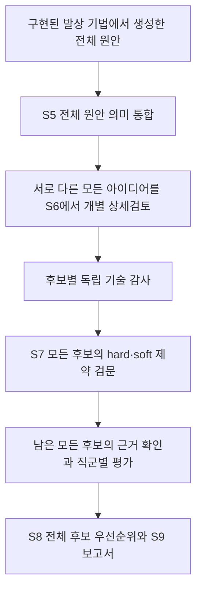

# 전체 아이디어 검토와 제약 기반 최종 후보

2026-09-27. 사용자가 승인한 변경: 다양성 점수나 고정 개수로 상세검토 대상을 고르지 않는다. 중복 통합 후 서로 다른 아이디어를 모두 검토한다. **hard와 soft 제약 위반 후보를 제외하는 정책은 유지한다.**

## 실행 흐름

- S5 통합은 전체 원안을 한 맥락에서 비교한다. 작동 원리, 개입 위치·변수, 적용 조건, 보호할 요구가 실질적으로 같은 경우에만 합친다. 목표나 제목이 비슷하다는 이유로 합치지 않는다. 불확실하면 독립적으로 유지한다.
- 모든 입력 ID는 정확히 한 그룹에 포함되어야 한다. 원안, 출처, 자원, 조건, 가설과 통합 이유를 보존한다. ID 누락·중복·위조 응답은 수리하고, 수리 실패 시 원안을 보존한 채 중단한다.
- S6는 모든 통합 그룹을 검토한다. 이전의 8/12개 검토 제한, 기법 다양성에 따른 선별, `TRADEOFF` 사전 제외를 사용하지 않는다. 각 아이디어에는 상세 개념 또는 구체적인 제외 사유가 남는다.
- 독립 감사는 생성자의 자체 승인과 분리한다. 기술적으로 성립하지 않는 후보는 제외하고, 검증이 부족한 후보는 미검증·보완 필요 상태로 구분한다. 후보별 판정 누락을 통과로 취급하지 않는다.
- S7는 저장된 hard와 soft 제약을 모두 검토한다. 알려진 제약의 확정 위반은 어느 종류든 제외한다. 판정 누락, UNKNOWN, 상충하는 판정은 조건부다. 모델의 최종 요약만 믿지 않고 개별 제약 행으로 판정을 다시 계산한다. 입력에 없는 의무나 금지는 추가하지 않는다.
- S8는 통과·조건부로 남은 모든 후보를 평가하고 순위를 매긴다. 최종 10개 상한, 신규성·사분면 비율 맞추기, 일정 수량을 채우기 위한 보강을 제거했다. 실제 미해결 모순과 품질 문제의 보완은 유지한다.
- 해결 개념의 순위가 높다는 사실은 실증 완료를 뜻하지 않는다. 실제 시험 결과가 없는 후보는 확정 추천으로 표시하지 않는다.

## 비용과 재개

총 검토 개수에는 상한을 두지 않는다. 호출당 S6 최대 5개, 독립 감사 최대 5개/18,000자, 제약 및 평가의 호출별 배치는 긴 응답의 누락을 방지하기 위한 분할 단위다. 모든 배치를 처리한다.

프로젝트 예산, 실행 시간, 공급자 컨텍스트/출력 길이, 실제 결함 보완의 재시도 한도는 유지한다. S5 전량 입력에 별도의 고정 바이트 상한을 기본 적용하지 않는다. 공개 패턴 글라스 사례의 46개 원안·출처·문제 문맥은 약 286KB이므로 임의의 240KB 상한으로 막지 않는다. 공급자 컨텍스트 한도나 명시적으로 설정한 운영 한도를 초과하면 일부를 잘라 처리하지 않고 원안을 보존한 채 중단한다. 예산 소진이나 호출 실패로 남은 검토를 완료라고 표시하지 않는다. 고유 아이디어가 많을수록 호출 수와 비용은 증가할 수 있다.

완료된 상세검토 호출과 독립 감사 배치는 입력·모델·정책 식별값으로 재사용한다. 복구 후보를 검토하는 임시 상태가 기존 후보 전체를 덮어쓰지 않도록 부모 상태에 체크포인트를 저장한다.

기존 프로젝트는 S6부터 재실행해도 새 통합 계약을 적용한다. 이전 고정 프롬프트 원본은 이력에 보존하고, 실제 실행에는 새 계약을 렌더링해 기록한다. 기존 보고서나 실행 결과를 자동으로 재작성하지 않는다. 이 변경의 검증 과정에서는 유료 모델 호출과 사용자 프로젝트 재실행을 하지 않는다.

## 사용자 사례와 검증 범위

패턴 글라스 공개 사례의 이전 결과는 46개 중 8개만 상세검토한 기록이다. 이 이력은 [이전 조사](IDEA_SELECTION_AUDIT_20260927.md)에 보존한다. 실제 새 통합 결과가 반드시 15개가 된다고 보장하지 않는다. 46→15는 테스트용 응답에서 모든 원안이 남고 15개 전체가 상세검토·감사를 받는지 검증하는 예시다.

저장된 soft 조건에는 공정 순서 유지 선호, 현재 시간 기준값, 직렬 동작 설명, 서보 방식, 병목 가정, 크기·중량 추정, 발열 가능성이 포함되어 있다. 이번 변경은 사용자의 지시에 따라 soft 위반 제외를 유지하며 기존 제약 데이터와 hard 표시는 바꾸지 않는다.

테스트는 전량 통합, 개별 판정, 중단·재개, 제약 검문, 전체 순위, AX 버전 연결과 보고서 정합성을 검증한다. 정확한 테스트 결과와 배포 식별자는 배포 확인 기록에 남긴다.
