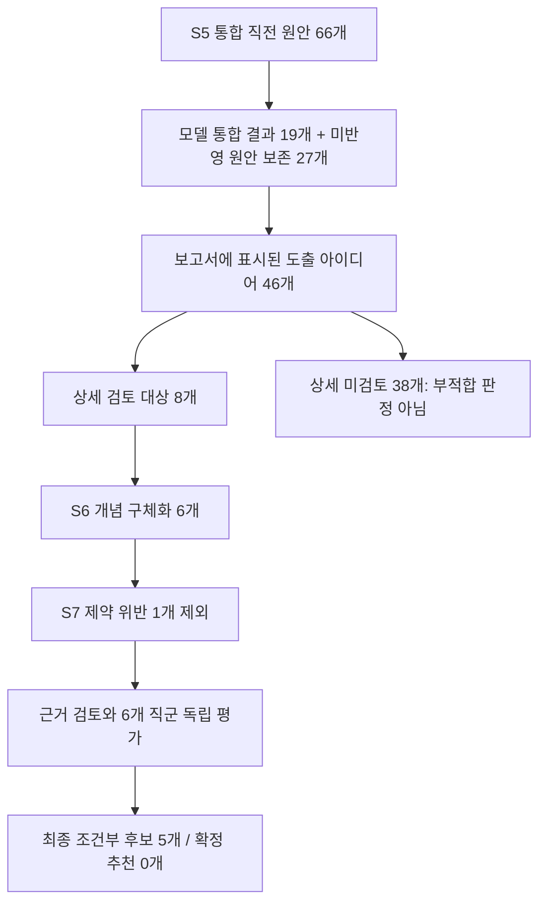

# 아이디어에서 해결안까지: 코드와 실제 실행 확인

> 이 문서는 개수 제한 제거 전 공개 프로젝트의 실행 이력이다. 새 정책과 구현은 [전체 아이디어 검토 변경](FULL_IDEA_REVIEW_20260927.md)을 참조한다. 기존 프로젝트 결과는 자동 재실행하지 않았다.

2026-09-27, 읽기 전용 조사. 현재 코드와 공개 프로젝트
`run-baa72a38ef40c8c63155ffc7a1dd25ee`
(패턴 글라스 180도 로테이션 설비의 takt time 단축)을 대조했다.
프로젝트 재실행, 모델 호출, 저장 데이터 수정은 하지 않았다.

## 실제 프로젝트의 수량 흐름

`ax_portfolio_trace`는 merge input_count=66, merged_count=19,
unaccounted_preserved=27, S6 assigned_ideas=8, generated_count=6,
retained_after_audit=6을 기록한다. S6 후보 목록의 두 원안은 자기 정렬 토크와
자이로 세차 토크의 성립 근거 부족으로 구체화되지 않았다. 생성된 여섯 개념 중
감속 위상 정렬·클램프 선접촉 중첩은 제약 검토에서 제외됐다.

`excluded_concepts`에는 통합한 아이디어의 원래 출처에 대한 흡수·중복 설명도
들어 있다. 이 배열 길이를 상세 검토 대상에서 탈락한 수로 사용하면 안 된다.

최종 다섯 후보 모두 quality_status=REVISE, constraint_verdict=CONDITIONAL이며
시험은 NOT_RUN이다. recommended는 빈 배열이고 문제 범위 충족 상태도
PARTIAL이다. 따라서 다섯 개 모두 기술적 성립이 확인된 해결책이라는 해석은
맞지 않는다. 해당 실행은 6개 직군의 독립 평가를 마쳤으며 직군 간 토론은
없었다(rounds/questions/answers=0).

보완 분기는 UNRESOLVED 4건과 DEFERRED_BUDGET 1건이었고, 채택된 추가 후보는
0개다. 따라서 이 사례의 수량 흐름에는 복구 후보를 더할 필요가 없다.

제약 검문의 제외 근거에는 별도 결함이 관측된다. 마지막 제외 사유인
`CON-44a63872`는 hard=false, source=DOMAIN, confidence=0.6이며 현재 공정의
정렬·클램프가 직렬로 시간을 추가한다는 현상 기록이다. 프롬프트 규정은 soft
위반만으로 후보를 FAIL 처리하지 않도록 하지만, 서버는 반환된 최종 FAIL을
다시 hard 제약과 대조하지 않고 후보를 제외한다. 따라서 이 한 건을
"필수 제약 위반이 확인됐다"고 설명해서는 안 된다. 이번 오타 배포에는 이
판정 로직 변경을 포함하지 않았다.

## 현재 파이프라인의 판단과 입출력

| 단계 | 입력 → 출력 | 판단 주체와 기준 |
| --- | --- | --- |
| S5 통합 | 기법별 원안 → 통합 아이디어와 보존 원안 | LLM이 같은 모순·개입 변수·작동 방식이면 병합. 코드가 원본 출처·조건·미반영 원안을 보존 |
| S6 대상 배정 | 전체 보존 목록 → 최초 상세 검토 대상 8개 | 코드가 TRADEOFF를 제외하고 출처 기법, 대상 문제, 메커니즘 다양성을 균형 있게 배정 |
| S6 구체화 | 배정 원안 → 부품·공정 변경, 작동 원리, 가정·위험·시험 계획 | LLM 설계와 별도 독립 품질 검토. 코드가 원안 출처 불일치와 동일 메커니즘 중복을 확인 |
| 보완 분기 | 미해결 문제·후보 결함 → 추가 후보 | 기존 후보를 보존하고 제한된 추가 설계·독립 검토. 새 후보도 제약 검토 필요 |
| S7 제약 게이트 | 개념 × 제약 → PASS/CONDITIONAL/FAIL | LLM의 제약별 판단과 코드의 수치 검사. 필수 제약 위반은 제외, 정보 부족은 조건부 |
| S8 근거 연결 | 남은 후보 → 특허·논문 적용 근거와 조건 | 기구·현장 조건에 연결. 문헌 존재를 실제 성능 실증으로 취급하지 않음 |
| S8 평가·순위 | 후보와 근거 → 직군별 평가, 우선순위, 로드맵 | 기본 4~6개 직군 독립 평가. 코드는 신뢰도와 항목 가중치 집계, LLM은 포트폴리오 순위 작성 |
| S9 보고서 판정 | 품질·제약·시험 기록 → READY/CONDITIONAL/REJECTED | 코드가 별도로 판정. 생성한 시험 계획만으로 READY가 되지 않음 |

## 수량 제한과 현재 한계

1. S5는 현재 LLM에 최대 40개만 전달하고 통합 반환 목표는 최대 20개다.
   입력되지 않거나 응답에서 다뤄지지 않은 아이디어는 삭제하지 않고 남긴다.
   그러므로 보고서의 46개는 통합 처리 **이후**의 인벤토리이고, 전체 46개가
   의미 중복 전수 검토를 마쳤다는 뜻은 아니다.
2. 최초 8개는 기술적 가능성 점수 상위 8개가 아니다. 다양한 발상 기법·문제·
   메커니즘을 상세 검토할 수 있도록 코드가 배정하며, 기술적 성립 검토는
   그다음에 이뤄진다. 미검토 38개는 탈락 38개가 아니다.
   구체적으로 매 선택마다 `(출처 기법 중 최소 선택 횟수, 동일 모순 ID 조합의
   선택 횟수, 동일 mechanism_key의 선택 횟수, 원목록 인덱스)`를 사전식으로
   비교한다. 선택한 안의 모든 출처 기법과 모순 조합·메커니즘 횟수를 갱신한
   뒤 반복한다. 동일 메커니즘은 후순위가 될 뿐 여기서 완전히 제거되지 않는다.
   RESOLVED 우선순위, 예상 성능, 비용, 타당성 점수는 이 배정 함수의 입력
   우선순위에 포함되지 않는다. 이번 사례는 TRADEOFF 6개 제외 후 40개 중
   8개를 배정한다.
3. 신규 AX 번들의 최초 상세 검토 한도는 8개다. 구형 DEEP의 3개 한도에는
   `max(8, pinned_limit)` 호환 처리가 적용된다. AX가 아닌 경로의 기본 한도는
   12개다. 따라서 모든 모드·버전의 절대 상한을 8이라고 표현하면 부정확하다.
4. 현재 coherence 복구는 제약 검토 전후에 기존 후보를 보존하며 최대 4개의
   추가 후보를 허용한다. 이 네 개는 공유 journal의 채택 건수로 제한된다.
   신규 기본 설정은 최초 8 + 추가 최대 4가 가능하고, 최종 순위 목록은
   `solutions.max_solutions=10`으로 제한된다. `presentation_target=5`는
   부족 여부를 판단하는 목표이며 최종 목록을 다섯 개로 잘라내는 상한이 아니다.
5. 확정 추천 READY에는 독립 품질 PASS, 필수 제약별 PASS, 모순 해소 연결과
   작동 원리·검증 계획뿐 아니라 현재 후보 버전에 대응하는 실제 시험 결과
   PASS 기록까지 필요하다. 점수나 순위가 높다는 사실만으로 확정 추천하지 않는다.

전체 원안의 중복 검토와 기술적 성립 가능성 선별을 완료한 뒤 총 상세 검토를
8개로 엄격하게 제한하는 정책을 원한다면, 현재 통합 입력 한도·대상 배정 기준·
복구 추가 한도를 함께 변경해야 한다. 이번 조사에서는 이 정책을 변경하지 않았다.

## 실제 8개 선정 순서 재현

저장된 46개 아이디어에 현재 `select_ideas`를 메모리에서 적용해 최신 S6
199번 단계 3개와 200번 단계 5개의 입력 ID·순서가 정확히 일치함을 확인했다.

| 선정 순서 | 아이디어 | 46개 보존 목록의 위치 |
| --- | --- | --- |
| 1 | 감속 위상 정렬·클램프 선접촉 중첩(통합) | 1 |
| 2 | 가감속 프로파일 구간별 분리(통합) | 2 |
| 3 | 결합부 강성-댐핑 분리 삽입(통합) | 5 |
| 4 | 자기 정렬 토크 | 16 |
| 5 | 클램프 패드 점탄성·강성 구배 댐핑(통합) | 6 |
| 6 | 서보 전기 제동 능동 감쇠(통합) | 7 |
| 7 | 자이로 세차 토크 | 17 |
| 8 | 감속 구간 에너지 흡수 제어 | 46 |

이번 선택에서는 여덟 번 모두 동일 모순 조합·동일 메커니즘의 기존 선택
횟수가 0이었다. 그러므로 실제 순서는 출처 기법의 선택 횟수와 기존 목록
순서가 결정했다. 여덟 번째는 목록 마지막이지만 당시 FOS 출처의 선택 횟수가
적어 배정됐다. 이 원안은 `addresses=[]`, `resolution_status=UNSUPPORTED`로
저장돼 있었다. 현재 배정 함수에는 유효한 모순 연결을 필수로 요구하거나
성립 가능성이 높은 안을 우선하는 별도 검사가 없다.

표시된 미검토 38개는 TRADEOFF로 상세 검토에서 제외한 6개와 나머지 미배정
32개를 합한 값이다. 재현 기록은
`.deployment/idea-selection-public-trace-20260927.json`에 보존했다.

## 코드 근거

- `pilot/triz/nodes.py`: `_merge`, `s7_gate`, `_aggregate`, `_rank`
- `pilot/triz/digest.py`: `select_ideas`
- `pilot/triz/quality.py`: `generate_concepts`, `audit_concepts`
- `pilot/triz/solve_contract.py`: `concept_review_limit`
- `pilot/triz/ax/runtime.py`: bundle limits 및 제약 전후 복구 호출
- `pilot/triz/ax/coherence_recovery.py`: 공유 추가 후보 수와 예산 제한
- `pilot/triz/ax/coherence.py`, `ax/validation.py`: 범위 충족 및 추천 성숙도
- `pilot/triz/prompts/P_S5_MERGE.md`, `P_S6_CONCEPT.md`, `P_S7_GATEKEEPER.md`
- `pilot/templates/report_full.md.j2`: 아이디어·상세검토·미검토 수량 표시

로컬 관측 기록: `.deployment/idea-pipeline-public-20260927.json`은 공개 GET
결과이며, `.deployment/idea-pipeline-public-state-20260927.json`은 공개 여부를
확인한 단일 프로젝트의 저장 상태를 서버에서 읽기 전용으로 조회한 요약이다.
