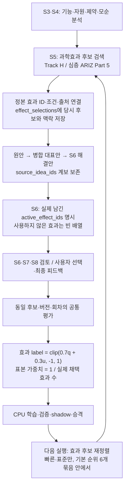
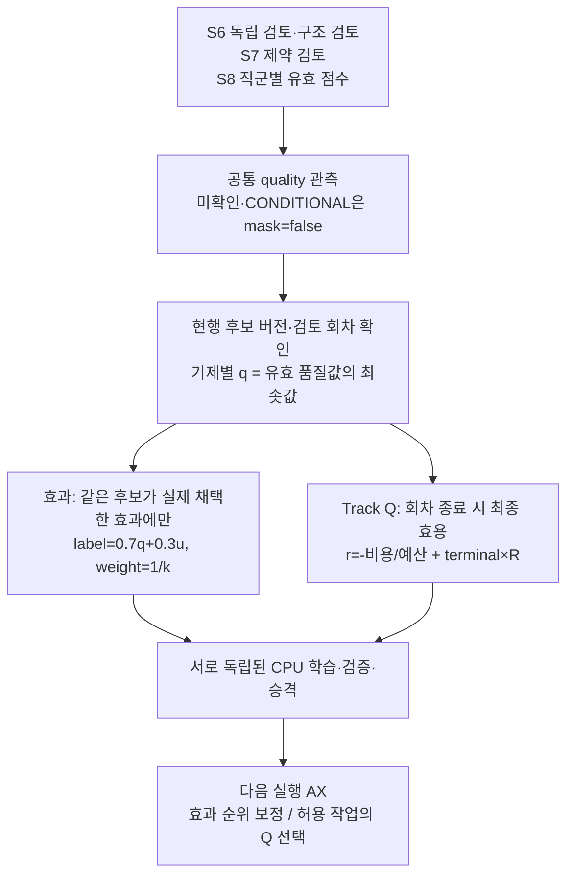
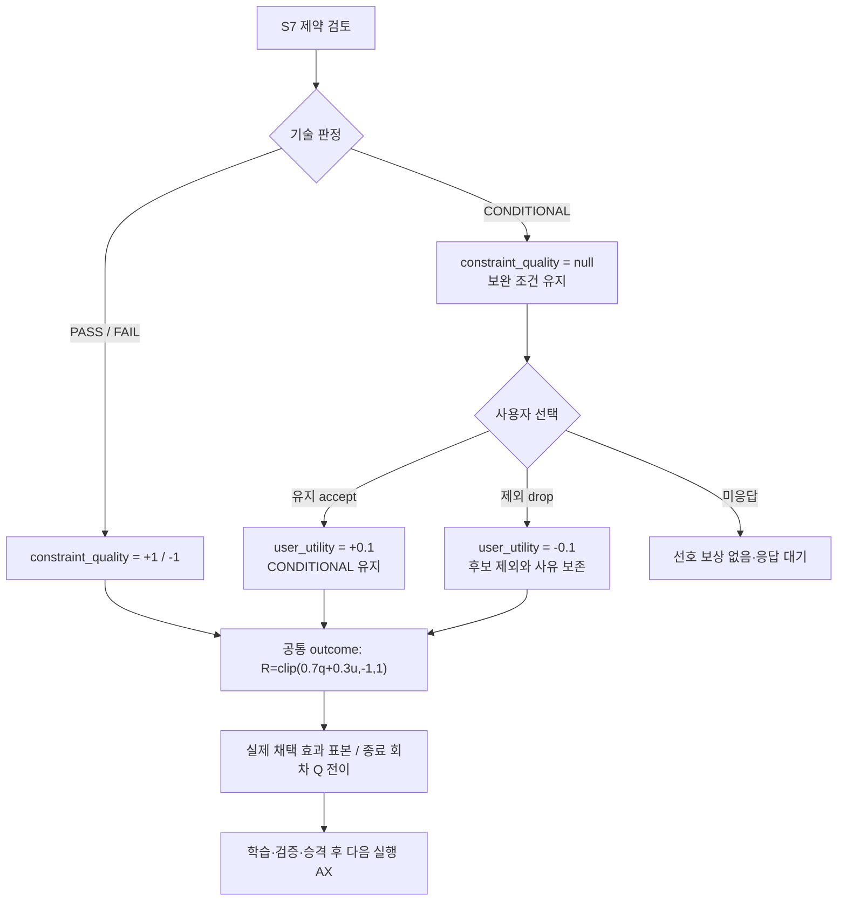
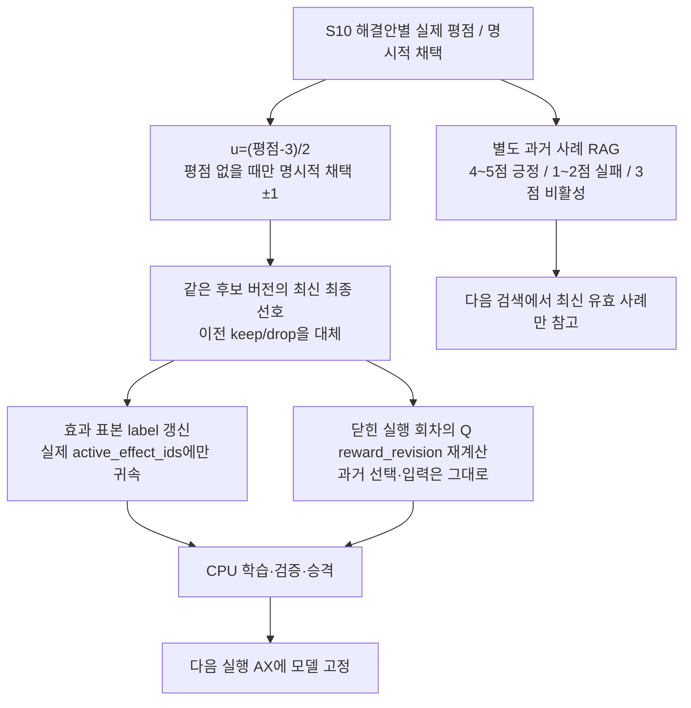

# 피드백과 학습

2026-09-30 코드·설정 재확인 기준입니다. 모드별 실행 흐름은 [MODES.md](MODES.md), 단계별 역할은 [STAGES.md](STAGES.md)를 함께 참고하세요. 이 문서는 구현 계약을 설명하며, 운영 프로젝트에 학습 모델이 실제 활성화되어 있다는 뜻은 아닙니다.

## 먼저 구분할 세 가지

| 구분 | 하는 일 | 바뀌는 대상 |
|---|---|---|
| AX | 실행 상태·제약·예산을 확인하고 다음 작업을 허용하거나 막는다. 선택, 산출물, 검토, 비용과 출처를 연결한다. | 실행 계획과 감사 이력 |
| Track Q | 허용된 다음 트랙·보완·종료 작업의 가치를 학습한다. 자료가 부족하면 명시적인 규칙으로 선택한다. | 512차원 선형 Q 가중치 |
| 과학효과 우선순위 | 문제 맥락과 실제 채택된 효과에 대한 평가로 효과 후보의 순서를 보정한다. | 256차원 선형 효과 모델 가중치 |

LLM 자체를 미세조정하지 않습니다. 별도 CPU 작업자가 학습하며, **평가 저장 → 유효 표본 생성 → 학습 → 검증 → 활성화 → 다음 실행에서 사용**은 각각 별도 단계입니다. 사용자 피드백을 받았다는 이유만으로 즉시 Q나 효과 순위가 바뀌지는 않습니다.

현재 신규 실행 계약은 `ax-run-v3`, Q 입력은 `ax-state-action-v5`, 공통 평가 계약은 `common-candidate-evaluation-v1`, 보상 계약은 `candidate-utility-cost-v2`입니다. 기존 실행은 시작할 때 고정한 계약을 유지합니다. [설정](../pilot/config/triz.yaml#L13), [`runtime.bundle`](../pilot/triz/ax/runtime.py#L41), [`routing_q.contracts`](../pilot/triz/ax/routing_q.py#L18)

## 과학효과가 적용되는 단계

Track H는 기본 `limit=6`, ARIZ Part 5는 `limit=10`으로 조회하며 실제 후보 풀은 각각 최대 `limit×4`입니다. 여러 요구 기능이 있으면 기능별 풀을 교차 선택해 한 기능이 전체 후보를 독점하지 않게 합니다. 비물리 문제의 효과 영역 제한은 별도 유지됩니다. [호출 위치](../pilot/triz/nodes.py#L800), [Track H](../pilot/triz/nodes.py#L965), [`runtime.effect_candidates`](../pilot/triz/ax/runtime.py#L347)

효과가 검색에 노출되거나 원안에 포함되었다고 채택으로 간주하지 않습니다. S6가 `active_effect_ids`를 명시해야 하며, 배정된 원안의 `source_effect_id`만 허용됩니다. 이름 유사도나 병합 원안에 있었다는 이유로 ID를 보충하지 않습니다. [`concept_effects.validate`](../pilot/triz/ax/concept_effects.py#L24), [`feedback_events.lineage`](../pilot/triz/ax/feedback_events.py#L33)

## 어떤 평가가 학습으로 연결되는가

공통 평가는 후보 ID·버전, 검토 입력의 수정 번호, 실행 회차, 원안과 실행 작업 ID, 실제 효과 적용 ID, 평가 시각, 동의 범위를 함께 보존합니다. 모델의 검토와 사용자의 선호는 물리적 실증과 구분합니다.

| 입력 | 공통 차원 | 정규화 값 | 해석 |
|---|---|---|---|
| S6 독립 AI 타당성 검토 | `concept_quality` | PASS `+1`, REVISE `0`, REJECT `-1`; 미확인 `null` | 모델의 기술 검토 대리 지표 |
| S6 구조·필수항목 검토 | `coverage_quality` | 최종 후보 상태에 따라 `+1 / 0 / -1 / null` | 모순 연결·근거·자원·검증 계획 등의 완결성 |
| S7 제약 검토 | `constraint_quality` | PASS `+1`, FAIL `-1`, CONDITIONAL `null` | 조건부를 실패나 중립 점수로 만들지 않음 |
| S8 AI 직군별 평가 | `evaluation_quality` | `(점수−3)/2`: 1점 `-1`, 3점 `0`, 5점 `+1` | 각 직군·평가항목의 실제 유효 응답 |
| S7 사용자의 보류안 유지 `accept` | `user_utility` | `+0.1` | 약한 긍정 선호; 기술적 CONDITIONAL은 유지 |
| S7 사용자의 제외 `drop` | `user_utility` | `-0.1` | 약한 부정 선호; 기술 실패와 별개 |
| S10 해결안별 최종 평점 | `user_utility` | `(평점−3)/2`, 평점 1~5 | 동일 설계의 기존 keep/drop보다 우선 |
| 최종 평점 없이 명시적 채택 여부 | `user_utility` | `adopted_explicit=true`이고 채택 `+1`, 미채택 `-1` | 평점이 있으면 평점이 우선; 기본 체크값은 신호가 아님 |
| 사용자 시험·현장 결과 제출 | `reported_test_result` | PASS `+1`, FAIL `-1`, 기타 `null` | 사용자 보고이며 독립 실증 확인으로 승격하지 않음 |
| 무응답·입력 변경으로 검토 무효화 | 관측 마스크 `false` | `null` | 보상을 만들어내지 않음 |

`overall_rating`, 자유 의견, 이유 태그만으로는 현재 공통 보상의 숫자 값을 만들지 않습니다. 해결안별 유효 평점 또는 명시적 채택 여부가 필요합니다. [`feedback_events`](../pilot/triz/ax/feedback_events.py#L94)

### AI Agent 검토의 경로

따라서 **AI 타당성 검토는 효과 모델뿐 아니라 Track Q에도 들어갑니다.** 다만 개별 AI 평가가 트랙 하나에 즉시 가산되는 방식은 아닙니다. Q는 실제 실행한 작업들의 전이와 회차 최종 결과를 학습합니다. 그 트랙이나 효과가 성공을 단독으로 일으켰다고 주장하지 않습니다.

심층(DEEP)은 적응형 Q 선택과 회차 종료 전이를 만들지 않습니다. 공통 평가를 수집하더라도 해당 심층 실행에서 Q 전이 표본이 자동으로 생기지는 않으며, 효과 표본은 별도 요건을 충족하면 사용할 수 있습니다.

S8은 완료된 검토의 직군·후보·입력·출력·실제 호출 출처가 맞는 점수만 수집합니다. `WARN` 전체를 허용하지 않으며, 선택적 추가 검증을 정책상 생략했지만 본 평가 점수가 완전하게 검증된 경우만 제한적으로 허용합니다. S6는 현행 검토 버전의 구조 검토 완료 여부도 확인합니다. [`meeting_review_sources`](../pilot/triz/ax/feedback_events.py#L239), [`outcome`](../pilot/triz/ax/learning_outcomes.py#L31)

### 제약 보류안에 대한 사용자 선택의 경로

사용자의 “유지”는 조건을 충족했다는 확인이 아닙니다. 현재 S7 입력은 보류 후보의 `accept/drop`이며, 별도의 사용자 `PASS`를 만들어내지 않습니다. 기술적 PASS/FAIL과 사용자 선호는 분리되어 저장됩니다. [`nodes.s7_gate`](../pilot/triz/nodes.py#L1244)

### 해결안 최종 피드백의 경로

최종 피드백은 이미 생성된 보고서와 선택을 소급 변경하지 않습니다. 새로운 보상 버전과 학습 자료에 반영됩니다. 나중에 받은 피드백은 그 시각 이후 자료셋에서만 사용할 수 있으며, 과거 선택 시점의 입력 특징에 섞지 않습니다.

## 공통 효용과 가중치

먼저 `(run, semantic_episode, candidate_id)`별 현행 후보 버전을 고릅니다. 설계 버전은 후보 내용에서 파생 상태인 `quality_status`, `quality_issues`만 제외해 계산합니다. 설계가 바뀌면 예전 설계의 평가를 넘겨 쓰지 않습니다. 같은 설계의 사용자 선호는 검토 맥락이 바뀌어도 남을 수 있지만, 품질 판정을 끌어올리지는 않습니다.

기제 `m`별로 다음을 계산합니다.

$$
q_m=\min(\text{차원·검토자·후보별 최신 관측 품질값}),\qquad
u_m=\operatorname{mean}\bigl(\operatorname{unique}(\text{후보별 유효 사용자 선호})\bigr)
$$

사용자 선호는 각 후보에서 유효 S10 평가를 S7 선택보다 우선하고, 같은 단계에서는 최신 값을 고릅니다. 동일 기제 후보의 같은 점수가 여러 번 있어도 값의 집합으로 한 번만 셉니다. 품질은 `concept_quality`, `coverage_quality`, `constraint_quality`, `evaluation_quality`, `reported_test_result`를 포함합니다.

$$
q=\operatorname{mean}_{m:q_m\text{ 관측}}q_m,\qquad
u=\operatorname{mean}_{m:u_m\text{ 관측}}u_m
$$

$$
R=\operatorname{clip}\left(0.7\,\mathbf{1}_{q\text{ 관측}}q+
0.3\,\mathbf{1}_{u\text{ 관측}}u,\ -1,1\right)
$$

관측되지 않은 항은 합산에서 기여하지 않지만, 저장값은 `null`과 `mask=false`를 유지합니다. 남은 항의 가중치를 1로 재정규화하지 않습니다. 명시적 REVISE나 3점의 `0`은 관측된 값입니다. Q의 회차 최종 집계에서 최종 후보군에 남지 않은 기제의 양수 품질은 `0`까지만 인정하며 음수 품질과 실제 사용자 선호는 보존합니다. [`learning_outcomes.outcome`](../pilot/triz/ax/learning_outcomes.py#L31)

| 계수·정책 | 현재 값 | 적용 범위 |
|---|---:|---|
| `quality_weight` | 0.7 | 공통 품질 항 |
| `utility_weight` | 0.3 | 사용자 효용 항 |
| `keep / drop` | +0.1 / −0.1 | S7 명시적 유지·제외 |
| `lambda_cost` | 1.0 | Track Q 실제 비용 감점 |
| `R` clip | [−1, +1] | 공통 효용·효과 label |
| 평가 출처별 별도 `source_weight` | 없음 | AI 직군이나 검토 차원에 추가 배율을 곱하지 않음. 유효 품질의 최솟값 사용 |
| 효과 표본 가중치 | `1/k` | 동일 후보의 유효 적용 연결이 확인된 고유 채택 효과 `k`개에 나눔 |
| Track Q 표본 가중치 | 별도 필드 없음 | 사용 가능한 전이를 같은 비중으로 평균 |

계수는 실행 번들의 `feedback_settings`에 고정됩니다. 문서의 기본값보다 각 저장 실행의 번들이 우선합니다. [설정값](../pilot/config/triz.yaml#L16), [`mode_contract.pin`](../pilot/triz/ax/mode_contract.py#L40)

예를 들어 유효 품질 집계가 `q=1`이고 사용자 선호가 미관측이면 `R=0.7`, 여기에 보류안 유지가 있으면 `R=0.73`입니다. 한 기제의 유효 품질값에 FAIL이 포함되어 `q=−1`이면 5점 최종 피드백이 있어도 `R=−0.7+0.3=−0.4`입니다. 이는 수식 예시이며 운영 관측 결과가 아닙니다.

### 보고서의 종합 점수와는 다른 계산

보고서 점수는 먼저 직군별 점수를 `max(0.1, confidence)`로 가중평균하고 소수 둘째 자리로 반올림합니다. 이후 관측된 평가항목의 가중합을 해당 가중치 합으로 나눕니다. 독립 품질 상태가 PASS가 아니면 총점을 3.0 이하로 제한합니다. **이 보고서 총점이나 confidence 가중치를 학습 품질 `q`에 다시 곱하지 않습니다.** 학습은 원래의 각 S8 점수를 정규화해 사용합니다. [`nodes._aggregate`](../pilot/triz/nodes.py#L1525)

| 평가항목 | 일반 기본값 | 조직·비즈니스 |
|---|---:|---:|
| GOAL / RESOLUTION | 각각 0.20 | 각각 0.20 |
| CAUSAL | 0.15 | 0.15 |
| FEASIBILITY | 0.15 | 0.10 |
| RISK / COST | 0.10 / 0.05 | 0.10 / 0.05 |
| TIME / QUALITY | 0.05 / 0.05 | 0.03 / 0.02 |
| ADOPTION | 0.05 | 0.15 |
| SAFETY / SCALABILITY | 0 / 0 | 0 / 0 |

SAFETY는 총점 가중치가 0이어도 veto 판단에 사용됩니다. [평가 설정](../pilot/config/triz.yaml#L88)

## Track Q: 무엇을 얼마나 실행할지 학습

실제 선택 `a_t`와 선택 당시 상태 `s_t`, 허용 목록, 실행 결과, 다음 선택을 연결합니다. `STOP_EXPLORATION`은 S5 탐색을 멈추는 행동이며 필수 검토를 건너뛰는 종료가 아닙니다. 회차 종료는 S9 보고서 완료 후의 `ADAPTIVE_EPISODE_CLOSED`로 확인합니다. [종료 이벤트](../pilot/triz/ax/runtime.py#L213)

$$
C_t=\frac{\lambda_{cost}\sum_{j\in I_t}\operatorname{actual\_microusd}_j}
{\max(1,\operatorname{budget\_microusd})},\qquad
r_t=-C_t+\mathbf{1}_{terminal}R
$$

`I_t`는 작업 생성 시각으로 나눈 해당 전이의 정산 작업 집합입니다. 처음·마지막 구간은 앞선 공통 분석과 이후 필수 검토·보고서 비용까지 포함할 수 있습니다. 한 작업의 비용은 한 번만 셉니다. 예약액·추정액을 보상 비용으로 쓰지 않으며, 정산되지 않은 사용량이 있으면 회차를 학습에서 제외합니다. `R`에는 clip이 있지만 현행 `r_t`에 별도의 [−2,+2] clip은 없습니다. 과거 계약의 식과 혼동하지 않도록 주의하세요. [`q_dataset`](../pilot/triz/ax/learning_outcomes.py#L114)

$$
Q_\theta(s,a)=\theta^T\phi(s,a),\qquad y_t=r_t+0.8B_{\bar\theta}(s_{t+1})
$$

`φ`는 상태·행동·모드·문제 맥락·확인된 제약·실행 기법·남은 예산 등의 교차 특징을 512차원에 해시한 뒤 정규화합니다. terminal의 `B`는 0입니다. 다음 상태는 관측된 다음 결정만 쓰며, 다른 회차나 지원되지 않는 다음 행동을 가정하지 않습니다.

학습의 오차와 보수적 페널티는 다음과 같습니다.

$$
e_t=\operatorname{clip}(Q_\theta(s_t,a_t)-y_t,-5,5),\qquad
L_t=\tfrac12e_t^2+\alpha\left[\log\sum_{a\in A_{legal}}e^{Q_\theta(s_t,a)}-Q_\theta(s_t,a_t)\right]
$$

코드는 사용 가능한 전이들의 평균 기울기로 `θ ← θ−ηg`를 수행합니다. 선택 행동에는 clip한 오차를, 모든 합법 행동에는 softmax 보수항을 적용합니다. 이 식의 `L`은 기록용 손실이며 clip 경계 밖에서도 clip한 오차를 기울기에 사용하는 구현입니다. [`routing_q.train`](../pilot/triz/ax/routing_q.py#L290)

| 학습·지원 설정 | 현재 CPU 작업자 경로 |
|---|---|
| epochs / 학습률 `η` / discount `γ` / 보수항 `α` | `180 / 0.025 / 0.8 / 0.05` |
| 하위 함수 직접 호출 기본값 | `routing_q.train`: 학습률 `0.05`, `α=0.03`; 작업자는 `learning.train`의 값으로 덮어씀 |
| target 가중치 갱신 | 0부터 세는 epoch가 `10`의 배수일 때 복사 |
| 행동 지원 / 상태영역 지원 | 각각 독립 문제군 최소 `4`개; 같은 문제군 반복은 지원 수를 늘리지 않음 |
| 실제 greedy 선택 | 지원되는 서로 다른 작업이 `2`개 이상일 때만 |
| TD 다음 값 | 지원 작업 ≥2이면 최대 Q; 합법 행동 1개가 지원되면 그 값; 그 외에는 **지원되는** 기록된 규칙 선택만 허용. 그것도 없으면 TD 표본 제외 |
| 탐색·확률 | 결정론적 선택, 동점은 앞선 목록 순서. 임의 탐색 없음; `behavior_probability=None` |

실제 호출 경로는 `worker.tick → registry.train_project → learning.train → routing_q.train`입니다. [`learning.train`](../pilot/triz/ax/learning.py#L179), [지원 판정](../pilot/triz/ax/routing_q.py#L58), [실행 선택](../pilot/triz/ax/coordinator.py#L312)

## 과학효과: 실제 적용된 후보의 효용을 학습

효과 자료셋은 먼저 후보의 최신 버전을 선택한 뒤 **후보별로** 나눕니다. 기제가 같은 다른 후보의 점수를 그 후보가 채택하지 않은 효과에 넘기지 않습니다. 효과 `e`의 표본은 다음과 같습니다.

$$
label_{c,e}=R_c,\qquad w_{c,e}=\frac1{\max(1,|active\_effects_c|)}
$$

효과 label에는 비용 감점을 넣지 않습니다. 여러 효과를 함께 쓴 후보의 공동 평가를 나눠 학습하는 것이므로 개별 효과의 성공을 독립 입증한 값도 아닙니다. [`effect_dataset`](../pilot/triz/ax/learning_outcomes.py#L190)

필요한 연결은 `후보 ID·전체 snapshot → 동일 회차의 application ID → 정본 효과 ID → 해당 실행 작업 → 후보 관측 이전의 selection ID·feature_snapshot`입니다. 정본 버전과 카탈로그 정의도 일치해야 합니다. 검색 당시 특징이 없거나 출처 계보가 불완전하면 제외합니다. 현재 후보에서 추측한 맥락으로 과거 검색 특징을 만들지 않습니다.

선형 모델은 256차원 특징을 사용합니다. 효과 ID·기제와 도메인, 요구 기능, 기술/물리 모순, 상호작용, 자원, 제약의 교차 항을 해시하고 L2 정규화합니다.

$$
\hat y_i=\theta^Tx_i,\quad
g=0.01\theta+\frac{\sum_i w_i(\hat y_i-y_i)x_i}{\max(10^{-9},\sum_iw_i)},\quad
\theta\leftarrow\theta-0.1g
$$

| 설정 | 값 |
|---|---:|
| epochs / 학습률 / L2 정규화 | 200 / 0.1 / 0.01 |
| 초기 가중치 | 전부 0 |
| 기록용 손실 | `Σw(예측−label)² / Σw` |
| 예측 clip | [−1,+1] |
| 관측 label | 유한한 [−1,+1]; `null` 제외 |
| 표본 weight | 유한한 0 이상; 0 제외, 음수·비유한 값 오류 |
| 맥락 지원 | 학습에 있던 효과 ID **및** `domain/resources/constraints`의 정확한 호환 키 필요 |
| 미지원 효과·맥락 | 예측 보정 0; 의미가 비슷하다는 이유로 지원을 확장하지 않음 |

[`effect_ranker.features/train/prediction`](../pilot/triz/ax/effect_ranker.py#L39)

### 검색 기본점수와 학습 보정

처음에는 전 카탈로그의 이름·별칭·기제·조건·응용·기능명으로 어휘 검색합니다. 출처 개수를 정확도 점수로 사용하지 않습니다. 검색점수의 모든 계수는 다음 식과 같습니다.

$$
S(e)=\sum_{t\in query\cap e}\log\left(1+\frac{N-df_t+0.5}{df_t+0.5}\right)
\frac{2.2f_{t,e}}{f_{t,e}+1.2(0.25+0.75|e|/avglen)}\,b_{t,e}
$$

`b=1.6`은 이름·별칭·기제 키 또는 기능명에 있는 단어, 나머지는 `1`입니다. 동점은 카탈로그 순서를 유지합니다. 질의 단어가 없으면 기능군별 순환으로 고릅니다. [`effect_catalog.select_effects`](../pilot/triz/effect_catalog.py#L16)

빠른·표준의 학습 보정은 검색 순위 0부터 세어 `(순위//6, −0.25×효과예측값, 원래 순위)`로 정렬합니다. **6개 묶음을 넘는 이동은 없습니다.** 현재 통합 계약은 옛 조건 질문 이력의 직접 보정을 끄므로 그 항은 0입니다. 모델이 없으면 `LEXICAL_FALLBACK`, 모델이 있으면 `LEARNED_UTILITY`로 기록하지만, 후자도 개별 후보의 지원 여부·점수와 최종 순서를 확인해야 실제 영향을 판단할 수 있습니다. 심층은 `ADVISORY`이며 순서를 바꾸지 않습니다. [`effect_history.rerank`](../pilot/triz/ax/effect_history.py#L256)

과거 비통합 계약에는 완전히 같은 구조 맥락의 다른 실행별 조건 관측을 `Σlabel/(실행 수+2)`로 보정하는 경로가 남아 있습니다. 신규 공통 효용 모델과 별도이며, 과거 조건 질문 UI를 현재 학습의 필수 입력으로 해석하면 안 됩니다.

## 유효 자료, 학습 준비와 다음 실행 적용

신규 실행은 기본 `PROJECT_ONLY`로 기록하고 같은 프로젝트의 다음 분석에 사용합니다. `NO_TRAINING`은 계속 지원합니다. 과거 상태에 동의 값이 없으면 평가 수집 함수는 보수적으로 `NO_TRAINING`을 적용합니다. [신규 실행 기본값](../pilot/triz/pipeline.py#L59), [평가 동의 처리](../pilot/triz/ax/feedback_events.py#L26)

문제군은 명시적으로 저장한 그룹 ID를 우선합니다. 없으면 문제 유형·대상 시스템·기술/물리 모순 구조를 정규화해 해시하고, 모순 정보도 없으면 정규화한 원문을 해시합니다. 따라서 여기서 말하는 독립 문제군은 이 저장 구조를 기준으로 나눈 그룹입니다. [`problem_family`](../pilot/triz/ax/feedback_events.py#L17)

| 확인 항목 | 처리 |
|---|---|
| 범위 | tenant·project를 제한하며 다른 프로젝트의 평가를 섞지 않음 |
| 중복 전송 | 제출 ID·내용 해시·논리 관측 키로 멱등 처리. 같은 ID의 다른 내용은 충돌 |
| 정정·동의 철회 | 원본을 수정하지 않고 `supersedes_event_id`로 새 이벤트 추가. cutoff 이후 점수는 제외하고 철회는 기존 연결에도 적용 |
| 설계·검토 변경 | 현재 후보 버전과 검토 수정 번호에 맞지 않는 품질 제외; 완료되지 않은 현행 검토를 예전 PASS로 대체하지 않음 |
| 수치 검증 출처 | 과거 `수치 자동검증:` 판정 중 현행 수치검증 계약이 확인되지 않는 S7 값은 학습 투영에서 `mask=false`로 격리. 원본 판정은 보존 |
| 실제 실행 | Q는 종료 회차·완료된 선택 작업·정산 비용 필요. 효과는 정확한 적용/선택 연결과 정산 사용량 필요 |
| 합성 자료 | 운영 학습·지원·승격 근거에서 제외 |
| 시간 분리 | 문제군별 마지막 가용 시각으로 정렬한 뒤 최근 `max(1, 문제군 수//4)`개를 holdout으로 분리. 문제군이 하나면 train만 구성 |
| 최대 표본 | 최대 2,000개; 최신 문제군부터 **문제군 전체 단위로** 담고 한 문제군을 잘라 train/holdout에 나누지 않음 |

[`feedback_events.current/revise`](../pilot/triz/ax/feedback_events.py#L210), [`evaluation_integrity.project_evaluations`](../pilot/triz/ax/evaluation_integrity.py#L13), [`learning_outcomes`](../pilot/triz/ax/learning_outcomes.py#L106), [`bounded_families`](../pilot/triz/ax/routing_q.py#L485)

| 준비·검증 기준 | Track Q | 효과 모델 |
|---|---|---|
| 최소 자료 | 전이 32개, 독립 문제군 8개, holdout 문제군 2개 | 관측 표본 16개, train 문제군 4개, holdout 문제군 2개 |
| 추가 지원 | train에서 4개 이상 표본을 가진 행동 종류 2개; 적격 성숙도 관측 8개; train/holdout에 사용 가능한 TD 표본 | train label 서로 다른 값 2개 이상. 코드상 반드시 양수·음수 한 쌍을 요구하는 것은 아님 |
| 오프라인 통과 | 가중치 변경, 평가한 기록 행동 지원율 1, Bellman MSE ≤ 동일 TD 목표에 대한 0 예측 MSE | 지원 holdout 표본 ≥2·문제군 ≥2·가중 질량 비율 ≥0.5; 아래 기준 통과 |
| 효과 오차 기준 | 해당 없음 | 지원 영역에서 모델 WMSE가 0 예측과 train 가중평균 예측 중 좋은 기준보다 `1e−12` 초과 개선. 전체 fallback WMSE는 두 기준 중 좋은 값보다 `1e−14` 넘게 나빠지지 않아야 함 |
| 실패 시 | `COLLECTING` 또는 `EVALUATION_FAILED` | `COLLECTING` 또는 `EVALUATION_FAILED` |

Q 준비도의 표본 수 조건을 만족해도 실제 선택에는 앞서 설명한 **독립 문제군 기준의 행동·상태 지원**을 별도로 통과해야 합니다. [`learning.readiness`](../pilot/triz/ax/learning.py#L151), [`registry.train_project`](../pilot/triz/ax/registry.py#L103), [`effect_ranker.readiness/eligibility`](../pilot/triz/ax/effect_ranker.py#L98)

공통 평가·회차 종료·사용량 정산 이벤트가 outbox를 통해 Q와 효과의 별도 작업 큐를 갱신합니다. 작업자는 외부 LLM 호출 없이 자료셋과 모델을 만들고, 통과한 모델도 우선 **shadow**에 둡니다. 자동으로 활성 모델이 되지는 않습니다. [작업자](../pilot/triz/ax/worker.py#L17)

활성화에는 운영자·사유, 합법적이고 지원되는 shadow 관측 20개 이상·서로 다른 실행 5개 이상이 필요합니다. `promote_task`의 canary는 기본 10%, 허용 1~25%이며 실행 ID 해시로 대상을 정합니다. 새로운 실행에서만 모델 버전을 번들에 고정합니다. 이미 실행 중인 분석의 정책을 바꾸지 않으며, 동의 철회는 고정 모델도 현재 권한을 다시 확인합니다. [`registry.promote_task`](../pilot/triz/ax/registry.py#L238), [`for_run`](../pilot/triz/ax/registry.py#L124), [`pinned_permissions_current`](../pilot/triz/ax/registry.py#L89)

## 과거 사례 RAG와 비용 이력은 별도 경로

최종 피드백은 모델 학습 외에도 다음 분석의 참고 사례를 만들 수 있습니다. 4~5점은 긍정 사례, 1~2점은 실패 사례, 3점이나 유효 평점 없음은 해당 사례를 비활성화합니다. 최신 유효 평가 ID·동의·프로젝트가 맞아야 재검색됩니다. 이 경로의 사용을 Q 학습이나 효과 모델 활성화로 세면 안 됩니다.

| RAG 계수 | 현재 계산 |
|---|---|
| 긍정 사례 weight | `min(1.30, 1 + 0.05×(평점−3) + (채택이면 0.05))` |
| 실패 사례 weight | 1.0 |
| 검색점수 | `텍스트 cosine × weight × (1+0.15×조건 cosine)`; 조건이 양쪽에 있을 때만 조건 항 적용 |
| 동일 산업 보정 / 최소 검색점수 / top-k | `×1.1 / >0.05 / 기본 3` |
| `feedback_rag.weight_min=0.90` | 설정에는 있으나 현재 쓰기 함수에서 하한으로 적용하지 않음 |

[`rag._write_feedback`](../pilot/triz/rag.py#L200), [검색 계산](../pilot/triz/rag.py#L314)

별도로 AX는 같은 모델·프롬프트·실행 계약·입력 크기 구간의 **실제 완료·정산된 트랙 비용**을 참고합니다. 예측액은 정렬한 비용의 `values[len(values)//2]`, 예약액은 `max(코드상 사전 예측, 관측 비용들)`입니다. 이력은 최대 64개 실행, 각 조회 최대 10,000행이며, 순수 캐시 재사용·불완전 실행·불명확한 비용 계보는 제외합니다. 이 값은 예산 판단용이고 Q의 실제 비용 보상과 구분합니다. [`track_cost`](../pilot/triz/ax/track_cost.py#L43)

## 실제 반영 여부를 확인하는 순서

1. 공통 평가의 값·mask·후보 버전·원본 검토/사용자 이벤트가 있는지 확인합니다.
2. 효과 `application_id/selection_id` 또는 Q `decision_id/action_instance_id`로 유효 표본이 만들어졌는지 확인합니다.
3. 자료셋 ID, 학습 모델 ID, 오프라인 검증 결과와 활성 배포 포인터를 확인합니다.
4. 다음 실행 번들에 그 모델이 고정되었고, 실제 선택 기록에 Q 점수 또는 효과 재정렬이 사용되었는지 확인합니다.

`RULE_BASED`, `FORCED`, `LEXICAL_FALLBACK`, `ADVISORY`도 정상적인 실행 상태입니다. 모델 코드가 존재하거나 가중치가 변했다는 사실만으로 비용·품질 개선을 주장하지 않습니다. 현재 오프라인 평가 역시 `field_improvement_established=false`를 명시하며, 실제 개선은 별도 운영 관측으로 확인해야 합니다.
