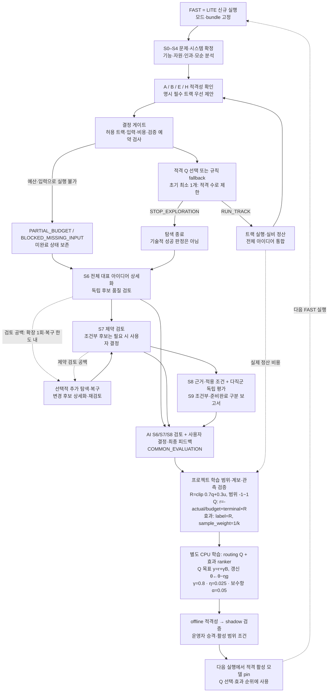
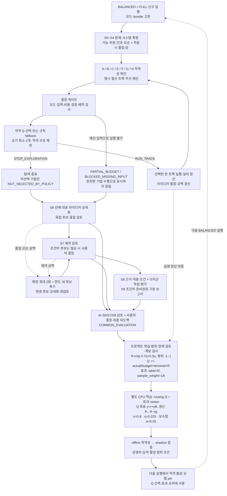
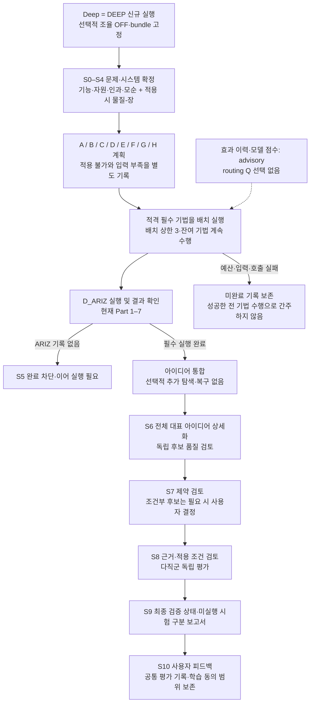

# 실행 모드: FAST · BALANCED · Deep

현재 소스의 신규 AX 실행은 `ax-run-v3` 계약을 사용한다. FAST와 BALANCED는 허용된 TRIZ 기법을 순차 선택하는 적응형 탐색이고, Deep은 ARIZ를 포함한 적용 가능한 기법을 모두 수행하는 고정 탐색이다. 세 모드 모두 생성한 후보의 품질·제약·근거·다직군 검토를 거친다. 이 문서는 저장소의 코드와 설정을 설명하며, 운영 서버의 활성 학습 모델 상태를 단정하지 않는다.

## 이름과 계약

| 이 문서의 사용자 명칭 | API·저장 상태의 `RunMode` | 현재 화면 명칭 | 신규 실행의 탐색 방식 |
| --- | --- | --- | --- |
| FAST | `LITE` | 빠른 탐색 | A/B/E/H 중 적응형 선택 |
| BALANCED | `FULL` | 표준 분석 | A/B/C/E/F/G/H 중 적응형 선택 |
| Deep | `DEEP` | 심층 분석 | A–H의 적용 가능한 기법을 모두 수행 |

FAST·BALANCED는 설명용 명칭이다. API에 전달하는 값은 `LITE`, `FULL`, `DEEP`이며 기본값은 `FULL`이다. 실행을 만들 때 모드·프롬프트·모델 설정·정책·한도를 `ax_bundle`에 고정한다. 저장된 `ax-run-v2`와 legacy 실행은 기존 계약을 유지하므로, 아래의 적응형 설명을 모든 과거 실행에 소급하지 않는다.

근거: [RunMode](../pilot/triz/schema.py#L65), [화면 선택지](https://github.com/equipment0226/triz_front/blob/5f4039073aee7a5168378d1035f18e3336980ef9/src/pages/Workspace.jsx#L155), [create_run](../pilot/triz/pipeline.py#L42), [신규 실행 설정](../pilot/config/triz.yaml#L6), [bundle·initialize](../pilot/triz/ax/runtime.py#L39).

## 기법 범위와 필수 실행

| 트랙 | 기법 | FAST | BALANCED | Deep |
| --- | --- | --- | --- | --- |
| `A_MATRIX` | 모순행렬·발명원리 | 허용 | 허용 | 필수 대상 |
| `B_SEPARATION` | 물리적 모순·분리원리 | 허용 | 허용 | 필수 대상 |
| `C_STANDARDS` | 물질-장·표준해 | 제외 | 허용 | 필수 대상 |
| `D_ARIZ` | ARIZ | 제외 | 제외 | 필수 대상 |
| `E_TRIMMING` | 트리밍 | 허용 | 허용 | 필수 대상 |
| `F_TRENDS` | 진화 경향 | 제외 | 허용 | 필수 대상 |
| `G_FOS` | 기능 중심 탐색 | 제외 | 허용 | 필수 대상 |
| `H_EFFECTS` | 효과 탐색·적용 | 허용 | 허용 | 필수 대상 |

FAST·BALANCED의 **허용**은 매번 실행한다는 뜻이 아니다. 기본 필수 트랙 목록은 비어 있으며, `explicit_required_tracks`로 지정한 기법만 개별 실행 의무가 된다. A/B도 자동 필수가 아니다. 초기 탐색의 최소 실행 수는 FAST 1개, BALANCED 2개이고, 실제 적격 트랙 수가 이보다 작으면 그 수까지 낮아진다. 모드 밖의 기법을 필수로 지정하면 실행 생성 단계에서 거절한다.

적격성은 선행 산출물로 판단한다. A는 기술적 모순, B는 물리적 모순, C는 물질-장 모델, E는 트리밍 분석이 없으면 `BLOCKED_MISSING_INPUT`이다. 물리적 적용 범위가 없는 C는 `NOT_APPLICABLE`이다. 입력 부족과 적용 불가는 구분하며, 명시 필수 트랙의 입력 부족은 정상 탐색 종료를 막는다. 적격 트랙이 하나도 없더라도 입력 부족이 남으면 `NO_APPLICABLE_TRACKS`로 처리하지 않는다.

Deep은 이 적격성 판정을 거친 필수 기법을 배치로 완료한다. `branches=3`은 한 배치의 상한이며 전체 기법 수를 3개로 줄이지 않는다. 특히 `D_ARIZ` 실행 기록과 ARIZ 결과가 없으면 S5를 완료할 수 없다. 현재 ARIZ 설정은 Part 1–7이며, Part 6은 문제 재해석 제안을 기록하고 원래 해결안의 Part 7 검증으로 진행한다.

근거: [PROFILES·pin·execution_plan](../pilot/triz/ax/mode_contract.py#L10), [적응형 proposals](../pilot/triz/ax/adaptive_tracks.py#L47), [STOP 적격성](../pilot/triz/ax/coordinator.py#L42), [필수 배치 완료](../pilot/triz/ax/coordinator.py#L224), [Deep 완료 조건](../pilot/triz/nodes.py#L1058), [ARIZ 설정](../pilot/config/triz.yaml#L63).

## 모드별 한도

금액의 내부 단위는 `microusd`이며 1 USD = 1,000,000 microusd이다. 아래 값은 현재 신규 실행 기본값으로, 실행에 고정된 bundle이 실제 적용 기준이다. 초기 생성·선택 작업의 예산과 선택적 후속 작업의 예산은 전체 한도 안의 부분 한도다.

| 설정 | FAST / LITE | BALANCED / FULL | Deep / DEEP |
| --- | --- | --- | --- |
| 전체 모델 API 비용 한도 | $2.00 | $2.00 | $2.00 |
| 초기 트랙 생성 한도 `generation_budget_microusd` | 600,000 ($0.60) | 1,200,000 ($1.20) | 적응형 초기 선택 한도 미적용 |
| 선택적 후속 작업 한도 `optional_budget_microusd` | 200,000 ($0.20) | 600,000 ($0.60) | 0 |
| 공통 검증 예약 `validation_reserve_microusd` | 120,000 ($0.12) | 120,000 ($0.12) | 120,000 ($0.12) |
| 후속 트랙 확장 `expansion_rounds` | 1 | 2 | 0 |
| 복구 반복 계산값 `recovery_targets` | 1 | 2 | 0 |
| blocker별 복구 시도 `repairs_per_blocker` | 1 | 2 | 0 |
| 복구 추가 후보 `recovery_additions` | 1 | 4 | 0 |
| 복구 선택 카운터 기준 `max_optional_rounds` | 2 | 6 | 0 |
| 선택적 조율·복구 | 켜짐 | 켜짐 | 꺼짐 |
| 효과 재정렬 | baseline, 적격 모델이 고정되면 active/shadow | baseline, 적격 모델이 고정되면 active/shadow | advisory: 원래 순서 유지 |

`max_optional_rounds`는 추가 호출을 그만큼 보장하는 값이 아니다. 복구 실행기는 `ax_optional_sequence`를 검사하며, 이 카운터는 초기 적응형 선택과 STOP 결정에서도 증가한다. 후속 트랙 탐색은 별도로 `expansion_rounds`와 예산을 검사한다. `recovery_targets` 역시 적응형 복구에서 고유 후보 수를 자르는 값이 아니라 `recovery_targets × repairs_per_blocker` 반복 한도 계산에 사용된다.

공통 실행 시간 설정은 활성 실행 누적 90분이며 provider 시도 상한은 2회다. 검증용 $0.12를 남겨도 모든 후속 검토 완료를 보장하지는 않는다. 실제 검토 호출도 전체 예산과 시간 한도의 적용을 받는다. FAST·BALANCED에서 `smart_orchestration_enabled=false`로 고정하면 routing Q와 선택적 후속 작업은 꺼지지만, 초기 적응형 트랙 선택은 규칙으로 수행한다. 효과 모델의 재정렬은 별도 설정이다.

근거: [기본 비용·시간 설정](../pilot/config/triz.yaml#L6), [모드 프로파일](../pilot/triz/ax/mode_contract.py#L10), [공통 limits](../pilot/triz/ax/runtime.py#L52), [복구 한도 적용](../pilot/triz/ax/coherence_recovery.py#L62), [후속 탐색](../pilot/triz/ax/adaptive_tracks.py#L145), [결정 카운터](../pilot/triz/ax/coordinator.py#L345), [시간 계산](../pilot/triz/pipeline.py#L166), [효과 advisory 처리](../pilot/triz/ax/effect_history.py#L295).

## FAST 흐름

FAST는 S3의 물질-장 모델 생성을 생략하고 A/B/E/H 안에서 탐색한다. 기능·자원·인과 분석과 모순 정의는 유지한다. 최소 한 트랙을 수행한 뒤 통합 결과와 예산을 보며 다음 트랙 또는 탐색 종료를 선택한다.

학습 화살표는 해당 실행 안에서 모델을 바꾸는 경로가 아니다. AI 검토와 실제 사용자 피드백이 관측·동의·계보 조건을 통과해야 학습 데이터가 되고, 다음 실행은 적격 정책이 없으면 규칙으로 동작한다. 도식의 `B`는 지원되는 다음 Q 값(terminal은 0), `g`는 TD 오차와 보수항의 평균 기울기, `k`는 후보의 연결 가능한 실제 채택 효과 수다. reward와 Q 갱신식, 효과 label·가중치는 [LEARNING.md](LEARNING.md)를 따른다.

## BALANCED 흐름

BALANCED는 물리적 적용 범위가 있으면 S3에서 물질-장 모델도 생성한다. A/B/C/E/F/G/H 중 초기 최소 두 트랙을 수행하고, 검토에서 드러난 공백에 대해 최대 두 번의 후속 트랙 확장을 허용한다. D/ARIZ는 이 모드의 학습 정책이나 fallback으로 추가할 수 없다.

AI 품질 검토만 관측된 경우와 사용자의 평가까지 관측된 경우를 구분한다. 미관측 사용자 값을 실제 피드백으로 채우지 않는다. FAST와 동일한 공통 평가·학습 경로를 사용하며 상세 수식은 [LEARNING.md](LEARNING.md)에 있다.

## Deep 흐름

Deep은 선택적 조율·후속 확장·후보 복구를 끄고 필수 기법 수행을 고정한다. routing Q가 트랙을 선택하거나 생략하지 않으며 효과 이력·모델 점수도 원래 효과 순서를 바꾸지 않는 advisory로 남는다. 공통 검토·정산·스냅샷·피드백 계약은 유지된다.

## 선택·예약·종료의 실제 의미

`coordinator.feasible()`이 먼저 허용 작업을 정한다. 모드 범위, 선행 입력, snapshot·대상 버전, 요구사항 보호, 도구, 깊이·분기·복구 한도와 예산은 학습 정책이 바꿀 수 없다. 그다음 Q가 적격 작업 사이에서 선택한다. 실제 Q 선택에는 호환되는 고정 모델, 작업별·상태 영역별 독립 문제군 각각 최소 4개, 서로 다른 지원 작업 최소 2개가 필요하다. 부족하거나 스키마·계약이 맞지 않으면 규칙 fallback, 허용 작업이 하나면 `FORCED`로 기록한다. shadow 모델은 관측만 남긴다.

적응형 규칙 fallback은 합법적인 STOP이 있고 추가 탐색 필요가 없으면 종료를 우선한다. 그렇지 않으면 실행 가능한 트랙 중 추정 비용이 가장 낮은 것을 우선한다. 비용 추정은 동의된 동일 프로젝트의 비교 가능한 완료·정산 실행을 사용하며, 표본이 없으면 고정된 모델 가격·호출 계획·출력 한도로 계산한다. 트랙 예약액은 이 사전값과 관측 비용의 최댓값이다. 이것은 Q 점수나 최종 실제 청구액과 다르다.

호출 직전 gateway가 실제 요청 크기·출력 한도·provider 시도 수로 비용을 다시 예약하고 ledger가 원자적으로 전체/초기/선택 예산을 검사한다. `remaining = limit − actual − RUNNING/UNKNOWN 예약`이며, 사용량이 미확정인 호출의 예약을 무료 잔액으로 돌리지 않는다. 비검증 호출은 공통 검증 예약을 남긴다. S7/S8/S9 및 독립 verifier 호출은 이 예약을 사용할 수 있다.

`STOP_EXPLORATION`은 **S5 탐색 단계 종료**다. 최소 탐색과 명시 필수 트랙을 충족해야 제안·실행할 수 있고, 이후 S6–S9 검토는 계속된다. 선택적 복구의 `DEFER`도 필수 검토를 건너뛰지 않는다. 예산 부족은 `PARTIAL_BUDGET`, 선행 입력 부족은 `BLOCKED_MISSING_INPUT`으로 남기며, provider 실패·UNKNOWN 사용량은 별도의 중단·복구 경로를 유지한다. 정상 정책 종료 후 미실행 허용 기법은 `NOT_SELECTED_BY_POLICY`이므로, 적응형 탐색 완료와 모든 기법 수행 완료(`method_coverage`)는 서로 다르다.

근거: [feasible](../pilot/triz/ax/coordinator.py#L42), [Q·fallback 기록](../pilot/triz/ax/coordinator.py#L311), [지원 관측 검사](../pilot/triz/ax/routing_q.py#L58), [choose](../pilot/triz/ax/routing_q.py#L227), [비용 추정](../pilot/triz/ax/track_cost.py#L110), [gateway 예약](../pilot/triz/ax/gateway.py#L30), [ledger 잔액·획득](../pilot/triz/ax/ledger.py#L295), [탐색 실행·종료](../pilot/triz/ax/adaptive_tracks.py#L77), [coverage](../pilot/triz/ax/mode_contract.py#L92).

## 모든 모드에서 유지되는 검토

1. **S6 후보 검토:** 중복 통합 후 모든 대표 아이디어에 상세화 또는 제외 사유를 배정한다. 생성 후보는 T3 독립 품질 검토와 모순·작동 기구 검사를 거친다. 같은 입력의 완료 검토는 재사용할 수 있지만, 입력이 달라진 후보는 검토를 무효화하고 다시 검토한다.
2. **S7 제약 검토:** 현재 후보의 제약별 판정을 완성하고 수치 조건을 정규화한다. `FAIL`은 제외하고, `CONDITIONAL`은 통과 수·사용자 결정 필요 여부에 따라 사용자 게이트로 보낸다. 제약이 없는 경우에도 후보별 PASS 결과를 기록한다.
3. **S8 근거·다직군 검토:** 근거와 적용 조건을 검토한 뒤 현재 설정상 4–6개 직군이 T3로 독립 평가한다. `evaluation.mode=independent`이므로 직군 간 문답 회의를 필수로 수행하지 않는다.
4. **S9 최종 판정:** 독립 품질·제약·모순 해소 연결·검증 계획·실제 등록된 시험 결과를 분리한다. 시험 계획이나 문헌만으로 시험을 수행했다고 판정하지 않는다. 미검증 의무가 남으면 조건부이며, 보고서 생성 자체가 기술적 성공을 뜻하지 않는다.

적응형 후속 탐색은 S6 뒤와 S7 뒤의 검토 공백을 근거로 수행하며 변경·추가 후보를 다시 검토한다. 사용자가 모든 후보를 명시적으로 버렸으면 `USER_DECLINED`로 두고 같은 후보군을 자율 재생성하지 않는다. 학습된 추가 규칙은 검증 계획에 의무를 덧붙일 수 있지만 보호된 요구사항을 변경하지 못한다. 추론 역할은 T2, 독립 검토는 T3로 고정하므로 FAST라고 품질 검토를 생략하거나 자동으로 낮은 모델 티어로 내리지 않는다.

근거: [전체 아이디어 검토](../pilot/triz/quality.py#L219), [독립 품질 검토](../pilot/triz/quality.py#L347), [입력 변경·재사용](../pilot/triz/ax/incremental_review.py#L14), [제약 gate](../pilot/triz/nodes.py#L1244), [다직군 설정](../pilot/config/triz.yaml#L73), [독립 평가 실행](../pilot/triz/meeting.py#L333), [최종 selection](../pilot/triz/ax/validation.py#L4), [후속 탐색](../pilot/triz/ax/adaptive_tracks.py#L145), [추가 규칙](../pilot/triz/ax/rules.py#L39), [역할 매핑](../pilot/triz/ax/mode_contract.py#L50).

피드백은 S6/S7/S8의 AI 검토와 사용자 결정·최종 평가를 공통 이벤트로 수집한다. 신규 실행의 기본 학습 범위는 `PROJECT_ONLY`이며 `NO_TRAINING`도 지원한다([create_run](../pilot/triz/pipeline.py#L59)). 별도 CPU worker가 routing Q와 효과 ranker 학습을 분리하며, offline 적격성·현재 동의·shadow 검증·운영자 승격·실행별 활성 범위를 통과한 모델을 다음 실행의 실제 선택에 사용한다. 승격 전 shadow 모델도 다음 실행 bundle에 관측용으로 들어갈 수 있지만 실행 선택을 바꾸지는 않는다. 이 경로의 이벤트, 보상식, 데이터 제외 조건과 모델 적용 조건은 [LEARNING.md](LEARNING.md)를 참고한다. 구현 근거: [feedback_events](../pilot/triz/ax/feedback_events.py#L154), [worker](../pilot/triz/ax/worker.py#L17), [registry의 실행별 모델 선택](../pilot/triz/ax/registry.py#L124), [승격 조건](../pilot/triz/ax/registry.py#L238).
