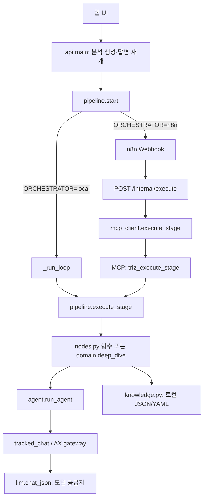

# 모듈 안내

최종 갱신: 2026-09-30. 2026-09-29 보고서 수정 이후의 코드를 기준으로 한다. 전체 구성은 [ARCHITECTURE](ARCHITECTURE.md), 단계별 호출은 [STAGES](STAGES.md), 모드와 학습 계약은 [MODES](MODES.md)·[LEARNING](LEARNING.md)을 함께 본다.

## 실행 진입점과 MCP의 위치

일반 단계 함수는 같은 Python 프로세스 안에서 호출된다. `nodes.py`가 단계마다 MCP 서버에 요청하는 구조는 아니다.

실제 연결은 [API](../pilot/api/main.py), [pipeline](../pilot/triz/pipeline.py), [MCP 클라이언트](../pilot/triz/mcp_client.py), [MCP 서버](../pilot/triz/mcp_server.py), [n8n 정의](../deploy/n8n/triz-workflow.json)에 있다. n8n은 `{run_id, stage_index, epoch}`를 전달하고 응답의 `continue_execution`이 참일 때 다음 단계를 호출한다. 단계와 도구를 고르는 별도 LLM은 사용하지 않는다.

`pipeline.PIPELINE`의 13개 항목 중 `s0_research`는 `domain.deep_dive`, 나머지는 `nodes`의 함수에 연결된다. `execute_stage()`는 실행 잠금, 예상 단계와 epoch를 확인한 뒤 함수를 호출한다. 오래된 요청은 새 상태에 커밋하지 않는다. 사용자 질문이나 실패가 생기면 상태를 저장하고 연쇄 실행을 멈춘다.

MCP에는 별도 사용을 위한 도구도 등록된다.

| 도구 | 동작과 범위 |
| --- | --- |
| `triz_execute_stage` | 저장된 실행의 한 단계를 진행한다. 내부적으로 `pipeline.execute_stage()`를 호출한다. |
| `triz_query_matrix`, `triz_get_engineering_parameters`, `triz_get_inventive_principles` | 로컬 지식을 조회한다. 행렬의 빈 셀을 임의의 원리로 채우지 않는다. |
| `triz_search_evidence`, `triz_parse_attachment` | 외부 근거 검색 또는 첨부 추출을 실행한다. |
| `triz_verify_artifact` | 결정론적 계약 검사와 설정된 검토를 실행한다. 모델 호출이 발생할 수 있다. |
| `triz_render_report` | 저장 결과로 보고서를 만들고 저장한다. 분석 단계를 진행하는 도구는 아니다. |
| `triz_s5_track_a` 등 동적 등록 도구 | `P_S*`, `P_EVIDENCE*`, `P_PERSONA_FACTORY` 프롬프트를 단독 실행한다. 실행·비용 기록과 artifact를 반환하지만 workflow의 다음 단계로 자동 이동하지 않는다. |

`TRIZ_MCP_MODULE`은 동적 프롬프트 도구의 등록 범위를 고른다. 일반 pipeline의 로컬 호출을 원격 호출로 바꾸지는 않는다. `nodes.py`의 `.schema` import는 Pydantic 데이터형이며 MCP 도구 선언이 아니다.

## 핵심 모듈의 책임

아래의 상태는 [schema.py](../pilot/triz/schema.py)의 `GlobalState`다. 단계 함수 대부분은 `RunContext`를 받아 상태의 해당 영역을 갱신하고, context와 pipeline이 기록을 저장한다.

| 모듈·주요 함수 | 입력 → 출력·저장 | 실패 처리·관련 설정 |
| --- | --- | --- |
| [api/main.py](../pilot/api/main.py): `create_run`, `resume`, `continue_run` | 인증된 요청·첨부 → 실행 ID, 상태 조회, 사용자 답변 전달 | 소유권·입력 크기·멱등 키 검사. `APP_*`, `TRIZ_APP_TOKEN`, `REQUIRE_USER_AUTH` |
| [pipeline.py](../pilot/triz/pipeline.py): `create_run`, `start`, `execute_stage` | 실행 ID·단계·epoch → 상태 envelope; 단계 완료 archive | `WAITING_HUMAN`, `INTERRUPTED`, `FAILED` 구분. 시간·금액 예산 및 중복 실행 검사 |
| [context.py](../pilot/triz/context.py): `RunContext` | 공용 상태 → 단계 기록, 이벤트, 저장, 동시 호출 제어 | `HumanInterrupt`, `BudgetExhausted`, `UsageUncertain` 등 상위 실행기에 전달 |
| [domain.py](../pilot/triz/domain.py): `deep_dive`, `sync_contract`, `physical_allowed` | 문제·첨부·산업 답변 → 도메인 설명, 물리적 범위, 탐색 문맥 | 사용자 답변 대기, 도메인별 적용 범위 유지 |
| [nodes.py](../pilot/triz/nodes.py): `s0_bootstrap`~`s10_feedback` | 이전 단계 상태 → 접수·분석·정의·탐색·제약·평가·보고서·피드백 | 하위 함수 조합과 상태 반영을 담당. 세부 호출은 [STAGES](STAGES.md) |
| [agent.py](../pilot/triz/agent.py): `run_agent`, `verify_artifact`, `tracked_chat` | prompt ID·변수·checker·rubric → 구조화 응답; step/call 기록 | 정규화→결정론 검사→설정된 독립 검토→보정. 계정·공급자 오류와 예산 소진은 중단 |
| [llm.py](../pilot/triz/llm.py): `chat_json` | system/user 메시지·tier 설정 → `LLMResult`의 JSON, 원응답, usage, 모델·비용 정보 | JSON 오류·출력 잘림의 제한된 재시도. `LLM_*`, `COST_*` |
| [prompts_registry.py](../pilot/triz/prompts_registry.py): `raw`, `render` | Markdown 프롬프트·변수 → 호출 본문 | 파일 mtime 캐시, 프런트매터 제거, 명시된 구버전 호환 보정. AX는 `runtime.render_prompt()` 경유 |
| [digest.py](../pilot/triz/digest.py), [coerce.py](../pilot/triz/coerce.py) | 상태·응답 → 작은 입력 packet, typed 데이터 | 사실·제약·원안 계보를 유지하며 모델 응답을 후속 계약에 맞춘다 |
| [verify.py](../pilot/triz/verify.py) | 기능/인과/모순/기법 결과 → 계약 오류 목록·제약 결과 정규화 | ID·필수 항목·금지사항 검사. 결정론 검사와 T3 검토는 서로 다른 절차 |
| [separation_contract.py](../pilot/triz/separation_contract.py), [catalog_binding.py](../pilot/triz/catalog_binding.py) | 실행별 카탈로그·생성 응답 → 정식명칭·출처·원리 선택 정책과 연결된 적용안 | 7접근·구버전 4접근 계약 구분. 미등록 번호·유형 오류를 통과시키지 않는다 |
| [idea_consolidation.py](../pilot/triz/idea_consolidation.py): `consolidate` | 원안 목록 → 통합 대표안·보류안 및 원본 계보 | 중복 통합에서 누락·중복 분할 검사. 원안을 새로 지어내지 않는다 |
| [quality.py](../pilot/triz/quality.py): `generate_concepts`, `audit_concepts` | 검토 대상 원안 → 개념 명세·원안 ID 연결·독립 품질 상태 | 생성과 검토를 분리. 미완료 필수 검토는 미확인으로 남거나 재개 대상으로 중단 |
| [personas.py](../pilot/triz/personas.py), [meeting.py](../pilot/triz/meeting.py): `build_personas`, `evaluate` | 산업·해결안·근거 → 검토자, 점수, 직군별 의견 | 평가 대상 누락·응답 형식 검사, 완료 묶음 재사용. `evaluation.*`, `personas.yaml` |
| [evidence.py](../pilot/triz/evidence.py): `discover`, `attach` | 문제/해결안 → 검색 계획·특허/논문·적용성 연결 | 검색 상태와 오류를 보존. 검색 성공과 해결안 적용성 충족을 구별. `evidence.*` |
| [rag.py](../pilot/triz/rag.py): `write_feedback`, `retrieve`, `prior_cases_block` | 사용자 피드백·질의 → 권한·최신성 확인된 이전 사례 | 취소·수정된 평가 및 접근 범위를 확인. 저장된 사례를 실제 사용했을 때 출처 기록 |
| [store.py](../pilot/triz/store.py): `save_state`, `save_step`, `save_call`, `archive` | typed 상태·기록 → SQL과 실행별 파일 archive | MySQL 잠금 또는 SQLite 프로세스 잠금. 파일은 임시 파일 후 교체. DB·파일 저장 오류를 숨기지 않는다 |
| [events.py](../pilot/triz/events.py), [presentation.py](../pilot/triz/presentation.py): `emit`, `view` | 상태·이벤트 → SSE/저장 이벤트, UI용 읽기 모델 | 내부 ID를 사용자 명칭으로 변환. AX 완료 보고서는 고정된 산출물로 투영 |

## 로컬 지식 자산

[knowledge.py](../pilot/triz/knowledge.py)는 `pilot/triz/knowledge/`의 JSON/YAML을 읽는다. 파일이 바뀌면 mtime·크기 기반 캐시 키가 달라진다. 이 함수 호출 자체에는 모델 추론이나 MCP 통신이 없다.

| 자산 | 주요 접근 함수·의미 |
| --- | --- |
| [params_39.json](../pilot/triz/knowledge/params_39.json), [params_biz_31.json](../pilot/triz/knowledge/params_biz_31.json) | `params(scheme)`, `param_name()`. `scheme: str = 'ENG_39'`는 문자열 인자의 기본값이다. `BIZ_31`이면 비즈니스 31개, 그 외에는 공학 39개 파일을 읽는다. |
| [principles_40.json](../pilot/triz/knowledge/principles_40.json), [matrix_39x39.json](../pilot/triz/knowledge/matrix_39x39.json) | `principles()`, `lookup_matrix()`. 실제 행렬 결과와 `LLM_FALLBACK`을 구분한다. Track A의 별도 후보 생성은 노드 계층에서 한다. |
| [standards_76.json](../pilot/triz/knowledge/standards_76.json) | 76개 부모 표준해, 공식 하위 11개, 번호 없는 대안 76개, 발전 순서 13묶음. `candidate_standards()`의 탐색 태그는 적용 가능 판정이 아니다. 각 원전 조건을 따로 확인한다. |
| [separation.json](../pilot/triz/knowledge/separation.json), [separation_legacy_v1.json](../pilot/triz/knowledge/separation_legacy_v1.json) | 5가지 분리와 2가지 보완 접근의 최신 카탈로그 및 과거 4접근 자료. `separation_contract.catalog_for(state)`로 실행별 버전을 선택한다. |
| [trends.json](../pilot/triz/knowledge/trends.json), [ariz_85c.yaml](../pilot/triz/knowledge/ariz_85c.yaml) | 진화 트렌드와 ARIZ Part/필수 단계 정의 |
| [effects.json](../pilot/triz/knowledge/effects.json), [effects_sources.json](../pilot/triz/knowledge/effects_sources.json) | 과학효과와 출처. `effect_catalog.select_effects()`로 기능 관련 후보를 찾고 AX가 실행 시점에 허용된 이력으로 재정렬할 수 있다. |

과학효과 수집·검수·발행은 `effect_mining.py`, `effect_review.py`, `effect_manual_review.py`, `effect_source_pages.py` 및 관련 scripts의 별도 작업이다. 분석 중 후보 선택과 지식 DB의 운영 갱신을 같은 작업으로 취급하지 않는다.

## AX와 비용·학습 기록

| 모듈 | 책임 |
| --- | --- |
| [ax/runtime.py](../pilot/triz/ax/runtime.py), [execution_config.py](../pilot/triz/execution_config.py) | 새 실행에 모델 설정·프롬프트·루브릭·효과·분리 카탈로그·실행 계약을 bundle로 고정하고 단계 산출물을 체크포인트에 연결한다. 현재 코드의 명시적 호환 처리와 저장된 bundle을 구분한다. |
| [ax/ledger.py](../pilot/triz/ax/ledger.py) | `ax_*` 테이블의 산출물 버전, 부모 관계, snapshot, epoch, task/attempt, 비용 예약·정산, decision/review/event/outbox 관리 |
| [ax/gateway.py](../pilot/triz/ax/gateway.py), [ax/usage_recovery.py](../pilot/triz/ax/usage_recovery.py) | 호출 전 예약, 실제 usage 정산, 중복 실행·응답 유실 관리. UNKNOWN을 무료 실패로 간주하지 않는다. |
| [ax/mode_contract.py](../pilot/triz/ax/mode_contract.py), [ax/adaptive_tracks.py](../pilot/triz/ax/adaptive_tracks.py), [ax/routing_q.py](../pilot/triz/ax/routing_q.py) | 모드별 허용/필수 집합, 다음 트랙·보완·종료 제안, 학습 정책 또는 명시적 fallback 선택 |
| [ax/coordinator.py](../pilot/triz/ax/coordinator.py), [ax/validation.py](../pilot/triz/ax/validation.py), [ax/recovery.py](../pilot/triz/ax/recovery.py) | 필수 검토, 후보 상태, 제한된 보완 및 종료 판단 |
| [ax/feedback_events.py](../pilot/triz/ax/feedback_events.py), [ax/effect_history.py](../pilot/triz/ax/effect_history.py), [ax/learning_outcomes.py](../pilot/triz/ax/learning_outcomes.py) | 사용자·AI 평가를 출처·시점·대상 ID와 함께 기록하고 학습 효용의 근거를 만든다 |
| [ax/learning.py](../pilot/triz/ax/learning.py), [ax/effect_ranker.py](../pilot/triz/ax/effect_ranker.py), [ax/registry.py](../pilot/triz/ax/registry.py) | 학습 가능한 실제 데이터 선별, Track Q와 과학효과 모델 학습·평가·버전 선택. 보상 상세는 [LEARNING](LEARNING.md) |
| [ax/outbox.py](../pilot/triz/ax/outbox.py), [ax/worker.py](../pilot/triz/ax/worker.py), [ax/service.py](../pilot/triz/ax/service.py) | 저장된 이벤트를 별도 CPU 프로세스에서 소비한다. `tick()`은 DB를 갱신하지만 외부 LLM을 호출하지 않는다. |
| [ax/report.py](../pilot/triz/ax/report.py) | 저장된 산출물·선택 버전으로 완료 보고서를 투영한다. 후속 피드백이 과거 보고서의 기술 검증 결과를 바꾸지 않는다. |

정책 코드가 있거나 학습 모델이 생성되었다는 사실만으로 비용 절감이나 품질 향상을 입증하지는 않는다. 실행·선택·평가·정산 기록을 함께 확인해야 한다.

## 검색과 보고서

특허 검색은 [tools/scholar.py](../pilot/triz/tools/scholar.py)의 provider 선택을 거친다. 기본 `PATENT_SEARCH_PROVIDER=vector`에서는 [vector_patents.py](../pilot/triz/tools/vector_patents.py)가 고정된 E5 모델로 임베딩을 만들고 Qdrant 검색 후 [patent_corpus.py](../pilot/triz/patent_corpus.py)의 전용 SQL DB에서 서지를 가져온다. 이 설정에서 BigQuery로 자동 전환하지 않는다. `bigquery`를 명시한 별도 경로와 공개 검색 경로도 코드에 존재한다. `EMPTY`, `PARTIAL`, `UNAVAILABLE`, `UNKNOWN`을 빈 결과 하나로 합쳐 해석하지 않는다.

[render.py](../pilot/triz/render.py)는 템플릿으로 Markdown/HTML을, [visuals.py](../pilot/triz/visuals.py)는 저장된 분석으로 SVG를, [report_content.py](../pilot/triz/report_content.py)는 장·본문·도식 블록을 만든다. 표현 정리는 [labels.py](../pilot/triz/labels.py), [display_terms.py](../pilot/triz/display_terms.py), [report_style.py](../pilot/triz/report_style.py)에 있다.

- 분리 접근 보고서는 적용 가능한 저장안마다 [separation_application_diagrams.py](../pilot/triz/separation_application_diagrams.py)를 사용한다. 같은 접근의 서로 다른 안도 별도로 그리며, 미적용 검토는 표에 남긴다. 도식은 기법별 아이디어 섹션에만 표시하고 최종 해결안 섹션에는 반복하지 않는다.
- 표준해 보고서는 저장된 `resulting_model`/`resulting_su_field`가 있을 때만 [standard_application_diagrams.py](../pilot/triz/standard_application_diagrams.py)의 실제 전후 도식을 쓴다. 구조가 없으면 일반 도식으로 채우지 않는다.
- 소개 자료의 일반 76개·상세 100개는 [standard_diagrams.py](../pilot/triz/standard_diagrams.py)의 별도 설명용 API다. 보고서에 그 일반 자료를 일괄 삽입하지 않는다.

독립 특허 작성 기능은 별도 상태·작업 티켓·MCP/API를 가진다. 연동과 운영 계약은 [pilot/patent_draft/README.md](../pilot/patent_draft/README.md)를 따른다.
