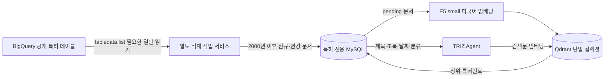

# 특허 저장소와 운영 커맨드

현재 기본 경로는 **Agent → 다국어 임베딩 → Qdrant 전체 산업 검색 → MySQL 일괄 조회**이다. BigQuery는 운영자가 실행하는 데이터 수집에만 사용한다. `PATENT_SEARCH_PROVIDER=vector`에서는 검색 실패 시 BigQuery나 특허 웹 검색으로 자동 전환하지 않는다.



## 저장 데이터

- 기준은 **공개일 2000-01-01 이상**이다. 등록 특허뿐 아니라 공개 출원도 포함한다. 같은 특허군은 검색 결과에서 중복 제거한다.
- MySQL: 원본 공개번호, 특허군, 국가, 문서종류, 공개·출원·우선일, 제목, 초록, 언어, 출원인, CPC/IPC. JSON을 압축 저장한다. 제목은 최대 1,500자, 초록은 24,000자이며 초과 여부를 기록한다. 제목이 없는 문서는 검색 대상으로 적재하지 않는다.
- 명세서 전체, 청구항, 도면, 전체 인용망은 저장하지 않는다. 따라서 상세 조회는 **보관한 검색용 서지·초록 정보**이며 특허 원문 전체를 의미하지 않는다.
- 영어가 있으면 우선 보관하며, 없으면 한국어 또는 제공된 언어를 보관한다. 초록은 가능한 한 제목 언어를 맞춘다.
- Qdrant: 특허당 384차원 벡터 하나와 공개번호·특허군·국가·날짜·CPC/IPC. 제목+초록의 앞쪽 최대 512 모델 토큰이 임베딩에 사용된다. 전체 초록은 MySQL에 남는다. 긴 명세서 수준의 검색 회수율을 제공하는 구성은 아니다.
- 산업별 컬렉션이나 검색 필터를 강제하지 않는다. 원본 CPC/IPC를 자동 분류 메타데이터로 사용하며, LLM으로 TRIZ 원리 라벨을 추정하여 붙이지 않는다.

임베딩은 공식 `intfloat/multilingual-e5-small`의 ONNX int8 파일, 커밋 `614241f622f53c4eeff9890bdc4f31cfecc418b3`을 고정한다. mean pooling 및 L2 정규화를 적용하고 검색문에는 `query: `, 문서에는 `passage: `를 붙인다. 외부 임베딩 API의 건당 요금은 없지만 Railway CPU·RAM·저장소 비용은 발생한다.

## 실행

로컬 저장소 루트에서 실행한다. 이 저장소에 설치된 Railway CLI 및 기존 로그인/프로젝트 연결을 사용한다. 로컬 PC는 Railway 내부 DNS에 직접 접속하지 않으며 실제 처리는 Railway 안에서 실행한다.

```powershell
# 연결·다운로드 표본·대략적인 용량 확인 (과금 SQL 없음)
.venv/Scripts/python.exe deploy/patents.py probe

# 1. MySQL 적재만: 표본 10페이지, 이후 같은 커맨드로 이어서 실행
.venv/Scripts/python.exe deploy/patents.py import --max-pages 10

# 2. 아직 임베딩되지 않은 문서 적재
.venv/Scripts/python.exe deploy/patents.py index --max-batches 10

# 3. 원본 갱신 확인 → MySQL 신규·변경 문서 반영 → 벡터 반영
.venv/Scripts/python.exe deploy/patents.py sync --max-pages 10

# 장시간 전체 적재/정기 갱신은 별도 작업 서비스에서 실행
# 이 커맨드는 재배포를 시작하고 반환한다. 완료를 의미하지 않는다.
.venv/Scripts/python.exe deploy/patents.py start

.venv/Scripts/python.exe deploy/patents.py status
.venv/Scripts/python.exe deploy/patents.py benchmark
```

`--max-pages=0`, `--max-batches=0`은 제한 없음이다. 긴 작업을 API 컨테이너에서 실행하면 CPU를 공유하므로, 전체 적재는 `start`를 사용한다. 이미 작업 중일 때는 `start`를 반복하지 않는다. 작업 서비스는 성공 시 종료하며 예약 실행은 자동 설정하지 않는다. 이후 필요할 때 같은 `start` 명령을 실행한다. 장애 시 마지막 커밋부터 재개한다.

컨테이너에서는 `/app/pilot`에서 `python scripts/patent_corpus.py import`, `index`, `sync`, `status`, `benchmark`를 직접 사용할 수 있다. 운영 점검은 `status`의 `source.complete`, `source.scanned`, `source.accepted`, `pending`을 확인한다. 원본 전체 순회 완료 및 `pending=0`이 되어야 최초 구축 완료다. `status`의 전체 행 개수 집계는 대규모에서는 시간이 걸릴 수 있으므로 사용자 요청 경로에서 호출하지 않는다.

## 갱신의 범위와 비용

확인한 원본 `patents-public-data.patents.publications`는 날짜 파티션이 없고, 행별 변경 커서도 제공하지 않는다. 공개일 최댓값 이후만 수집하면 늦게 추가된 과거 특허를 놓친다. 따라서 다음과 같이 동작한다.

1. 원본 테이블 수정 시각·행 수가 같고 직전 순회가 완료되었으면 데이터 다운로드를 생략한다.
2. 최초 또는 원본 갱신 시 필요한 열을 페이지 단위로 순회한다. SQL 분석 쿼리를 제출하지 않는다.
3. 보관된 내용의 해시가 같은 문서는 SQL 쓰기와 임베딩을 생략한다. 없거나 변경된 문서만 upsert하고 `pending`으로 표시한다.
4. Qdrant 저장 완료 응답 후에만 `pending`을 해제한다. 같은 특허의 벡터 ID는 항상 같아 재시도해도 중복되지 않는다.
5. 문서와 페이지 토큰을 같은 MySQL 트랜잭션으로 커밋한다. 순회 중 원본 버전이 달라지면 중단하고 다음 실행에서 새 버전을 처음부터 확인한다.

**BigQuery에서 없는 특허만 서버 측으로 걸러 내려받는 방식은 아니다.** 추가 스캔 요금을 피하는 대신, 원본 갱신 시 필수 메타데이터를 다시 읽고 MySQL에서 차이를 판별한다. 네트워크 전송과 작업 시간은 필요하다. 데이터 삭제는 자동 전파하지 않으며 공개 원본에서 사라진 기존 특허도 보관한다.

Google의 [테이블 데이터 관리](https://docs.cloud.google.com/bigquery/docs/managing-table-data) 및 [tabledata.list API](https://docs.cloud.google.com/bigquery/docs/reference/rest/v2/tabledata/list)를 사용한다. `LIMIT`이나 날짜 조건이 쿼리 스캔 비용을 줄여준다고 가정하지 않는다.

## 용량과 속도

- 제공된 MySQL은 250GB이다. 기본 `PATENT_DB_MAX_BYTES=200000000000`으로 원문 압축 크기·문서별 여유 공간 및 MySQL 테이블 크기를 확인하고 여유분을 남긴다. 이 검사는 볼륨 실사용량을 완벽하게 측정하는 하드 쿼터가 아니므로 Railway 볼륨 사용량도 확인한다. 특히 MySQL binary log·redo·undo·백업은 별도 공간이 필요하다.
- Qdrant 볼륨은 MySQL과 별도이며, 2026-09-09 사용자가 **50GB에서 250GB로 확장**한 것을 Railway API로 확인했다. 384차원 float32 원본만으로 1천만 건당 약 15.36GB, int8 양자화 복사본은 약 3.84GB가 추가된다. HNSW·payload·WAL·최적화 임시 공간은 추가다.
- 현재 운영 상한은 **`PATENT_VECTOR_MAX_POINTS=50000000`(5천만 건)**이다. 250GB 볼륨에 여유 공간을 남기는 보수적 상한이며, 전체 특허를 분할하거나 제외하는 필터가 아니다. 상한을 넘는 배치는 `PATENT_VECTOR_CAPACITY_LIMIT`으로 일시 중단한다. 백엔드 변수에 설정하고 작업 서비스는 `${{triz_backend.PATENT_VECTOR_MAX_POINTS}}`로 참조해 이후 배포에서도 일치시킨다. 코드의 미설정 기본값은 최초 50GB 설치용인 1천만 건이다. 표본 1,000건을 단순 외삽한 float32 벡터 크기는 약 119.6GB였지만 표본은 무작위가 아니므로, 추가 상한 조정은 실제 디스크 사용량을 확인한 후 수행한다.
- 볼륨 확장이 필요하면 Railway 프로젝트 → `triz-patent-vectors`에 붙은 볼륨 → Settings → Live Resize에서 확장한다. 조회한 공개 CLI/API에는 크기 변경 입력이 없어 자동 확대하지 않았다. [Railway 볼륨 설명](https://docs.railway.com/volumes/reference)을 참고한다.
- 전체 산업을 한 컬렉션에서 검색한다. 벡터·HNSW·payload는 디스크에 보관하고 int8 양자화와 상위 후보 원본 재채점을 사용한다. 양자화 벡터를 모두 RAM에 고정하지 않으므로 전체 데이터 규모에서 RAM·SSD 성능이 지연에 영향을 준다. [Qdrant 용량 계획](https://qdrant.tech/documentation/capacity-planning/)을 참고한다.
- 쿼리들을 한 번에 임베딩하고 Qdrant 배치 요청 후 MySQL `IN` 조회로 일괄 복원한다. 임베딩 모델은 API 시작 때 미리 읽는다.
- `benchmark`는 첫 호출과 준비된 모델의 반복 배치 지연을 구분한다. 작은 표본 결과는 전체 규모의 속도·회수율 보장이 아니다. 실제 전 산업 평가 질의와 관련 특허 정답집으로 회수율을 확인해야 한다. 기본 `PATENT_MIN_SCORE=0.75`는 초기값으로, 관련성 확률이나 검증된 품질 기준이 아니다.

## 다운로드 또는 연결 실패 시

1. 로컬에서는 `deploy/patents.py probe`로 실행한다. `mysql-mggl.railway.internal`은 프로젝트 내부 DNS이므로 로컬 MySQL 클라이언트로 직접 연결하지 않는다.
2. `triz_backend`와 작업 서비스에 `BIGQUERY_PROJECT_ID`, `BIGQUERY_LOCATION=US`, `GOOGLE_SERVICE_ACCOUNT_JSON`이 존재하는지 확인한다. Google 로그인 OAuth 키와 BigQuery 서비스 계정 키는 서로 다르다.
3. Google Cloud 콘솔에서 해당 프로젝트의 BigQuery API가 활성화되어 있는지, 서비스 계정이 공개 원본을 읽을 수 있는지 확인한다. 이 수집 방식은 과금 SQL 분석 작업을 제출하지 않으므로 기존 SQL 무료 한도 초과와 구분해서 진단한다.
4. 무료 크레딧이 다른 프로젝트의 결제 계정에 활성화되어 있지 않은지 확인한다. 별도 SQL 방식으로 수집을 바꾸는 경우 dry run과 청구 바이트 상한부터 확인한다.
5. `Forbidden`/`Unauthorized`이면 원본 접근·서비스 계정·API 설정을 확인한다. `TooManyRequests`이면 잠시 후 재시작한다. 저장된 토큰부터 재개된다.
6. `SOURCE_CHANGED_RESTART_IMPORT`이면 같은 커맨드를 다시 실행한다. 새 원본을 처음부터 읽지만 기존 문서의 중복 임베딩은 생략한다. `PATENT_DATABASE_CAPACITY_LIMIT`이면 용량과 로그 사용량을 확인하고 확장 후 상한을 조정한다.
7. `INDEX_CONFIG_CHANGED_REBUILD_REQUIRED` 또는 `VECTOR_COLLECTION_MISSING_REBUILD_REQUIRED`는 기존 인덱스와 DB 상태가 다르다는 의미다. 임의로 체크포인트를 삭제하지 말고 MySQL에서 새 컬렉션 전체 재색인을 계획한다. 기존 모델·컬렉션 설정 복원은 재색인 없이 가능하다.

## Railway 연결 변수

2026-09-09 확인: API·Qdrant·작업 서비스 배포 성공. 실제 BigQuery 메타데이터 1,000건 다운로드, MySQL 적재, 벡터 색인 및 SQL 상세 복원을 검증했다. BigQuery 연결 함수를 차단한 상태에서도 저장 특허 3건의 제목+초록 검색에서 같은 특허/특허군이 검색되었다. 작은 초기 코퍼스의 검색문 4개 배치에서 첫 호출 2,945ms, 준비된 모델의 반복 평균 47ms·최대 111ms였다. 전체 적재·전 산업 회수율 검증은 완료되지 않았다.

전체 적재는 장시간 작업이다. 실제 문서 길이·CPU·Qdrant 색인 작업에 따라 처리 속도가 달라지므로 초기 몇 페이지의 속도를 완료 시간으로 확정하지 않는다. 작업 서비스 로그와 Railway 리소스 사용량으로 진행을 확인한다. 현재 Qdrant 상한은 5천만 건이며, 전체 적격 특허가 이를 넘으면 실사용량을 확인해 상한을 추가 조정해야 한다. 볼륨 확장이 전체 적재 완료를 의미하지는 않는다.

이번 배포는 로컬 소스를 Railway CLI로 업로드했다. GitHub에는 커밋/푸시하지 않았다. 다음 GitHub 자동 배포 전에 `release/triz_backend`의 변경을 저장소에 반영해야 이전 코드로 돌아가지 않는다.

`triz_backend`의 기존 `DATABASE_URL`/`MYSQL*`는 앱 데이터용으로 유지한다.

```text
PATENT_SEARCH_PROVIDER=vector
PATENT_DATABASE_URL=${{MySQL-mGgL.MYSQL_URL}}
QDRANT_URL=http://${{triz-patent-vectors.RAILWAY_PRIVATE_DOMAIN}}:6333
QDRANT_API_KEY=${{triz-patent-vectors.QDRANT__SERVICE__API_KEY}}
PATENT_VECTOR_COLLECTION=patents_e5_small_v1
PATENT_DB_MAX_BYTES=200000000000
PATENT_VECTOR_MAX_POINTS=50000000
```

Qdrant API 키는 생성 시 난수로 설정한다. MySQL·Qdrant 비밀값은 소스에 기록하지 않는다. [Railway private networking](https://docs.railway.com/networking/private-networking)으로 연결하며 두 저장소의 공개 엔드포인트를 새로 만들지 않는다.
