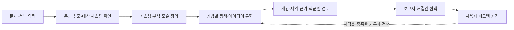

# TRIZ Studio 기획안

기준일: 2026-09-30. 이 문서는 현재 구현된 제품을 설명합니다. 작업 계획과 배포 이력은 [변경 기록](CHANGELOG.md)에 구분해 둡니다.

## 어떤 일을 돕나요?

TRIZ Studio는 기술 문제를 입력하면 해결해야 할 모순을 정리하고, 여러 TRIZ 기법으로 해결안을 만든 뒤 제약과 근거를 검토하는 도구입니다. 사용자는 시스템 범위를 확인하고, 보류할 해결안을 결정하며, 마지막에 실제 적용 가능성과 보완할 점을 남깁니다.

핵심 목표는 **필수 검토 품질을 유지하면서 총 추론비용을 줄이는 것**입니다. 코드에 Q-learning이 있거나 가중치가 달라졌다는 사실만으로 이 목표를 달성했다고 판단하지 않습니다. 같은 조건의 분석에서 실제 비용, 검토 누락, 근거 적합성, 사용자 평가를 함께 비교해야 합니다.

## 사용자가 얻는 결과

| 결과 | 담는 내용 |
|---|---|
| 확인된 문제 | 대상 시스템, 범위, 증상, 목표, 사용자 제약 |
| 분석 모델 | 9-Windows, 기능 관계, 물질-장 모델, 자원, 원인 가설 |
| 해결 방향 | 이상해결책, 기술적·물리적 모순, 핵심문제, 트리밍 후보 |
| 해결안 | 사용 기법, 작동 원리, 필요한 조건, 검증 계획, 원본 아이디어 연결 |
| 검토 결과 | 독립 품질 검토, 제약 판정, 근거 적용성, 직군별 평가와 순위 |
| 보고서 | 저장된 분석·검토·해결안을 바탕으로 한 본문과 도식, HTML·Markdown·ZIP 출력 |
| 다음 분석에 쓸 기록 | 사용자 피드백, 공통 평가, 실제 사용량, 학습 버전과 선택 근거 |

보고서는 개념 검토 결과입니다. 실험하지 않은 효과를 실증으로 표시하거나, 특허를 찾았다는 이유만으로 적용 가능성을 확정하지 않습니다. `CONDITIONAL`과 미확인 조건은 사용자가 안을 유지해도 남습니다.

## 기본 사용 흐름

각 단계의 입출력과 검증 경로는 [Stage 흐름](STAGES.md), 화면 사용법은 [사용 안내](USAGE.md)를 참고하세요.

## 세 가지 분석 모드

화면의 빠른·표준·심층은 API에서 각각 `LITE`·`FULL`·`DEEP`입니다. **`FULL`은 표준이며 심층이 아닙니다.** 문서에서 FAST/BALANCED라고 부르는 경우도 이 둘을 뜻합니다.

| 화면 | 탐색 방식 | 공통으로 지키는 조건 |
|---|---|---|
| 빠른 | 허용된 A/B/E/H 중 Q 정책 또는 명시적 fallback으로 선택 | 필요한 초기 탐색과 지정 기법을 수행하고 검토 예산을 남김 |
| 표준 | 허용된 A/B/C/E/F/G/H 중 Q 정책 또는 fallback으로 선택 | 제약·근거·평가를 확인하며 필요한 보완을 선택 |
| 심층 | 등록된 A–H 전체 기법을 수행하도록 계획 | ARIZ를 포함한 전체 탐색; 필수 기법을 Q로 생략하지 않음 |

이 표는 현재 신규 AX 실행의 기본 계약입니다. 빠른·표준에서 “허용”은 “모두 실행”을 뜻하지 않습니다. 심층도 적용 불가, 선행 입력 부족, 실패·예산 중단을 별도로 기록하며 미실행 기법의 결과를 만들지 않습니다. 모드별 예산, 종료 조건, 기존 실행과의 호환 범위는 [모드 설계](MODES.md)에 정리했습니다.

## 사용자 결정과 자동화의 경계

- 사용자 확인은 문제 범위, 역질의 답변, 제약에서 보류된 안의 유지·제외, 최종 해결안 피드백에 남습니다.
- AI 검토는 검토 근거와 판정을 저장합니다. 사용자의 keep은 약한 긍정 효용이며 기술적 PASS로 바뀌지 않습니다.
- AX는 산출물 버전, 의존관계, 검토, 보완 실행, 예산, 선택을 연결합니다. Q-learning은 그 안에서 다음 행동을 고르는 학습 방식입니다.
- 새 분석의 기본 학습 동의는 `PROJECT_ONLY`입니다. API의 `NO_TRAINING`도 유지합니다. 실제 학습 범위와 다른 분석에서의 사용 조건은 [학습 설계](LEARNING.md)를 따릅니다.
- 공개 사례 동의와 학습 동의는 별개입니다. 현재 인증이 켜진 베타의 새 분석은 공개 동의를 요구하며, 공개 조회는 읽기 전용입니다.

## 현재 범위와 연결 기능

TRIZ 정본에는 39 공학 파라미터, 31 비즈니스 파라미터, 40 발명원리, 모순행렬, 76표준해, 분리 5가지와 보완 2가지, 진화 경향, 과학효과, ARIZ 절차가 있습니다. LLM의 기억으로 정본 번호와 정의를 대체하지 않습니다.

과학효과 카탈로그에는 물리·화학·기하·생물·정보 분야의 원리와 필요 조건이 있습니다. 특허·논문 검색은 실제 자료를 수집하고 해결안과의 관계를 검토합니다. Introduction의 일반 도식과 보고서의 문제별 적용 도식은 용도가 다릅니다. 보고서의 분리 접근은 저장된 적용안으로, 표준해는 저장된 결과 모델이 있을 때 실제 전후 도식으로 표현합니다.

선택 해결안에서 특허 초안을 작성하는 기능도 별도 모듈로 연결됩니다. TRIZ 분석의 특허검색 단계와 특허 명세서 작성 프로세스는 구별합니다. 자세한 흐름은 [특허 작성 모듈](../pilot/patent_draft/README.md)에 있습니다.

## 개선 여부를 판단하는 방법

1. 같은 문제·모드·평가 기준으로 비교 대상을 고정합니다.
2. 저장된 LLM 사용량과 비용을 집계합니다. 사용량 미확인은 0으로 바꾸지 않습니다.
3. 제약 누락, 미확인 조건의 오판, 근거 없는 효과, 검토 누락을 확인합니다.
4. 사용자 평가와 유지·선택 기록을 연결하고, 어느 효과·행동에 실제 귀속됐는지 확인합니다.
5. 학습 생성, 정책 승격, 다음 실행에서의 사용을 각각 확인합니다.

이번 문서 정비의 검증 범위와 아직 측정하지 않은 항목은 [검증 기록](VALIDATION.md)에 적었습니다.
