# 분석 단계와 검증 흐름

이 문서는 2026-09-30 작업 트리의 실행 코드를 기준으로 UI 단계, 함수 호출 순서, 입출력과 검증 지점을 연결한다. 실행 순서의 정본은 [`pipeline.PIPELINE`](../pilot/triz/pipeline.py)이다. 모드별 실행 계약은 [MODES.md](MODES.md), 평가·피드백의 학습 경로는 [LEARNING.md](LEARNING.md), 모듈별 책임은 [MODULES.md](MODULES.md)를 함께 본다.

## 전체 흐름

UI에는 **13개 단계**가 있다. S0와 S8은 각각 두 단계로 나뉜다. 아래 순번은 UI 실행 순서이며 `control.stage_index`는 0부터 시작한다.

| 순번 | UI 단계 | Pipeline key | 실행 함수 |
|---|---|---|---|
| 1 | 실행 계획 | `s0_bootstrap` | `nodes.s0_bootstrap` |
| 2 | 산업·기술 심층 검토 | `s0_research` | `domain.deep_dive` |
| 3 | 문제 추출·역질의 | `s1_intake` | `nodes.s1_extract` |
| 4 | 대상 시스템 확정 | `s2_confirm` | `nodes.s2_confirm` |
| 5 | 시스템·기능·자원·인과 분석 | `s3_analyze` | `nodes.s3_analyze` |
| 6 | 이상해결책·모순 정의 | `s4_define` | `nodes.s4_define` |
| 7 | 다중 기법 해결책 탐색 | `s5_solve` | `nodes.s5_solve` |
| 8 | 개념 구체화 | `s6_concept` | `nodes.s6_concept` → `quality.generate_concepts` |
| 9 | 제약 검토 | `s7_gate` | `nodes.s7_gate` |
| 10 | 근거 자료·적용 조건 검토 | `s8_references` | `nodes.s8_references` → `evidence.attach` |
| 11 | 다직군 평가 | `s8_evaluate` | `nodes.s8_evaluate` → `meeting.evaluate` |
| 12 | 시각화 보고서 | `s9_report` | `nodes.s9_report` |
| 13 | 피드백 | `s10_feedback` | `nodes.s10_feedback` → `nodes.record_feedback` |

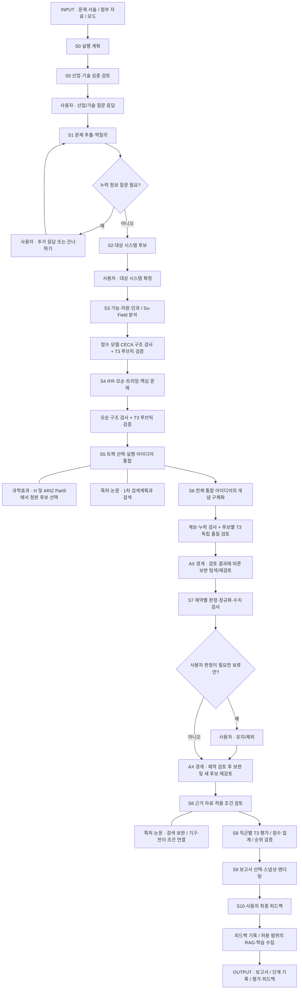

점선에 준하는 보조 연결(`---`)은 해당 단계의 내부 작업을 뜻한다. 과학효과 선택과 특허검색은 별도의 최상위 Stage가 아니다. `STOP_EXPLORATION`은 S5 탐색 종료이며 S6·S7·S8의 필수 검토를 생략하는 명령이 아니다. 보완 경로는 실행 계약과 예산이 허용할 때만 수행한다.

## 공통 실행·검증 규칙

[`pipeline.execute_stage`](../pilot/triz/pipeline.py)는 실행 잠금, epoch와 Stage index, 대기 상태를 확인한 뒤 `ax.runtime.before_stage`와 실제 Stage 함수를 호출한다. 성공하면 Stage index를 증가시키고 체크포인트를 저장한다. `HumanInterrupt`는 `WAITING_HUMAN`으로 저장하며 `pipeline.resume`는 응답을 `scratch.resume_payload`에 넣고 **대기했던 동일 Stage**를 다시 실행한다. 예산·사용량 불확실·검토 미완료·공급자 오류는 별도의 중단 경로를 가진다. 재개는 기존 실행의 사용량과 예산을 유지한다.

[`agent.run_agent`](../pilot/triz/agent.py)의 공통 경로는 다음과 같다. 모든 노드에 모든 검사기가 붙는 것은 아니다.

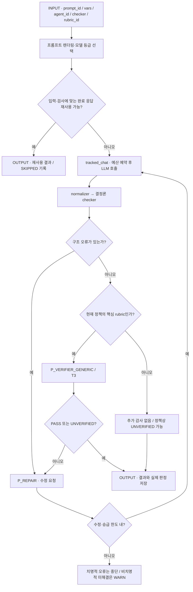

| 항목 | 현재 코드의 의미 |
|---|---|
| 기본 system prompt | `P_COMMON_PREAMBLE`. `system_override`를 주는 S7·S8 등의 호출은 해당 system을 사용한다. |
| `agent_id` | Step에 기록하는 역할 식별자. 이름만으로 별도 모델·별도 프로세스가 생기지 않는다. S8의 `persona::{id}`는 실제 직군별 입력을 갖는다. |
| 기본 핵심 루브릭 | [`config/triz.yaml`](../pilot/config/triz.yaml)의 `R3_FUNC`, `R3_CECA`, `R4_CONTRA`, `R6_CONCEPT`. 다른 rubric을 전달해도 현재 기본 정책에서는 추가 generic 감사가 생기지 않는다. |
| generic 감사 | `agent.verify_artifact` → `P_VERIFIER_GENERIC` → T3. S3·S4에서는 생성 Step 내부 호출이며 별도의 직군 persona가 아니다. S6는 별도의 `s6_quality` Step도 기록한다. |
| 수정·승급 | 기본 공통 수정 횟수 1회. 노드별 override가 가능하며 S8은 별도 설정을 사용한다. 승급 순서 배열은 `T1 → T3 → T2`지만 한 Step의 추가 승급은 1회 제한이고, 최초 T2는 더 승급하지 않는다. 일반 네트워크 retry와 의미적 수정은 다르다. |
| 검증 결과 | 정책상 `UNVERIFIED`와 실제 `PASS`를 구분한다. 검사기가 없는 호출의 공통 `PASS/source=none`은 기술적 타당성 검증을 뜻하지 않는다. |
| 실행별 고정 | AX에서는 실행 bundle의 프롬프트·루브릭·설정·모델을 사용한다. `execute_stage`가 실행 profile을 설정하고 `finally`에서 복원한다. 과거 실행을 현재 기본 설정으로 해석하지 않는다. |

### 모델 등급

이하 표의 T 등급은 **최초 실제 라우팅**이다. `routed_tier`가 호출부의 `tier` 인자보다 우선하며 수정·승급이나 고정 bundle에 따라 후속 호출은 달라질 수 있다.

| 등급 | 기본 라우팅 | 소스 기본 모델명 |
|---|---|---|
| T1 | bootstrap, intake 추출·역질의, persona 생성, non-AX 보고서 요약, 피드백 정제 | `deepseek-chat` |
| T2 | 그 밖의 일반 생성·추론 노드 | `deepseek-chat` |
| T3 | `s8_review*` 및 직접 호출하는 독립 루브릭 감사 | `deepseek-chat` |

모델명은 [`settings.TierConfig`](../pilot/triz/settings.py)의 `LLM_MODEL_T1/T2/T3`, provider URL과 thinking 설정으로 달라질 수 있다. AX 호출은 [`gateway.chat`](../pilot/triz/ax/gateway.py)의 bundle 모델 설정을 우선한다. 위 기본값만으로 운영 실행의 실제 모델을 단정할 수 없으며, 실제 모델은 저장된 Step·호출 기록을 확인한다.

## 1. S0 — 실행 계획

호출: [`nodes.s0_bootstrap`](../pilot/triz/nodes.py), [`titles.ensure_title`](../pilot/triz/titles.py).

| INPUT | OUTPUT |
|---|---|
| `raw_query`, 첨부 자료 요약, 모드 지정·잠금 여부 | `control.lang/mode/enabled_tracks`, `domain`, `scratch.title`, 산업 실행 계약 |

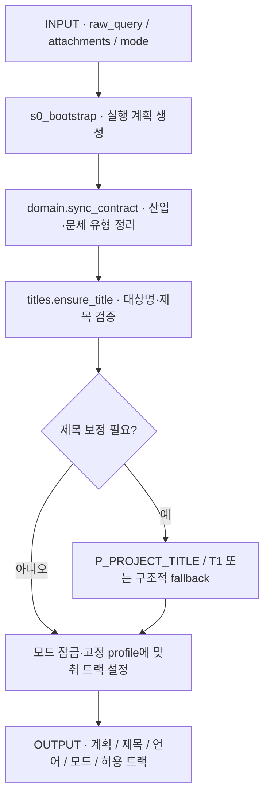

| 호출 | Agent | Prompt | T / 검증 |
|---|---|---|---|
| `s0_bootstrap` | `orchestrator` | `P_S0_BOOTSTRAP` | T1 / 별도 rubric 없음 |
| 조건부 제목 보정 `s0_title_repair` | `run_agent`를 거치지 않는 직접 호출 | `P_PROJECT_TITLE` | T1 / `identity_title`, `valid_title`; 최대 2회 후 `fallback_title` |

제목 보정은 `titles.ensure_title`이 `tracked_chat`을 직접 호출하는 경로다. 별도의 UI Stage가 아니다.

## 2. S0 — 산업·기술 심층 검토

호출: [`domain.deep_dive`](../pilot/triz/domain.py). Pipeline key는 `s0_research`, 생성 Step은 `s0_deep_dive`다.

| INPUT | OUTPUT |
|---|---|
| 문제 서술, `scratch.industry_profile`, 첨부 사실, 사용자 산업·난이도·질문 응답 | `scratch.deep_dive`, `deep_dive_history`, 산업 profile, 답변·건너뛰기 이력 |

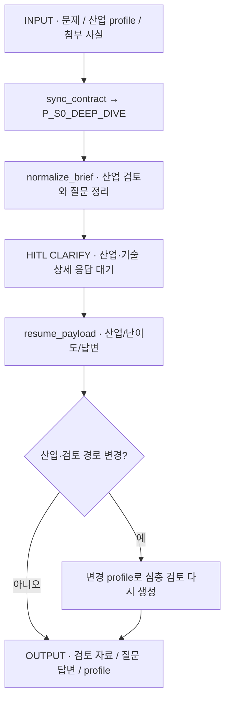

`domain_researcher` / `P_S0_DEEP_DIVE` / T2를 사용한다. 산업 카탈로그 기반 질문 fallback이 있으며, 이 단계의 산업 검토는 `scholar`의 특허·논문 검색과 다른 작업이다. 최초 검토 후 사용자 응답을 받는 구조이므로 S0 실행 계획과 합쳐서 자동 통과 단계로 표시하지 않는다.

## 3. S1 — 문제 추출·역질의

호출: [`nodes.s1_extract`](../pilot/triz/nodes.py), `_intake_gaps`.

| INPUT | OUTPUT |
|---|---|
| `raw_query`, 첨부 사실, 산업 검토, `intake.clarify_turns`와 새 응답 | `intake.frame`, `domain`, `constraints.items`, 후보 특성·충돌, 역질의 이력 |

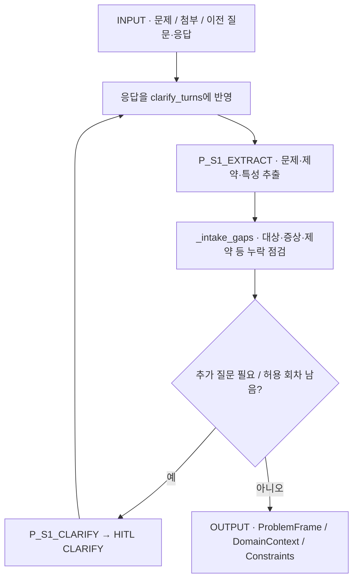

| 호출 | Agent | Prompt | T / 검증 |
|---|---|---|---|
| 추출 | `interviewer` | `P_S1_EXTRACT` | **T1** / `R1_INTAKE` 전달, 기본 추가 generic 감사 제외 |
| 역질의 | `interviewer` | `P_S1_CLARIFY` | T1 / 누락 정보 점검과 최대 2회 질문 제어 |

추출 호출부에 `tier="T2"`가 적혀 있어도 `routed_tier('s1_extract')`의 결과는 T1이다. 빈 추출 결과는 정상 완료로 처리하지 않는다.

## 4. S2 — 대상 시스템 확정

호출: [`nodes.s2_confirm`](../pilot/triz/nodes.py).

| INPUT | OUTPUT |
|---|---|
| 도메인·문제 요약, 첨부 사실, 후보 선택과 사용자 수정 | `confirm.candidates`, 선택 시스템·상위 시스템, 작동 영역·시간, 문제 구역, `confirm.user_confirmed` |

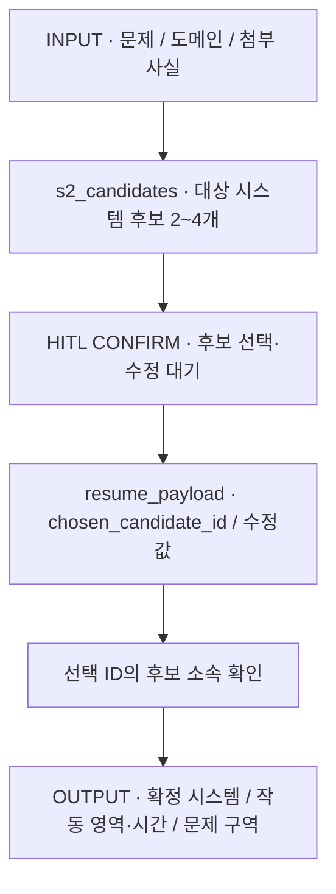

`system_analyst` / `P_S2_CANDIDATES` / T2 / `R2_CANDIDATE`를 사용한다. 해당 rubric은 기본 추가 감사 대상이 아니다. 사용자가 선택한 후보와 수정값을 반영한 뒤 `user_confirmed=True`를 기록한다.

## 5. S3 — 시스템·기능·자원·인과 분석

호출: [`nodes.s3_analyze`](../pilot/triz/nodes.py). 9화면과 기능 모델을 먼저 만든 뒤 자원·CECA·조건부 Su-Field를 병렬 실행한다.

| INPUT | OUTPUT |
|---|---|
| 확정 시스템·문제 구역·작동 시간, 문제 특성, 첨부 사실 | `analysis.nine_windows/components/function_edges/interaction_matrix/function_mermaid/resources/ceca/su_fields`, 도메인 제약·가정 |

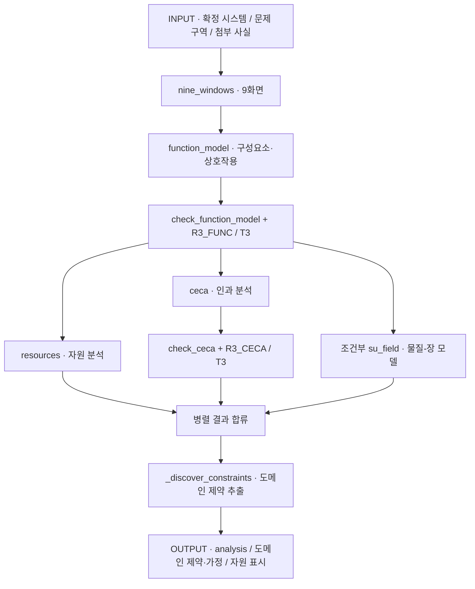

| 실행 순서·함수 | Agent | Prompt | T / 검증 |
|---|---|---|---|
| 1. `nine_windows` | `system_analyst` | `P_S3_NINE_WINDOWS` | T2 |
| 2. `function_model` | `system_analyst` | `P_S3_FUNCTION_MODEL` | T2 → `check_function_model` → `R3_FUNC` generic T3 |
| 3. `resources` | `resource_analyst` | `P_S3_RESOURCES` | T2 / `R3_RES`는 기본 추가 감사 제외 |
| 3. `ceca` | `root_cause_analyst` | `P_S3_CECA` | T2 → `check_ceca` → `R3_CECA` generic T3 |
| 3. `su_field` | `sufield_specialist` | `P_S3_SUFIELD` | T2 / `R3_SUF`는 기본 추가 감사 제외 |
| 4. `_discover_constraints` | `constraint_analyst` | `P_S3_CONSTRAINTS` | T2 / 추가된 도메인 제약은 사용자 확정 제약과 구분 |

Su-Field 분석은 LITE에서 생략하며, 다른 모드에서도 `domain.physical_allowed`가 참일 때 수행한다. 표준해 힌트는 정본 `knowledge.standard_hints`로 정리한다. 도메인 추정 제약은 `DOMAIN`, `hard=False`, 제한된 confidence로 추가한다. CECA의 도출 가설을 사용자 관찰 사실로 바꾸지 않는다.

## 6. S4 — 이상해결책·모순 정의

호출: [`nodes.s4_define`](../pilot/triz/nodes.py).

| INPUT | OUTPUT |
|---|---|
| 기본 기능, CECA·자원·상호작용, 작동 영역·시간, 사용자 성공 기준 | `definition.ifr/technical_contradictions/physical_contradictions/trimming/key_problems`, `scratch.param_scheme` |

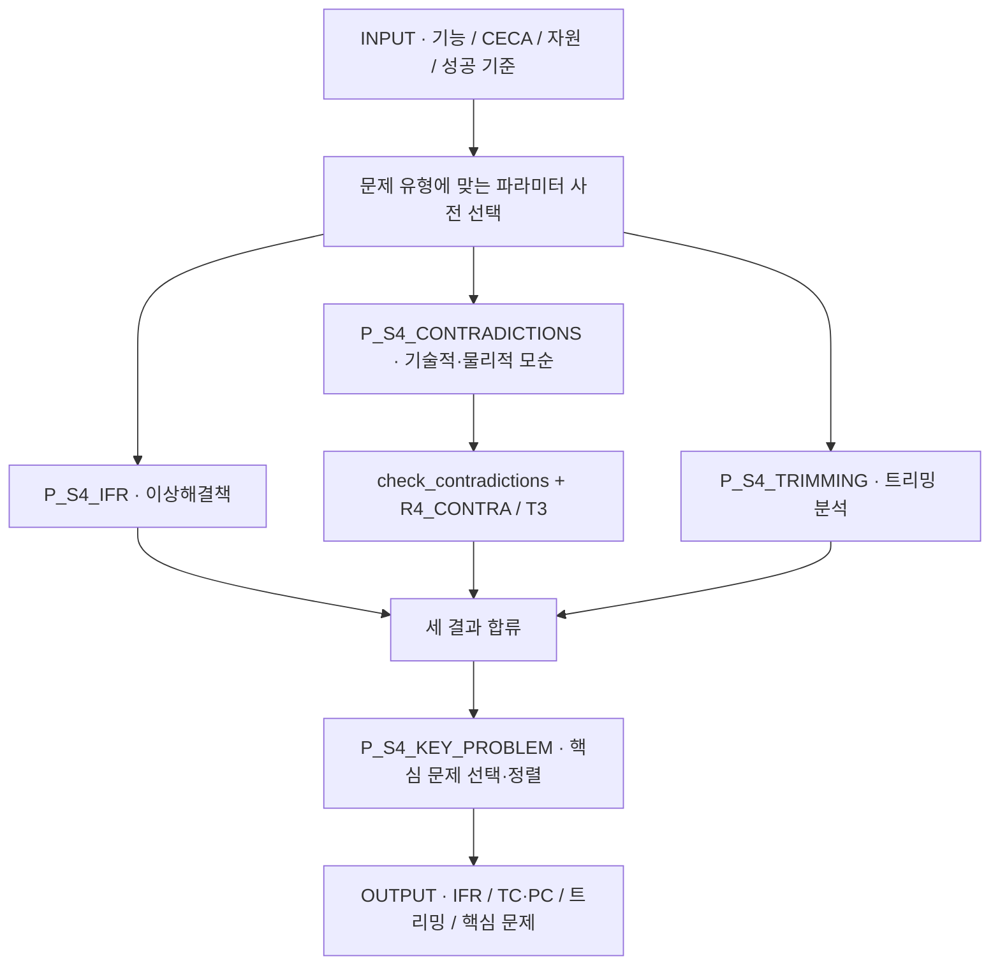

| 함수 | Agent | Prompt | T / 검증 |
|---|---|---|---|
| `define_ifr` | `triz_master` | `P_S4_IFR` | T2 / `R4_IFR`는 기본 추가 감사 제외 |
| `define_contradictions` | `contradiction_definer` | **`P_S4_CONTRADICTIONS`** | T2 → `check_contradictions` → `R4_CONTRA` generic T3 |
| `define_trimming` | `trimming_specialist` | `P_S4_TRIMMING` | T2 |
| 핵심 문제 선택 | `triz_master` | `P_S4_KEY_PROBLEM` | T2 / 결과를 영향도·다루기 용이성으로 정렬 |

공학 문제는 `ENG_39`, 다른 유형은 `BIZ_31`을 사용한다. `_pick_tcs`, `_pick_pcs`, `_required_functions`, `_add_ideas`는 소스에서 S4 다음에 정의되어 있지만 **S5 트랙이 사용하는 helper**다. S4 분석이 S5로 이동한 것으로 해석하지 않는다.

## 7. S5 — 다중 기법 해결책 탐색

호출: [`nodes.s5_solve`](../pilot/triz/nodes.py), [`ax.adaptive_tracks`](../pilot/triz/ax/adaptive_tracks.py), [`ax.coordinator`](../pilot/triz/ax/coordinator.py), [`idea_consolidation`](../pilot/triz/idea_consolidation.py).

| INPUT | OUTPUT |
|---|---|
| S3 분석·자원, S4 IFR·모순·트리밍·핵심 문제, 고정 모드 계약·카탈로그, 실제 잔여 예산 | `solve.tracks_run`, 트랙별 적용안, `solve.raw_ideas`, `solve.ariz`, `solve.gaps`, 트랙 실행·정책 결정 기록, 검색 후보 |

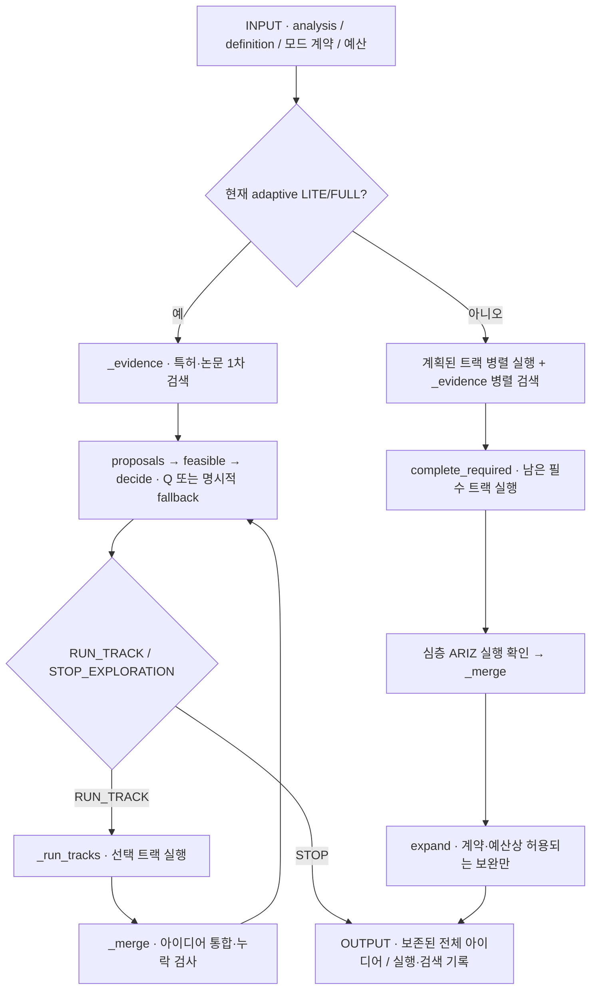

현재 `ax-run-v3`의 LITE/FULL은 실행 가능한 제안 중 한 트랙씩 선택하고, 각 실행 후 통합 결과로 다음 행동을 정한다. 초기 검색은 첫 트랙 선택 전에 한 번 수행한다. LITE 허용 집합은 A/B/E/H, FULL은 D를 제외한 A/B/C/E/F/G/H다. 특정 A/B/C를 모두 기본 의무로 실행하는 구조가 아니다. 명시 필수 트랙과 최소 초기 실행 수를 충족해야 탐색 종료를 제안할 수 있다.

DEEP은 A~H 전체 트랙을 수행하는 계약이다. 물리적 대상이 없어 적용 불가한 C와, 선행 입력이 부족해 차단된 트랙은 서로 다른 상태로 남는다. `_run_tracks`의 A~H 정렬은 **병렬 결과를 합치는 순서**다. A 완료 후 B를 실행하는 직렬 파이프라인을 뜻하지 않는다. `complete_required`는 분기 동시 실행 수로 인해 아직 실행하지 못한 필수 트랙을 처리한다. 현재 DEEP의 `expand`는 optional 비활성 계약 때문에 즉시 반환한다.

### 등록된 트랙과 실제 생성 호출

`nodes.TRACK_FUNCS`에는 D와 G를 포함한 아래 8개가 모두 등록되어 있다. 아래 생성 호출은 모두 최초 T2다.

| 트랙·함수 | 주요 INPUT → OUTPUT | Agent / Prompt | 검사·정본 연결 |
|---|---|---|---|
| A `A_MATRIX` / `_track_a` | 선택 TC·행렬·자원 → `matrix_lookups`, `principle_apps`, 원안 | `inventor_a` / `P_S5_TRACK_A`; 원리 보완 선별은 `P_S5_MATRIX_FALLBACK` | `check_principles`로 허용 원리 ID 확인. 행렬이 있어도 설정에 따라 추가 후보 교차검토 가능. `R5_A`는 기본 generic 제외 |
| B `B_SEPARATION` / `_track_b` | 선택 PC의 양측 상태·이유 → `separation_apps`, 실제 적용 가능한 원안 | `inventor_b` / `P_S5_TRACK_B` | `separation_contract.normalize` + `check_separation` + 사후 검사. 신규 5분리·2보완 / 고정 과거 실행은 legacy 4종. `R5_B`는 기본 generic 제외 |
| C `C_STANDARDS` / `_track_c` | Su-Field·요구 기능·자원 → `standard_apps`, 원안 | `standards_specialist` / `P_S5_TRACK_C` | 정본 76표준해 후보 subset, `bind_standard`, `check_standards`. 후보 밖 표준 코드 제외. `R5_C`는 기본 generic 제외 |
| D `D_ARIZ` / `_track_d_ariz` | 핵심 문제·모순·자원 → `solve.ariz`, 원안·재해석 제안 | `ariz_specialist` / `P_S5_ARIZ_PART1`~`PART7` | Part별 필수 단계 검사, `check_ariz_part5/part6`. Part1·3의 `R5_D`는 기본 generic 제외 |
| E `E_TRIMMING` / `_track_e` | S4 트리밍·자원 → 트리밍 원안 | `trimming_specialist` / `P_S5_TRACK_E` | 트리밍 입력이 없으면 함수가 반환. 별도 공통 application checker 없음 |
| F `F_TRENDS` / `_track_f` | 대상·구성요소·자원·진화 법칙 → `trend_apps`, `scratch.s_curve`, 원안 | `evolution_analyst` / `P_S5_TRACK_F` | `solve_contract.check_applications` 및 `_check_track_result` |
| G `G_FOS` / `_track_g` | 요구 기능·환경·모순 → `fos_apps`, 타 분야 원안 | `cross_domain_scout` / `P_S5_TRACK_G` | 동일 application 검사. 해당 트랙 원안만 `CROSS_DOMAIN` 표시 |
| H `H_EFFECTS` / `_track_h` | 요구 기능·정본 과학효과 후보 → `effect_apps`, 원안 | `effects_specialist` / `P_S5_TRACK_H` | `effect_candidates` → `bind_effect` → application 검사. 정본 효과 ID·조건·출처 결합 |

ARIZ는 고정 설정에서 활성화된 Part1→2→3→4→5를 순서대로 수행하고, **Part6 재해석 제안은 매 실행 기록**한다. Part6는 조언을 저장하며 원문 문제나 앞 Stage를 자동 변경하지 않는다. Part7이 활성이고 평가할 해결 방향이 있으면 검증을 수행한다. 대상이 없으면 실제 미실행 이유와 `SKIPPED`를 기록한다. Part5에서도 표준해·분리 접근·과학효과 후보를 참조한다.

`_merge`는 `idea_consolidation.consolidate`를 통해 `solution_curator` / `P_S5_MERGE` / T2를 호출하며 partition 검사로 원안의 통합·보존 계보를 확인한다. `R5_MERGE`는 기본 추가 generic 감사 대상이 아니다. `digest_json`은 입력 변경 확인용 해시 helper이며 추론 노드가 아니다.

### 과학효과와 특허검색의 위치

| 작업 | 실제 진입점 | 기록·한계 |
|---|---|---|
| 과학효과 후보 선택 | H 및 ARIZ Part5 → `ax.runtime.effect_candidates` | 실행의 고정 카탈로그와 허용된 학습 우선순위를 사용. 효과 노출과 최종 개념의 실제 채택을 구분 |
| S5 검색계획 | `_evidence` → `evidence.discover(before_concepts=True)` | `patent_researcher` / `P_EVIDENCE_PLAN` / T2. Step은 `s5_patent_plan` |
| 실제 특허·논문 검색 | `scholar.search_kind`, 특허 vector batch는 `scholar.patent_search_batch` | LLM Agent 호출과 별도의 검색 작업. provider·예산·캐시·검색 장애 상태 기록 |
| S8 근거 연결 | `evidence.attach` | 추가 검색 뒤 후보 기구·전이 조건과 근거를 연결. 아래 10번 참조 |

## 8. S6 — 개념 구체화

호출: [`quality.generate_concepts`](../pilot/triz/quality.py), 신규 통합 계약에서는 [`ax.incremental_review.generate`](../pilot/triz/ax/incremental_review.py)를 경유한다.

| INPUT | OUTPUT |
|---|---|
| 통합 `solve.raw_ideas` 전체, 사실·인과·모순·자원, 근거와 허용된 이전 사례 | `concepts`, `quality_status/quality_issues`, 원안 계보·활성 효과, 제외 이유, 후보별 검토 revision·진행 기록 |

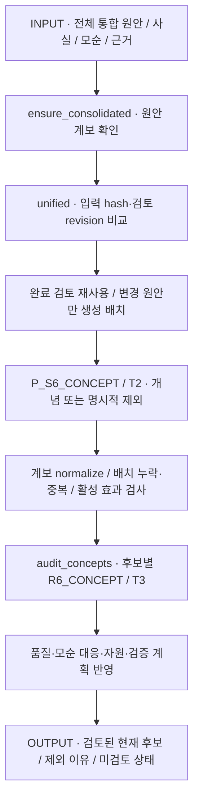

| 호출 | Agent | Prompt | 검증 |
|---|---|---|---|
| `s6_concept` | `concept_architect` | `P_S6_CONCEPT` / T2 | `normalize_concept_lineage`, `check_concept_batch`, 계약상 `concept_effects.check_batch`; 배정 원안을 각각 개념화하거나 이유와 함께 제외 |
| `s6_quality` | `independent_auditor` | `P_VERIFIER_GENERIC` / T3 | `R6_CONCEPT`, 후보별 판정 coverage, 구조적 모순 대응 검사, 기존 자원·신규 자원 표시 검사 |

변경된 검토 입력은 기존 승인을 먼저 `UNVERIFIED`로 무효화한다. 현재 입력의 완료 검토만 재사용하며, 미검토 후보를 완료로 세지 않는다. 생성기는 스스로 품질 PASS를 부여하지 않는다. 독립 검토 REJECT는 제외 기록으로 남고, REVISE·UNVERIFIED는 그 상태를 유지한다. 배정 누락 같은 치명적 오류는 재시도 후에도 남으면 중단한다. 후보 수를 임의 top-K로 줄이는 단계가 아니다.

## 9. S7 — 제약 검토

호출: [`nodes.s7_gate`](../pilot/triz/nodes.py), [`verify.normalize_constraint_result`, `verify.numeric_violation`](../pilot/triz/verify.py).

| INPUT | OUTPUT |
|---|---|
| 현재 `concepts`, 전체 제약, 저장된 조건 사실, 사용자 유지·제외 응답 | `constraint_checks`, `constraint_normalization`, 제외 이력, `gate_decisions`, 공통 평가·사용자 효용 이벤트 |

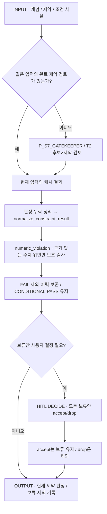

`gatekeeper` / `P_S7_GATEKEEPER` / T2를 사용하며, 제약 전용 system override가 붙는다. S6 generic 품질 감사와 별개다. 결과가 빠진 후보는 CONDITIONAL로 보완한다. 수치 보조 검사는 원문 관측 근거·단위·비교 문맥을 검증하며, override 출처를 함께 기록한다. 제약이 아예 없으면 LLM 호출 없이 제약 PASS 목록을 만든다.

사용자의 `accept`는 **보류안 유지**다. 기술적 CONDITIONAL이나 미확인 의무가 PASS로 바뀌지 않는다. `drop`은 사용자 제외 이력을 남긴다. unified 계약에서는 `feedback_events.user_decisions`가 공통 효용 기록을 만든다. 과거 효과 조건 응답을 받는 호환 경로의 `_recheck_effect_conditions`는 변경 후보만 기존 S7 함수로 재검토하며 사용자 보고만으로 전체 PASS로 승격하지 않는다.

## 10. S8 — 근거 자료·적용 조건 검토

호출: [`nodes.s8_references`](../pilot/triz/nodes.py) → [`evidence.attach`](../pilot/triz/evidence.py). **다직군 평가보다 먼저 실행한다.**

| INPUT | OUTPUT |
|---|---|
| S7 후 현재 개념·작동 기구·제약, S5 검색 캐시·자료 후보 | `evidence`, 개념별 `evidence_ids/transfer_conditions`, `evidence_mappings`, 관련 자료·검색 진단·근거 부족 기록 |

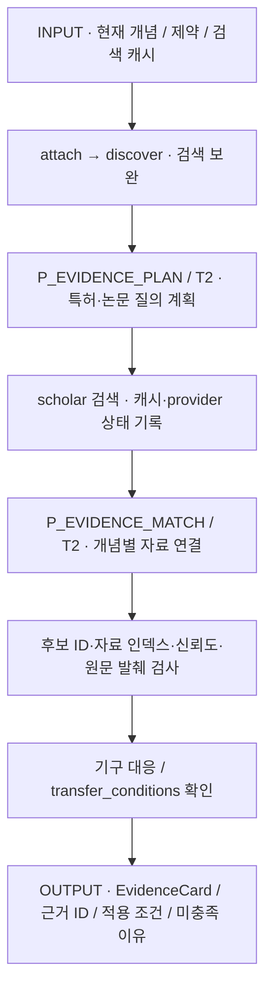

| 작업 | Agent / Prompt / T | Step 이름 |
|---|---|---|
| 자료 검색계획 | `patent_researcher` / `P_EVIDENCE_PLAN` / T2 | `s9_evidence_plan` |
| 검색 실행 | 검색 모듈, LLM tier 없음 | `s9_search_retrieval` |
| 자료 연결 | `patent_researcher` / `P_EVIDENCE_MATCH` / T2 | `s9_evidence_match_1`, `..._2`, … |

위 `s9_*` 이름은 내부 Step의 과거 명명이며 S9 보고서 단계에서 실행된다는 뜻이 아니다. `attach`가 `discover`를 호출하고, 자료 연결은 개념 배치별로 실행한다. `nodes._applied_principles`는 `discover`가 사용하는 검색계획 구성용 helper다. 조직·비즈니스 문제의 기본 검색 종류는 논문(PAPER)이며, 그 밖의 문제는 특허·논문을 모두 요청한다. 검색 비활성 설정·잔여 질의 수·저장된 계획·캐시 상태에 따라 일부 호출은 생략된다.

현재 연결 검사는 신뢰도 0.7 이상, 충분한 원문 발췌, `mechanism_mapping`, 비어 있지 않은 `transfer_conditions` 등을 요구한다. 관련성이 낮은 자료는 별도 관련 자료로 남길 수 있다. 검색·연결 성공은 실제 성능 실증이나 특허 청구범위 검증을 뜻하지 않는다. 특허에서 추가로 제안된 `patent_additions`는 **제약·다직군 평가 전 추가 검증 후보**로 보관하며 검토된 최종 개념에 자동 편입하지 않는다.

## 11. S8 — 다직군 평가

호출: [`nodes.s8_evaluate`](../pilot/triz/nodes.py) → [`meeting.evaluate`](../pilot/triz/meeting.py) → `_aggregate` → `_rank`.

| INPUT | OUTPUT |
|---|---|
| 현재 개념·S7 제약 판정, 근거·적용 조건, 문제 목표·모순, 직군 설정 | `evaluation.reviewers/meeting/evaluations`, 점수·순위·사분면, `ranking_note/portfolio_note/roadmap`, 공통 평가 이벤트 |

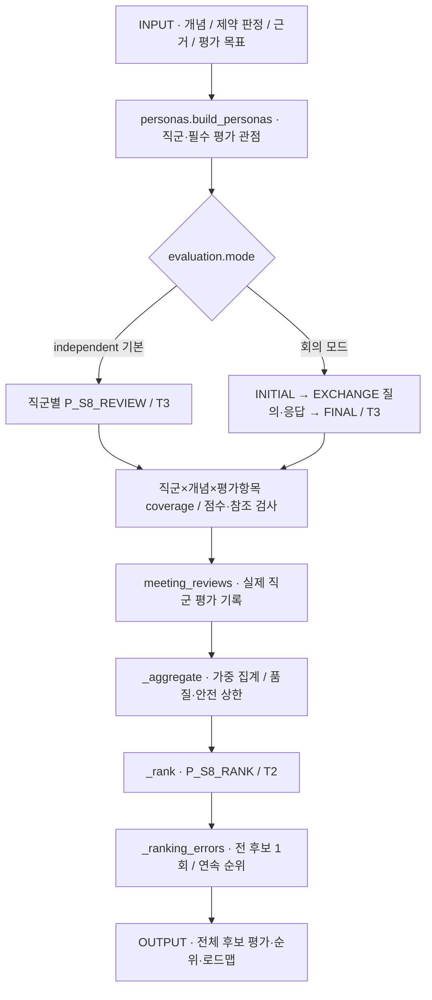

| 호출 | Agent | Prompt | T / 검사 |
|---|---|---|---|
| 직군 생성 | `role_router` | `P_PERSONA_FACTORY` | T1 / 필수 관점·안전 관점 coverage를 코드에서 보완 |
| 기본 독립 평가 | `persona::{persona_id}` | `P_S8_REVIEW` | T3 / `_check_independent`, `verify.check_review`, 배치·직군 사후 검사 |
| 선택적 회의 | `persona::{persona_id}` | `P_S8_MEETING_INITIAL`, `P_S8_MEETING_EXCHANGE`, `P_S8_MEETING_FINAL` | T3 / 질문·답변·근거 참조·최종 점수 및 veto 보존 검사 |
| 순위·포트폴리오 | `portfolio_manager` | `P_S8_RANK` | T2 / `_ranking_errors` |

기본 평가에도 직군별 역할·경력·mandate·평가 차원·veto 권한이 전달된다. “persona 없는 기본 T3 한 번”이 아니다. `R8_REVIEW`를 전달하지만 현재 기본 `critical_rubrics`에 없으므로 **추가 `P_VERIFIER_GENERIC` 호출은 생략**한다. 직군 평가 자체와 결정론 행렬 검사는 수행한다. 현재 필수 독립 루브릭은 기능 모델·인과·모순·개념이다. [verification 설정](../pilot/config/triz.yaml)과 [S8 검토 출처 테스트](../pilot/tests/test_s8_review_provenance.py)에서 검증 경계를 확인할 수 있다.

기본 독립 모드는 직군 간 질의·응답을 생성하지 않는다. 회의 모드를 선택하면 initial→각 회차 answer/후속 question→final을 수행한다. 단계 내 직군 호출은 병렬이고 다음 회차는 앞 회차가 끝난 뒤 시작한다. `_aggregate`는 신뢰도와 차원 가중치를 반영하며 미통과 품질·안전 우려의 상한을 유지한다. 순위 생성이 S7의 제약 판정을 뒤집지 않는다.

## 12. S9 — 시각화 보고서

호출: [`nodes.s9_report`](../pilot/triz/nodes.py), [`ax.report`](../pilot/triz/ax/report.py), [`render`](../pilot/triz/render.py), [`presentation`](../pilot/triz/presentation.py).

| INPUT | OUTPUT |
|---|---|
| 전체 분석 결과, 현재 후보·검토·제약·근거·평가, AX 선택·보고서 snapshot | `report`의 narrative/template/markdown, 보고서 파일·도식, 화면용 sections |

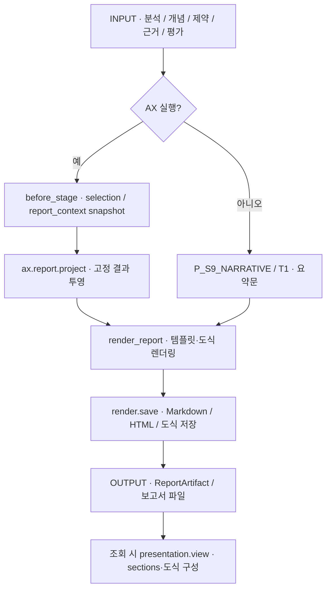

AX 기본 경로는 저장된 선택·보고서 문맥을 렌더링하며 `P_S9_NARRATIVE`를 호출하지 않는다. non-AX 경로만 `report_generator` / `P_S9_NARRATIVE` / T1을 호출하고 LITE/FULL 템플릿을 선택한다. 조회용 도식·구역 구성은 표시 계층이며 원래 해결안을 다시 추론하는 단계가 아니다. 정본 참고도식과 저장된 해결안 적용도식도 표시 계층에서 구분한다.

## 13. S10 — 피드백

호출: [`nodes.s10_feedback`, `nodes.record_feedback`](../pilot/triz/nodes.py), [`POST /api/runs/{run_id}/feedback`](../pilot/api/main.py).

| INPUT | OUTPUT |
|---|---|
| 전체 평가, 해결안별 rating·adopted·reason_tags·comment, 재사용 의향·부족 관점 | `feedback`, 공통 최종 평가 이벤트 또는 legacy 피드백 행, 허용된 프로젝트 범위의 RAG 기록 |

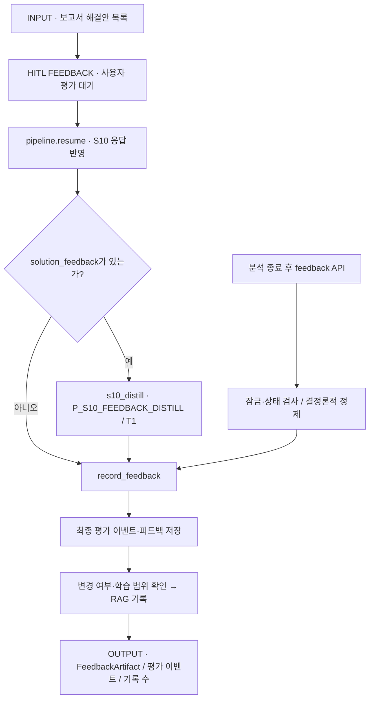

S10 대기 중 API 제출은 `pipeline.resume`를 통해 S10으로 돌아오므로, 개별 해결안 피드백이 있으면 `rag_writer` / `P_S10_FEEDBACK_DISTILL` / T1이 실행된다. 분석 종료 후 같은 API를 호출하면 `record_feedback(..., distill=None)`가 저장된 작동 원리·사용자 의견으로 정제하며 **추가 LLM 호출이 없다**. 다른 사용자 대기나 RUNNING/QUEUED 상태에서는 해당 API가 409를 반환한다.

`record_feedback`는 Stage 함수가 아닌 공유 저장 함수다. 현재 unified 계약은 `feedback_events.final_feedback`로 평가 기록을 만들고, 변경이 있으며 프로젝트 학습 범위가 허용될 때 RAG에 반영한다. 피드백 저장, 학습 표본 편입, 모델 훈련·활성화, 다음 분석에서 실제 사용은 각각 별도 사건이다. 세부 조건은 [LEARNING.md](LEARNING.md)를 따른다.

## Stage 경계의 AX 추가 작업

[`ax.runtime.before_stage`](../pilot/triz/ax/runtime.py)는 UI Stage 진입 전에 실행된다. 이 hook 때문에 일부 보완 생성·재검토 Step이 최초 실행 Stage 바깥에서도 보일 수 있다.

| 진입 Stage | 실제 hook | 해석 |
|---|---|---|
| S5 | `coordinator.route` | 고정 모드와 실행 가능한 트랙을 준비한다. |
| S6 | `CHECK_APPLICABILITY`, 효과 application 수집·snapshot | 과학효과의 적용 조건을 검토 대상으로 기록한다. 검색·생성만으로 PASS를 만들지 않는다. |
| S7 | adaptive `followup(after_concepts)` 또는 legacy `recovery.run`; `rules.apply` | S6에서 저장된 검토 누락·결함에 한해 허용된 보완 탐색·개념 검토를 수행할 수 있다. 사용자 응답 처리 중에는 건너뛴다. |
| S8 근거 검토 | pending gate 응답 처리 → `followup(after_constraints)` → 새 후보의 `s7_gate` | 보완으로 생긴 후보가 제약 검토를 우회하지 않게 한다. 과거 계약은 recovery와 새 후보 subset 재검토를 사용한다. |
| S9 | coherence·selection·report_context capture, `FINALIZE` 또는 `DEFER` | 보고서에 사용할 결과와 추천/보류 상태를 고정한다. 추천 없음도 저장 가능한 결론이다. |

`adaptive_tracks.followup`은 입력 fingerprint로 중복 작업을 막고, 모든 후보를 사용자가 명시적으로 제외했을 때 같은 포트폴리오를 자동 재생성하지 않는다. 보완 트랙이 실행되면 `quality.generate_concepts`를 다시 거치며, 수정 후보의 이전 승인·평가를 무조건 승계하지 않는다.

## 코드 확인 지점

| 확인할 내용 | 소스 |
|---|---|
| UI 단계 순서·잠금·중단·응답·재개 | [`pipeline.py`](../pilot/triz/pipeline.py) |
| Stage 본체·A~H 등록·집계·보고서·피드백 | [`nodes.py`](../pilot/triz/nodes.py) |
| 생성·공통 프롬프트·검사·수정·모델 라우팅 | [`agent.py`](../pilot/triz/agent.py), [`verify.py`](../pilot/triz/verify.py), [`settings.py`](../pilot/triz/settings.py) |
| 산업 계약과 S0 검토 | [`domain.py`](../pilot/triz/domain.py) |
| 실제 트랙 선택·필수 실행·모드 | [`ax/adaptive_tracks.py`](../pilot/triz/ax/adaptive_tracks.py), [`ax/coordinator.py`](../pilot/triz/ax/coordinator.py), [`ax/mode_contract.py`](../pilot/triz/ax/mode_contract.py) |
| 원안 보존·개념 배치·독립 검토 | [`idea_consolidation.py`](../pilot/triz/idea_consolidation.py), [`quality.py`](../pilot/triz/quality.py), [`ax/incremental_review.py`](../pilot/triz/ax/incremental_review.py) |
| 특허·논문 검색과 근거 연결 | [`evidence.py`](../pilot/triz/evidence.py), [`tools/scholar.py`](../pilot/triz/tools/scholar.py) |
| 직군 생성·독립 평가·회의 | [`personas.py`](../pilot/triz/personas.py), [`meeting.py`](../pilot/triz/meeting.py) |
| AX Stage 전후 hook·고정 실행 입력 | [`ax/runtime.py`](../pilot/triz/ax/runtime.py), [`execution_config.py`](../pilot/triz/execution_config.py) |
| 사용자 피드백 API | [`api/main.py`](../pilot/api/main.py) |
