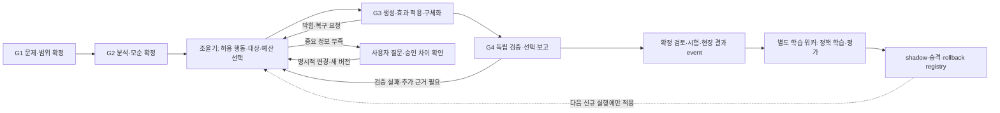

# TRIZ AX V3 코드 반영 전략 — 승인 후 구현 기록

작성일: 2026-09-16 KST. 사용자는 1차 구성 → DLC 실제 사례 검증 → RL·규칙 진화 구성 → 전체 재검증 순서를 승인했다. 후속 지시로 조율 에이전트의 HITL을 금지했다. 실제 구현·운영 범위는 [구현 기록](TRIZ_AX_V3_IMPLEMENTATION.md), 시험은 [DLC 검증 기록](TRIZ_AX_V3_DLC_TEST.md)을 따른다.

기존 FastAPI·MCP·n8n·MySQL을 유지하면서, **4개 게이트의 산출물 계약 → S4/S5 사이 조율 계층 → 제한된 복구·재설계 → 비동기 RL 학습** 순서로 확장한다. 아래는 최초 목표 전략이며, 동봉 마스터 전체가 구현됐다는 선언은 아니다. 실제 차이는 구현 기록에 명시한다.

## 1. 검토 근거와 해석

- `concept/TRIZ_AX_V3_MASTER_DESIGN.md`와 `concept/triz_ax_v3_design/TRIZ_AX_V3_MASTER_DESIGN.md`는 SHA-256 `c40b6e32fc910a97ec7dd4219f76a79fa18ca2e9d2a5877d97d2327dc0853bde`로 동일하다.
- 패키지 README, artifact/decision/feedback schema 3개, runtime policy, 비용 예제, CVD 예제, 검증 스크립트를 함께 확인했다.
- `validate_contracts.py` 실행은 통과했다. 이는 schema·예제·일부 거부 조건·비용 산술 확인이며 서비스 통합, 물리 타당성, RL 성능 검증은 아니다.
- 현행 `pipeline.py`, `nodes.py`, `schema.py`, `store.py`, `agent.py`, `domain.py`, `knowledge.py`, `effect_catalog.py`, `rag.py`, `quality.py`, API·UI·배포 및 조사 코드를 대조했다.
- 아래 G1~G4 명칭과 경계는 사용자의 4개 게이트 요구를 현재 단계에 대응시킨 **이번 제안**이다. 제공된 마스터 문서에 이미 고정된 G1~G4 구현이 있다는 뜻은 아니다.

과학효과의 폐루프는 `효과 후보 선택 → 적용조건 검사 → 개념 적용 → 반례·검증 → 실패 원인/사용자 판단 → 다음 탐색 행동`으로 해석한다. 이 과정의 경로·대상·자원 배분을 작은 정책 모델이 학습한다. 특허 수집량이나 효과 정본 항목 수의 증가만으로 RL이 구현되었다고 보지 않는다.

## 2. 4개 게이트와 조율 위치

| 게이트 | 현재 단계 대응 | 통과 시 고정할 산출물 | 통과 조건 / 보류·회귀 |
|---|---|---|---|
| G1 문제 정의·범위 확정 | `s0_bootstrap`~`s2_confirm` | InputBundle, SourceSpan, ProblemContract, 승인 event | 목표·단위·대상·보호조건·변경 권한을 식별하고 사용자가 범위를 확정. 결론을 바꾸는 미확인 사항은 질문 |
| G2 문제 분석·모순 확정 | `s3_analyze`, `s4_define` | ProblemGraph, ContradictionSet, AnalysisSnapshot, VerificationObligation | 승인 요구→기능/원인→핵심 문제→모순/IFR의 연결, 근거·가정 구분, 미해결 항목 확인 |
| G3 해결안 탐색·구체화 | `s5_solve`, `s6_concept`, `s7_gate` | CandidateVersion, ApplicabilityCheck, Blocker, RepairPatch, ConstraintVerdict | 기구·필요조건·제약 판정이 있는 후보를 G4 검증 대상으로 인계. 조건부 후보는 조건부 상태로 보존 |
| G4 검증·선택·결과 환류 | `s8_references`, `s8_evaluate`, `s9_report`, `s10_feedback` | ValidationSnapshot, SelectionSnapshot, ReportManifest, Review/OutcomeEvent | 필수검증 충족 후보만 추천. 연구안·보류안을 구분하고 같은 snapshot에서 화면/보고서 생성. 결과 피드백은 이후에도 추가 가능 |

G2 통과 후, 최초 S5 실행 전에 `s4.route`라는 하위 작업으로 조율 에이전트를 둔다. 후속 검증·복구에도 같은 Governor를 적용한다. 조율기는 사용자 확인을 기다리지 않는다. `ASK_HUMAN`은 영구 mask 처리하며 부족한 조건은 자동 보완 또는 조건부·보류로 기록한다. G1 범위 확정과 기존 S7 제약 검토, 실행 후 의견은 조율기 밖에 남는다.

G1의 범위를 바꿔야 한다면 변경 제안과 승인 차이를 남기고 G1 계약 새 버전으로 돌아간다. 원인·모순만 바뀌면 G2와 해당 종속 산출물을 무효화한다. HITL-2는 어느 구간에서든 필요한 질문을 일으키는 interrupt로 유지한다. G4 보고서 출력을 사용자의 최종 피드백이나 미래 현장시험까지 기다리게 하지 않는다.

## 3. 현행 코드에서 재사용할 것과 실제 격차

| 영역 / 코드 | 현재 확인된 구현 | V3에서 필요한 확장 |
|---|---|---|
| `pipeline.py:PIPELINE/execute_stage/_upgrade/resume` | 13개 단계, `pipeline_version=3`, epoch·stage 확인, 중복 전달 방지, 재개 | 제품 V3와 기존 pipeline_version 3을 구분. `workflow_version=triz-ax-v3`와 버전별 단계 매핑 추가 |
| `store.py:run_lock/save_state/archive` | MySQL 실행 잠금, run_states JSON 갱신, 단계 파일 archive, event·호출 로그 | 불변 artifact/edge/snapshot 원장, lease/fencing, 원자적 action commit·outbox. 현재 JSON은 호환 projection으로 이전 |
| `nodes.py:s5_solve/_run_tracks`, `domain.py:select_tracks` | 모드별 A~H 트랙, 일부 필수 추가, 분리된 트랙 결과 병합, 제한된 추가 트랙 | 입력 계약을 읽는 정책+Governor+typed ActionTicket. action 결과를 중앙 reducer에서 검증·병합 |
| `nodes.py:_track_h`, ARIZ Part5, `knowledge.py:effect_candidates` | 요구 기능별 효과 검색·정본 ID 바인딩 후 LLM 적용안 생성 | EffectVersion과 적용조건·불일치·미확인 원장을 남기고 적용/검증 결과를 decision에 연결 |
| `effect_catalog.py:select_effects` | 토큰 기반 가중 검색. 참고자료 수를 정답 점수로 쓰지 않음 | 검색은 후보 공급자로 유지. 순차 정책의 재료로 사용하며 검색 점수를 RL 가치로 간주하지 않음 |
| `quality.py`, `verify.py`, `evidence.py`, S7/S8 | 독립 품질검토·제약검토·근거 적용성·직군 평가 | claim 단위 검증 의무, 영향관계, PASS/FAIL/UNKNOWN/NOT_RUN/ERROR의 통일된 추천 규칙 |
| `agent.py:tracked_chat`, `llm.py`, `context.py` | 호출 예약·동시성·재시도·usage·실행 내 캐시 | DB 영속 예약, 응답 유실 비용의 미확인 상태, 공급자별 usage, 가격 버전, 작업별 durable cache |
| `schema.py`, `api/main.py`, `Workspace.jsx` | 가변 GlobalState, 질문/별점/채택/댓글, 단계 이력 | snapshot·expected_epoch를 받는 검토 API, 버전 diff, 권한별 수정·선호·시험 결과 구분 |
| `rag.py:write_feedback/retrieve` | 사용자별 피드백/실패 패턴 검색과 가중치 | 그대로 보조 검색에 활용. 실제 정책 학습기·dataset·reward revision·registry는 신규 구현 |
| `effect_manual_review.py`, 연구 TSV/JSON | 원문 hash에 연결된 직접 검토와 정본 편집 | 출처·검토 계약으로 옮길 수 있으나 탐색 trajectory와 실제 성공 라벨로 소급 변환하지 않음 |

특히 다음 차이는 구현 전에 반영한다.

1. **버전 이름 충돌:** 현재 `pipeline_version=3`은 과거 단계 배치의 버전이다. AX V3 도입을 이 숫자 하나로 판별하거나 기존 run에 일괄 적용하지 않는다.
2. **게이트 번호와 단계 인덱스:** `PIPELINE` 중간에 새 항목을 단순 삽입하면 저장된 재개 위치가 바뀐다. 처음에는 S5 진입 어댑터가 `s4.route` action을 수행하게 한다.
3. **보안 현행 차이:** 마스터 §17의 전제와 달리 현재 코드는 Google 로그인·계정·세션·run 소유권을 구현했다. 이를 기반으로 tenant/project RBAC와 학습 동의를 추가한다. 공개 사례 동의는 학습 동의로 간주하지 않는다.
4. **효과의 비물리 분야 누락:** 정본에 정보 원리가 있지만 `domain.select_tracks()`는 비물리 문제에서 H_EFFECTS를 제외한다. V3에서는 물리·화학·생물·정보 원리의 적용 가능성을 항목별 판정한다. 물리 전제가 없는 문제에 물리 효과를 강제하지 않는다.
5. **모듈 이름 충돌:** 신규 `quality/` 디렉터리는 기존 `quality.py`와 충돌한다. 초기에는 `validation/`을 신설하고 기존 import는 어댑터로 유지한다.
6. **비용·수량 충돌:** 현재 설정은 run $3, 최소 개념 8·최대 12, 최종 해결안 5~10인 반면 목표안은 최초 후보 최대 6·상세화 최대 3, soft $0.30·hard $0.60이다. 전역 설정을 교체하면 모순된다. workflow별 profile로 분리하고 품질 비교 뒤 채택한다. `triz.yaml`의 예산 시 강등 주석도 실제 중단 코드와 다르므로 문서·설정을 정리한다.
7. **티어 의미:** 현행 `TIER_ORDER=[T1,T3,T2]`와 V3의 CODE/LITE/FLASH/EXPERT는 같은 순서가 아니다. 이름 치환이 아닌 명시적 역할 매핑이 필요하다.

## 4. 조율 에이전트의 구현 계약

### 입력

ProblemContract·AnalysisSnapshot의 정확한 버전, 핵심 모순/필요 기능, 보호조건·변경 권한, 효과·근거 후보, 미해결 blocker, 이전 action, 잔여 예산·시간을 ContextPack으로 구성한다. `digest.py`의 기존 요약 함수는 초기 조립기로 재사용하되 provenance를 붙인다.

### 출력 및 책임 분리

`DecisionSnapshot → ActionTicket → Governor 승인 → dispatcher → branch-local 결과 → reducer commit` 순서로 처리한다.

- 정책/조율기는 다음 행동, 대상 버전, 이유, 예상 산출물, 요청 티어를 선택한다.
- Governor는 요구 변경 권한, 사용 가능 도구, 예산, 깊이/반복 상한, 검증 의무, 도메인 적합성을 코드로 강제한다. 정책이 Governor를 수정할 수 없다.
- n8n은 티켓 전달·재시도·재개를 담당한다. 동일한 경로 결정 규칙을 n8n 노드에 중복 작성하지 않는다.
- reducer는 epoch, read-set, lease token, 대상 버전, 산출물 schema를 검사하고 오래된 결과를 현재 상태에 병합하지 않는다.
- 후보의 기능·기구 선택은 기존 LLM 도구에 맡기고, 스케줄링을 위해 매번 추가 대형 LLM 호출을 만들지 않는다.

초기에는 승인된 규칙 기반 정책을 사용한다. action catalog는 목표안의 12개 이름을 따르되, 실제 handler가 없는 행동은 mask 처리한다. 1차 적용은 `GENERATE_BASELINE`, `CHECK_APPLICABILITY`, `FETCH_EVIDENCE`, `ASK_HUMAN`, `DEFER` 및 검증 조건을 통과한 `FINALIZE`부터 시작한다. 복구·공동 설계·규칙 생성은 해당 단계 구현 후 활성화한다. `RUN_TEST`는 등록된 계산·검증 도구만 호출하며 외부 장비 시험 집행은 별도 권한이다.

출력에는 `proposed_action`, `executed_action`, `override_reason`, feasible actions/mask, 알고 있는 선택확률, input snapshot, 예약 ID를 남긴다. 알 수 없는 과거 행동 확률은 null이다. 규칙 기반 단계는 RL로 표시하지 않는다.

## 5. 전체 일관성을 보장할 저장 구조

핵심 연결은 `요구 버전 → 원인/모순 버전 → 효과/아이디어 버전 → 개념 버전 → 검증결과 → 선택 snapshot → 보고서`이다. 문장·수치·단위·추천 상태는 같은 claim 또는 verdict ID를 참조해야 한다.

**1차 원장:** `execution_bundles`, `tasks`, `task_attempts`, `artifacts`, `artifact_versions`, `artifact_edges`, `snapshots`, `snapshot_members`, `review_events`, `decision_steps`, `budget_reservations`, `usage_attempts`, `domain_events`, `outbox`.

**확장 원장:** source_documents/spans, claims/evidence, requirement/candidate/effect versions, blockers/recovery/co-design, validation cases/results, outcomes, reward revisions, dataset manifests/samples, policy/rule registries.

실제 migration에는 tenant/project/run 인덱스, FK 또는 동등한 참조 검증, artifact version·idempotency·review event의 unique 제약을 둔다. 금액은 정수 마이크로달러 또는 DECIMAL, 시각은 UTC로 저장한다. 기존 float 금액의 이관은 원래 값과 변환 기준을 함께 보존한다.

커밋은 짧은 트랜잭션으로 lease·비용 예약을 잡고, 모델 호출은 밖에서 수행한 뒤, 내구성 blob 저장을 확인하고 artifact·edge·usage·event·outbox·projection을 함께 반영한다. 전달은 at-least-once이며 consumer는 event ID로 중복 제거한다. 모델 공급자의 중복 과금 방지를 완전 보장한다고 주장하지 않는다.

기존 이력은 `LEGACY_IMPORTED` provenance로 감싸고 원문 해시와 가져온 시점을 기록한다. 없는 claim 위치·검증·학습 동의를 채워 넣지 않는다. 진행 중인 legacy run은 legacy executor에서 완료하고, V3는 신규 run부터 시작한다. 사용자 재계획 시 새 epoch/branch를 만든다.

### 동봉 schema 보강

동봉 파일은 출발 계약이다. 운영용으로 그대로 복사하는 것으로 끝내지 않는다.

- artifact schema의 예시 payload를 타입별 payload schema로 분리한다. envelope 요약 상태와 claim 상태의 집계 규칙, blob 참조, 내용 hash 정규화, parent/supersedes/snapshot의 실제 존재·소유권을 검증한다.
- decision schema 밖에 ActionTicket/Result/Patch 계약을 둔다. proposed/executed ID의 유효성, override 사유, feasible mask, 허용 도구, 예상 출력, 실제 예약 금액과의 일치를 검사한다.
- feedback의 `decision_type`과 `reward_maturity` 조합을 제한한다. 탐색 승인에 FIELD_OBSERVED를 붙일 수 없게 하고, corrected_value·authority_scope·대상 claim/blocker·outcome 조건을 보완한다.
- snapshot 불일치 제출은 409와 diff로 응답한다. 관계 오류나 승인 불일치를 JSON 형식 통과만으로 인정하지 않는다.

## 6. 과학효과 폐루프와 실제 RL

### 온라인 효과 탐색

1. 승인된 필요 기능을 기준으로 기존 정본/검색기에서 효과 후보를 가져온다.
2. `EffectApplicability`에 입력·출력, 적용 범위, 필요 자원, 미충족 조건, 출처 span, 반례/시험 의무를 남긴다.
3. 조율기는 적용, 추가 근거, 하위 문제, 복구, 다른 효과, 질문, 보류 중 허용 행동을 선택한다.
4. 검증기는 입력 조건 충족과 효과→개념 기구의 연결을 독립 확인한다. FAIL과 UNKNOWN을 분리한다.
5. 실패 기구의 유효 기능과 blocker를 남겨 제한된 복구에 사용한다. 유효 기능이 서로 보완되는 후보만 공동 설계한다.
6. 후속 검토·시험·현장 결과를 정확한 candidate/effect/decision 버전에 연결한다.

정본 편집 경로와 사용자 문제풀이 경로는 서로 다른 책임을 가진다. 특허 초록에서 도출한 일반 지식 후보는 검토·적용 범위 확인 뒤 별도 catalog version으로 승격한다. RL이 효과를 자주 선택했다는 이유로 정본에 추가하거나 과학적 사실로 바꿀 수 없다. catalog/rule 승격도 현재 열린 run의 버전을 바꾸지 않는다.

### 학습 대상과 보상

기본 API LLM은 고정하고 작은 `Q(state, candidate_action)` 또는 동등한 정책 네트워크의 파라미터를 실제 갱신한다. 상태에는 도메인·문제 특징, 적용성/근거 상태, 미해결 blocker, 최근 행동 이력, 잔여 예산·시간을 넣는다. 행동은 대상·효과/트랙·티어를 포함한 허용 macro action이다. 단순 검색 순위 학습은 보조 모델로 구분한다.

보상은 다음을 별도 차원으로 보존한다: 구조·계산 검사, 확인된 blocker 해소, 전문가의 해당 범위 판단, 시험/현장 관측, 호출비·지연·수정 부담. 사람의 선호·탐색 승인과 현장 성공은 서로 대체하지 않는다. 미응답/미관측은 missing이며 0점으로 바꾸지 않는다. 최종 성과를 모든 병렬 branch에 중복 부여하지 않고 fork/join과 산출물 lineage를 기록한다.

초기 알고리즘 후보는 설계안대로 보수적 offline Q-learning이다. CQL은 고정 데이터 밖 행동의 가치 과대평가를 다루는 방법이지만 이 서비스에서의 품질 향상을 보장하지 않는다. [CQL 원 논문](https://arxiv.org/abs/2006.04779). 적용 여부는 행동 지원 범위와 순차 데이터 평가로 결정한다.

### 학습·평가·승격

`확정 event → dataset manifest → 별도 trainer → offline 평가 → shadow → 승인된 신규 run canary → 모니터링/rollback`.

- feature는 decision 당시 `available_at` 이전 정보만 사용한다. 같은 문제의 revision/branch는 같은 split에 두고 도메인·문제군·시간 holdout을 고정한다.
- reward 변경은 새 revision이며 이전 event와 합산하지 않는다. 동의 없는 고객 자료와 검증 안 된 자동 라벨을 성공 학습 표본으로 넣지 않는다.
- 32개 확정 event는 **배치 트리거 후보**일 뿐 학습 가능·승격 조건이 아니다. 충분한 독립 문제 수, 행동별 지원, 유효한 순차 transition, 라벨 품질이 부족하면 규칙 정책을 계속 사용한다.
- 기존 로그에는 feasible actions/확률/정확한 버전이 부족하다. 확보된 사실만 복원하고, 현재 48개 완료 run이나 992개 직접 검토 초록을 자동으로 RL episode 수로 계산하지 않는다.
- trainer·규칙 연구는 온라인과 다른 프로세스/서비스, CPU·메모리·API quota·예산을 사용한다. 학습 월 cap이 미설정이면 유료 학습/규칙 작업을 dispatch하지 않는다.
- 새 정책은 다음 run에서만 pin한다. rollback은 registry 포인터를 직전 정책으로 돌려 신규 run에 적용한다. 기존 run 변경은 명시적 새 epoch다.

## 7. 단계별 코드 반영과 완료 기준

| 순서 | 변경 단위 | 주요 파일·모듈 | 검증 및 완료 조건 |
|---|---|---|---|
| P0 기준선·계약 확정 | 4개 게이트 매핑, workflow/version 네이밍, 예제→운영 계약, 평가 문제집·판정 기준 고정 | `contracts/`, `config/`, 기존 schema·테스트 읽기 모델 | 현재 경로의 기능·비용 기준선과 V3 비교 가능. 예산·수량 충돌 제거 |
| P1 원장·snapshot·권한 | additive DB migration, 원자적 outbox, lease/fencing, 영속 예산, review snapshot·RBAC | `store.py` adapter, `lineage/`, `ops/`, `api/main.py` | 중복 전달/중단/오래된 응답/동시 검토 시 잘못된 commit 0. legacy 재개 유지 |
| P2 조율기·효과 계약 | S5 진입의 `s4.route`, 규칙 정책, Governor, typed action handler, 효과 적용성 | `orchestration/`, `nodes.py`, `domain.py`, `knowledge.py`, `catalog_binding.py` | 승인 조건 유지, unsupported action 차단, 실제 선택·override 기록. 기존 효과 ID·비물리 분야 조건 보존 |
| P3 제한된 폐루프 | blocker·하위 문제·후보 복구·공동 설계, 부분 invalidation | `recovery/`, `lineage/`, `nodes.py` adapters | 보호조건 몰래 완화 0. 기준안 보존. 깊이·반복·예산 상한. 순환 의존만으로 공동 설계 통과 금지 |
| P4 검증·표시 일관성 | claim/verdict 검사, 단일 report manifest, 4게이트 UI·버전 diff | `validation/`, 기존 `quality.py` adapter, `render.py`, `presentation.py`, `Workspace.jsx`, `Shared.jsx` | 필수 검증 없는 최종 추천 0. 본문/표/그림의 수치·상태 참조 일치. stale 검토 409. 검증 장애는 보류 |
| P5 실제 RL 학습 | event/reward/dataset, 작은 정책 trainer, registry·shadow | `learning/`, 별도 worker와 운영 설정 | checkpoint 파라미터 실제 변경·재현, 데이터 누출 없음, 과거 라벨 철회 반영, 현재 run bundle 불변. 지원범위 부족 시 운영 승격 금지 |
| P6 규칙 진화·제한 운영 | graph-patch DSL, 규칙 시험, 정책/규칙 canary·rollback·관측 | `rules/`, `ops/`, registry UI/API | 문제 간 검증 없는 규칙 자동 배포 0. 품질 회귀·권한·비용·백업 복구 확인 후 확대 |

P1~P2를 첫 구현 묶음으로 권고한다. 이때부터 일관성 원장과 조율 위치를 확보하고 실제 학습에 필요한 기록을 수집할 수 있다. P3~P4는 복구 가능한 문제풀이 루프, P5는 학습 가능한 루프, P6는 검증된 규칙 진화 단계다. P0~P4까지만 끝낸 상태를 RL 완성이라고 표시하지 않는다.

기존 회귀 검사는 `test_gate_resume`, `test_execution_lifecycle`, `test_provider_interruptions`, `test_pipeline_quality`, `test_independent_reviews`, `test_effect_catalog`, `test_manual_effect_reviews` 등을 변경 범위별로 재사용한다. 새 통합 검사는 MySQL/Redis/n8n에서 중복 event·worker 종료·응답 유실·두 reviewer 수정·source 개정·budget 초과·tenant 경계·정책 승격 중 열린 run을 다룬다. 로컬 SQLite 통과만으로 운영 동시성을 검증했다고 보지 않는다.

## 8. 모델·비용·배포 정책

- 초기 정책 연결은 기존 검증된 공급자 설정을 유지한다. 문서의 Gemini 모델명·단가는 후보 예시이며 이번 검토에서 가용성·도메인 품질·정확한 단가를 재검증하지 않았다. 모델 교체 PR은 native adapter와 기능/usage/재시도 계약, 공식 가용성·가격 확인, 같은 문제집의 품질 평가를 통과한 뒤 진행한다.
- $0.30/$0.60, 검증 예약 $0.06, 병렬 3·깊이 2·막힘당 복구 2회는 신규 workflow의 초기 실험 설정이다. 실제 과금 보장이나 최적값으로 승인하지 않는다. 필수 검증 예산이 없으면 조건부/보류로 끝낸다.
- 논리 flag는 `artifact_ledger`, `coordinator`, `recovery`, `rl_shadow`, `rl_canary`, `rule_lab`로 분리하고 run 시작에 bundle로 고정한다. 환경변수 이름·설정 구현은 P0에서 확정한다.
- 새 테이블을 먼저 추가하고 호환 projection의 parity를 검증한 뒤 V3를 신규 run에만 사용한다. flag off로 신규 V3 유입을 중단하고 기존 legacy 경로를 보존한다. 진행 중 V3는 핀된 executor를 유지하거나 명시적 중단/재계획한다.
- 원본 `pilot/`·`frontend/`에서 구현하고 export allowlist에 신규 모듈·migration·설정·고정 계약을 반영한다. `release/` 저장소를 별도 원본처럼 이중 편집하지 않는다.
- 운영 볼륨·DB를 삭제하지 않는다. 변경마다 schema 호환성, 이미지·workflow·정책 버전, rollback 경로를 기록한다.

## 9. 이번 확인 요청 범위

다음 묶음으로 승인 요청한다.

1. G1 문제 정의 / G2 문제 분석 / G3 해결안 / G4 검증·선택의 4개 게이트와, G2→G3 사이의 조율기 및 G3/G4 재호출 구조.
2. 기존 인프라·단계 키·legacy 실행을 유지하면서 P0→P1→P2를 먼저 구현하고 P3~P6로 확장하는 순서.
3. RL의 기본 대상은 작은 경로·자원 정책이며, 학습 워커 분리·다음 run 적용·평가 후 승격을 원칙으로 하는 범위.
4. 효과 정본 편집, 정책 학습, 실제 시험·장비 제어 권한을 분리하고 모델·예산 변경은 실측 검증 뒤 채택하는 운영 기준.

승인은 사용자가 이번에 요청한 **코드 반영 전략 확인**을 위한 것이다. 승인을 받기 전 V3 migration·제품 코드·모델 설정·RL 운영 전환을 적용하지 않는다. Railway 재기동과 기존 방식의 수집·검토 재개는 이미 별도로 요청받은 운영 작업이다.

운영 복구와 지식효과 검토의 실제 결과는 [2026-09-16 재개 기록](RAILWAY_RESUME_20260916.md)에 분리해 기록한다.
