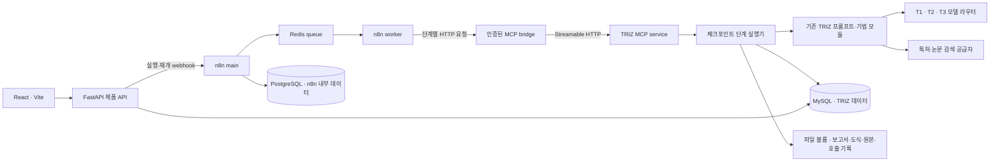
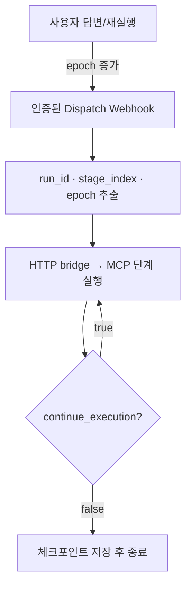

# TRIZ Studio v2 — 전체 기획·구성·설계

작성 기준: 2026-09-08. 이 문서는 `feedback/feedback.md`를 반영한 **현재 코드의 설계**다. 최초 기획은 [PoC 설계 보관본](TRIZ_MASTER_SPEC_POC_ARCHIVE.md)에 보존한다. 운영 환경에서 아직 측정하지 않은 성능이나 답변 품질을 달성 수치로 쓰지 않는다.

## 1. 제품 목적과 범위

현업 엔지니어가 문제 현상·목표·제약·참고 자료를 입력하면, 산업별 질문과 TRIZ 분석을 통해 실행 가능한 해결 개념과 검증 실험을 얻는 협업 도구다. AI가 모든 관측을 알고 있다고 가정하지 않는다. 산업·시스템 경계 확인, 제약 보류 판단, 중간 의견 반영, 전문가 추가, 최종 피드백을 사용자가 수행한다.

핵심 산출물은 문제 프레임, 기능·인과·자원 모델, 기술적·물리적 모순, 다중 기법 아이디어, 해결 개념, 제약 판정, 다직군 평가, 특허·논문 근거, 추가 검증 후보, 시각화 보고서다.

v2는 PC 중심의 공유 데모다. 모바일에서 탐색·입력·열람할 수 있는 반응형 레이아웃을 제공한다. 사용자별 테넌트 분리·OIDC·결제·특허 청구항의 법적 판정은 현재 구현 범위가 아니다. 외부 공개 서비스에서 필요한 접근 정책은 배포 게이트웨이에 적용해야 한다.

## 2. 기존 구현에서 확인한 사항

`concept/` 문서·PDF, 기존 마스터 설계, 모순행렬 PDF, `pilot/`의 API·노드·프롬프트·지식 JSON/YAML·템플릿·검증·스크립트·기존 보고서와 저장 구조를 검토했다.

- 기존 실행 코드는 LangGraph 라이브러리가 아니라 자체 Python 스레드 실행기였다.
- S3 일부와 S8 검토는 병렬이었으나 해결 기법 A~H는 순차 실행이었다.
- 고급 추론은 T3에 집중되어 피드백에서 요구한 T2의 역할과 달랐다.
- 검증/수리/티어 승급의 중첩으로 호출 수가 커졌고, 승급 때 수리 카운터가 초기화됐다.
- 기능 분석의 고정 부품 수와 기계 부품 중심 기준이 다른 산업에도 적용됐다.
- 특허 검색과 논문 검색이 혼합되었고, 검색 결과 페이지를 근거로 연결할 수 있었다.
- 문헌 존재만으로 해결안 성숙도를 높이는 처리가 있었다.
- SQLite와 프로세스 내 이벤트 버스로는 API와 별도 워커 간 실행을 관리하기 어려웠다.
- 기존 Mermaid·표 렌더링은 일부 존재했으나 사용자 화면은 JSON·로그·내부 코드 중심이었다.

## 3. 서비스 아키텍처



**TRIZ 업무 데이터는 MySQL**, **n8n 내부 실행·설정 데이터는 PostgreSQL**, **n8n 큐는 Redis**다. 세 저장소는 역할이 다르다. 피드백의 Railway 자원 구조와 대응한다.

`ORCHESTRATOR=n8n`에서는 API가 전체 파이프라인을 실행하지 않는다. n8n이 다음 단계를 요청하고, API의 `/internal/execute`가 MCP 프로토콜로 `triz_execute_stage`를 호출한다. 이 선택은 결정론적이어서 별도 LLM 도구 선택 비용이 들지 않는다.

`ORCHESTRATOR=local`은 인프라 없는 개발·테스트 경로다. 동일한 `execute_stage()`를 로컬 스레드가 호출한다. SQLite는 이 경로와 기존 PoC 데이터의 호환용이며, 배포 Compose는 MySQL을 사용한다.

## 4. 저장소 구성

| 경로 | 책임 |
|---|---|
| `frontend/` | React/Vite, 5개 화면, 입력·확인·도식·해결안·보고서·이력 |
| `pilot/api/main.py` | 제품 API, 첨부, 보고서 다운로드, n8n → MCP bridge |
| `pilot/triz/pipeline.py` | 단계 계약, 실행 상태, 중복 요청 방지, 재개, 재실행 |
| `pilot/triz/mcp_server.py` | MCP tools/resources/prompts, 서비스 인증 |
| `pilot/triz/mcp_client.py` | MCP 세션 초기화와 단계 호출 |
| `pilot/triz/domain.py` | 고정 산업 카탈로그 매핑, 난이도, 사전 심층 질의 |
| `pilot/triz/agent.py` | T1/T2/T3 라우팅, 호출 예약 예산, 검증, 수리, 실행 내 캐시 |
| `pilot/triz/nodes.py` | S0~S10 TRIZ 기능, 독립 트랙 병렬 실행과 병합 |
| `pilot/triz/evidence.py` | 단계 전후 특허 탐색, 적용성 검토, 근거 부족·추가 후보 |
| `pilot/triz/tools/` | 첨부 추출, 학술·특허·웹 검색 어댑터 |
| `pilot/triz/store.py` | SQLAlchemy Core MySQL/SQLite 저장, 잠금, 이벤트, 파일 아카이브 |
| `pilot/triz/visuals.py` | 구조화 데이터 → SVG 도식 |
| `pilot/triz/presentation.py` | 사람이 읽는 제품용 응답 |
| `pilot/triz/render.py`, `pilot/templates/` | Markdown·독립 HTML 보고서 |
| `pilot/config/` | 산업·난이도·페르소나·TRIZ 설정·검증 기준 |
| `pilot/triz/knowledge/` | 기존 39 파라미터·40 원리·행렬·76 표준해·분리원리·효과·ARIZ 자산 |
| `deploy/` | Docker Compose, n8n import JSON, 환경변수 예시 |
| `pilot/tests/`, `frontend/tests/` | 백엔드 회귀·MCP 프로토콜·브라우저 테스트 |

기존 `pilot/web/`는 PoC 참고 자산으로 남지만 활성 서비스 경로에서는 제공하지 않는다. FastAPI는 `frontend/dist/`를 제공한다. 이전 보고서 템플릿은 보존하되 기본 템플릿은 `report_visual.md.j2`다.

## 5. 실행 단계

| 단계 키 | 목적 | 사용자 개입 | 주요 티어 |
|---|---|---|---|
| `s0_bootstrap` | 실행 모드·트랙·제목·예산 계획 | 모드 직접 선택 | T1 |
| `s0_research` | 산업·난이도·관련 이론·필요 측정·경쟁 가설 검토 | 산업·난이도 확인, 심층 질문 답변 | T2 |
| `s1_intake` | 문제 프레임·제약 추출 | 부족 정보 역질의 | T1 |
| `s2_confirm` | 대상 시스템·영역·시간 확정 | 후보 선택·설명 보완 | T2 |
| `s3_analyze` | 9 Windows → 기능 모델 → 물질–장/자원/CECA, 도메인 제약 | 의견 반영 재실행 | T2 |
| `s4_define` | IFR·기술적 모순·물리적 모순·트리밍·핵심 문제 | 의견 반영 재실행 | T2 |
| `s5_solve` | A~H 기법, 사전 타산업 특허 탐색, 통합 | 의견 반영 재실행 | T2 |
| `s6_concept` | 부품·공정·메커니즘·전제·검증 실험으로 구체화 | 의견 반영 재실행 | T2 |
| `s7_gate` | 제약 검토, 불확실성 유지 | 조건부 유지·제외 | T2 |
| `s8_evaluate` | 도메인별 검토자 구성·독립 평가·랭킹 | 추가 전문가·보완 의견 | T1/T3/T2 |
| `s8_references` | 해결안별 특허·논문 대조, 새 적용 방식 발굴 | 보고서에서 근거 확인 | T2 |
| `s9_report` | 요약 작성 + 결정론적 시각화·템플릿 렌더 | 열람·다운로드 | T1 + 코드 |
| `s10_feedback` | 해결안 평가·적용 의견·RAG 적재 | 평가 또는 나중에 | T1 또는 호출 없음 |

S3은 기능 모델 의존성을 지킨다. 물질–장·자원·CECA는 그 이후 병렬 실행한다. S5는 트랙마다 독립 분석 상태를 만들고 병렬 실행한 뒤 고정 순서로 결과를 병합한다. ARIZ 내부 Part 1→2→3→4→5→7은 순서를 유지한다. S8 검토자는 서로의 판단을 보지 않고 병렬 평가한다.

## 6. 산업·난이도·프롬프트 스위칭

`industries.yaml`은 반도체, 이차전지, 화학·소재, 소프트웨어, 제조·기계·디스플레이, 서비스·물류·경영, 일반·복합 문제를 정의한다. 각 산업은 키워드, 기본 난이도, 학문 영역, 검토할 이론, 필요한 측정, 타산업 탐색 범위, 전문가 역할을 가진다.

| 난이도 | 분석 깊이 | 사전 질문 상한 |
|---|---|---|
| routine | 구성요소와 관찰된 기능 | 2 |
| advanced | 작동 메커니즘과 인과관계 | 3 |
| frontier | 길이·시간·에너지 척도와 복합 이론 | 4 |

초기 매핑은 사용자 질의와 첨부의 키워드 기반 **잠정 분류**다. UI에서 사용자가 산업·난이도를 확인·수정한다. S0 심층 프롬프트는 확인 사실, 이론의 적용/배제 조건, 경쟁 가설, 구별 실험, 미확인 조건을 만든다. 이후 단계에는 관련 산업 계약과 답변이 주입된다.

반도체는 소자 물리·표면/계면 화학·재료·화학공학을 함께 검토한다. 양자·분자 효과는 해당 척도와 조건이 관련될 때 적용하며, 용어 자체를 붙여 깊이를 과장하지 않는다. 소프트웨어는 요청·데이터 경로·공유 상태·큐·일관성 경계를 분석한다. 고정된 축·베어링 수를 강제하는 검사 기준은 제거했다.

검토자와 제약 게이트에는 확인 사실·미확인 조건·사용자 답변을 전달하되, 생성된 TRIZ 출처나 경쟁 가설을 검토 근거처럼 누출하지 않는다.

## 7. LLM 라우터와 비용 제어

| 티어 | 역할 | 기본 시험 모델 |
|---|---|---|
| T1 | 추출·정규화·질문·페르소나 구성·서술·피드백 정제 | deepseek-chat |
| T2 | 산업 심층 검토, S3/S4/S5/S6, 제약 판단, 검색 계획·메커니즘 대응·랭킹 | deepseek-chat |
| T3 | 독립 루브릭 감사·다직군 검토 | deepseek-chat |

`routed_tier()`가 기존 호출부의 티어보다 우선한다. 고성능 외부 AI로 확장할 때 `LLM_API_KEY_T2`, `LLM_BASE_URL_T2`, `LLM_MODEL_T2`를 지정한다. 공통 키/주소를 비워 두지 않아도 티어별 값이 우선한다. OpenAI 호환 Chat Completions API 서버를 지원하며, 비호환 네이티브 API에는 별도 어댑터 구현이 필요하다.

모델 기능은 `LLM_JSON_MODE_T*`, `LLM_SUPPORTS_TEMPERATURE_T*`, `LLM_TOKEN_PARAMETER_T*`로 조정한다. 키·주소·모델·입출력 단가는 환경변수다. 모든 시험 티어는 DeepSeek 설정을 유지한다.

비용 제어:

1. JSON 직렬화에서 불필요한 공백을 제거한다. 단계별 digest와 제한된 검색 메타데이터만 전달한다.
2. 생성 시 노드 수리 1회, 티어 승급 최대 1회로 제한하며 카운터를 초기화하지 않는다. SDK 자동 재시도는 꺼서 앱 재시도와 중첩하지 않는다.
3. 비용이 큰 독립 루브릭 감사는 기능 모델·인과·모순·개념 등 핵심 기준에 집중한다. 검증 생략/장애는 PASS로 기록하지 않는다.
4. 같은 실행에서 입력·프롬프트·모델·검증 정책이 같은 성공 호출은 재사용한다. 실행 간 데이터 공유 캐시는 없다.
5. 병렬 호출 전 입력 바이트 수·출력 상한·단가·재시도 수로 비용을 예약한다. 예약 가능 예산이 없으면 모델을 강등하지 않고 INTERRUPTED로 중단한다.
6. 성공·실패 응답의 사용량을 집계한다. 출력 길이 초과 응답을 부분 JSON 성공으로 처리하지 않는다.
7. SVG 도식, 기본 보고서 구조, UI 형식, MCP 도구 선택은 LLM 호출 없이 처리한다.
8. 특허·논문 검색은 실행 단위 쿼리 캐시와 상한을 적용한다.

비용은 공급자 usage 및 설정 단가 기반 추정이다. 실제 청구 금액, 캐시 할인, 모델별 특수 과금과 차이가 있을 수 있다. 변경 전후 토큰·지연·산업별 정확도 개선 수치는 실제 동일 입력 평가 후 산출해야 한다.

## 8. MCP 모듈 계약

공식 Python MCP SDK v1 API를 명시적으로 사용한다(`mcp>=1.28,<2`). MCP SDK v2와 혼용하지 않도록 상한을 둔다. [공식 SDK 저장소의 버전 안내](https://github.com/modelcontextprotocol/python-sdk).

- `triz_execute_stage(run_id, stage_index, epoch)`: 단계 상태를 변경하는 실행 도구. n8n이 호출한다.
- `triz_s0_*`~`triz_s10_*`: 기존 프롬프트별 도구. `run_id`, `variables`를 받아 산출물을 반환하고 호출/단계 기록을 저장한다. 단독 호출은 전체 파이프라인의 단계 번호를 자동 전진시키지 않는다.
- `triz_evidence_plan`, `triz_evidence_match`: 기능 지향 검색 설계·근거 매칭.
- `triz_get_engineering_parameters`, `triz_get_inventive_principles`, `triz_query_matrix`: 지식 조회. 행렬 누락을 모델 기억으로 채우지 않는다.
- `triz_search_evidence`: 종류별 실재 검색 레코드 조회.
- `triz_parse_attachment`, `triz_verify_artifact`, `triz_render_report`: 저장된 첨부 재추출, 독립 검증, 모델 호출 없는 보고서 재렌더.
- `triz://workflow`: 단계 리소스.
- `/triz` prompt: 문제로부터 가이드형 상담 흐름을 시작하는 템플릿.

총 도구 목록은 서버의 `tools/list`로 확인한다. 현재 기본 서버는 52개 도구를 등록한다. `TRIZ_MCP_MODULE=s3` 같은 설정은 프롬프트 그룹을 분리 배포하는 진입점이다. 기본 Compose는 운영 복잡도를 줄이기 위해 all 서버를 하나 배치한다. Streamable HTTP는 `Authorization: Bearer TRIZ_SERVICE_TOKEN`, 로컬 stdio는 MCP 호스트가 접근을 관리한다.

## 9. n8n 실행·재개·중복 처리

import 파일: `deploy/n8n/triz-workflow.json`.



외부 큐는 at-least-once 전달을 가정한다. MySQL `GET_LOCK`과 현재 단계 번호·epoch를 함께 확인해 같은 단계의 중복 커밋을 막는다. 오래된 epoch의 요청은 새 흐름을 진행시키지 않는다. 사용자 대기 중에는 n8n 워커를 점유하지 않고 실행을 종료한다. 답변 제출은 새 webhook 요청으로 재개한다.

모델 호출 도중 워커가 중단되면 외부 API 호출 자체의 exactly-once를 보장하지는 않는다. 이미 DB/파일에 완료된 체크포인트는 유지되고, 마지막 미커밋 단계는 재시도될 수 있다. MySQL 잠금은 연결 종료 때 해제된다. n8n 큐 복구와 HTTP 재시도가 담당하며, API 재시작 시 다른 워커의 RUNNING 상태를 임의 중단시키지 않는다.

실패 시 하위 단계를 성공처럼 진행하지 않는다. 비용 중단과 오류는 현재 단계에서 이어서 실행할 수 있다. 재실행은 다음 단계의 오래된 아이디어·개념·평가·보고서를 무효화하며, 기존 파일 아카이브는 보존한다.

## 10. 특허·논문·타산업 이식

S5에서 **해결안 확정 전에** 실제 사용된 모순·발명원리·기능을 기준으로 타산업 특허를 탐색한다. S6에는 검색된 메커니즘 정보가 전달된다. S8 뒤에는 각 해결안에 대해 특허와 논문을 각각 검색·대조한다.

검색 쿼리는 목적만 나열하지 않고 작용 주체·동작·대상·물리적 수단·상충 특성으로 작성한다. 원리 번호나 TRIZ라는 단어만 검색하지 않는다. 산업 중립 쿼리와 donor 산업 쿼리를 포함한다.

| 검색 종류 | 공급자 | 조건 |
|---|---|---|
| PATENT | PatentsView, Tavily의 특허 레코드 | 공급자 키 필요 |
| PAPER | Crossref, OpenAlex, arXiv | 공급자 정책에 따른 사용 가능 여부 확인 |

공급자 검색을 병렬 실행하고 URL/식별자 기반으로 중복 제거한다. 쿼리 자체도 실행 내 캐시로 중복 요청하지 않는다. 기본 상한 16개 중 사전 탐색 최대 4개, 최종 검색 최대 12개를 사용한다.

매칭은 공급자가 반환한 레코드의 index만 참조한다. confidence ≥ 0.7, 구체적 메커니즘 대응, 이식 조건이 있는 경우에 연결한다. 근거의 `verified`는 **공급자 메타데이터 확인**을 의미하며 `evidence_scope`에 범위를 기록한다. 특허 청구항·실증 성능·상용화 검증을 의미하지 않는다. 문헌 존재만으로 `maturity`를 올리지 않는다.

기존 해결안과 구현 수단이 같으면 해당 해결안의 참고 링크로 연결한다. 수단이 다르면 차별점·이식 조건·실험·위험을 가진 **추가 검증 후보**로 별도 보고한다. 이 후보는 기존 해결안의 제약·다직군 평가를 통과한 것으로 간주하지 않는다. 각 해결안의 특허 또는 논문이 부족하면 종류별 미확보 상태를 명시한다.

## 11. 첨부 자료 처리

파일당 기본 25MB, 요청당 8개. 확장자 검증과 서버 생성 파일명을 사용한다. 저장 원본에 SHA-256과 경로를 기록한다. 파일을 저장한 후 파서는 백그라운드 작업으로 수행해 API 이벤트 루프를 막지 않는다.

- PDF: 최대 30페이지, 텍스트와 최대 4개 표/페이지를 추출한다. 스캔 페이지는 OCR을 시도한다.
- XLSX: 최대 8시트·200행·25열, 저장된 수식 계산값을 읽는다.
- CSV: 최대 200행, UTF-8/CP949 처리.
- 텍스트: 행 번호, 이미지: OCR 출처를 유지한다.
- 측정값·단위·결함·제약 관련 줄을 우선 선별해 문서 후반의 정보도 반영한다.
- OCR 실패, 일부 추출, 도면의 연결·치수 관계 미해석은 명시한다. OCR이 비전 도면 이해를 대체한다고 주장하지 않는다.

첨부와 검색 데이터는 프롬프트의 외부 데이터로 취급한다. 자료 안의 지시문은 실행 명령이 아니다. 원본은 파일 볼륨에, 추출 텍스트·사실·출처는 상태 DB와 아카이브에 남는다.

## 12. 검증·다직군 평가·품질

기존 결정론적 검증(파라미터·원리·표준해·간선 참조·ARIZ 필수 단계·평가 ID·제약 수치)과 독립 루브릭을 사용한다. 작은 시스템에 고정 부품 수를 강제하는 조건은 제거했다. 반면 기능의 주체/대상 참조 무결성과 주기능은 검사한다.

해결 개념은 기존 설명·동작 원리·변경·자원·TRIZ 출처·모순 연결·전제·위험에 더해 `validation_plan`, `transfer_conditions`를 가진다. 실험은 지표/기준값/목표/대조 방법/반증 기준을 명시하며 미측정 기준값을 만들어 넣지 않는다.

산업별 전문가 시드와 기존 페르소나를 합쳐 검토자를 구성한다. 역할별 사람 형태의 아이콘·전문분야 아이콘을 UI와 보고서에 배정한다. 평가는 0~5 원 점수로 표시하며 도식 미관을 위해 점수 좌표를 바꾸지 않는다.

사용자가 제약 보류안을 유지해도 기술적 판정은 CONDITIONAL이다. 사용자 승인 자체가 물리적·수치적 검증 통과를 의미하지 않는다.

## 13. 시각화와 보고서

`visuals.py`는 모델이 작성한 Mermaid 문자열 대신 상태 데이터를 읽어 SVG를 만든다. 텍스트는 XML escape하며 UI에서도 DOMPurify를 적용한다.

도식 범위: 9 Windows, 기능 관계, S1/S2/F 물질–장과 실제로 존재하는 S3, CECA, 자원, IFR, 기술적·물리적 모순, 트리밍, 행렬과 추천 원리, 표준해/분리/진화/FOS/효과 적용, ARIZ 단계, 해결안 변경 구성. 존재하지 않는 S3나 모델에 없는 인과 간선을 만들어 넣지 않는다.

보고서는 요약·해결안 비교·도식·구체 실행·검증 실험·특허·논문·추가 후보·전문가·제약·불확실성 순서다. 내부 ID는 표시명으로 치환한다.

출력:

- `report.md`: 편집·Git 관리용, SVG 상대 경로 포함.
- `report.html`: SVG를 포함하는 독립 HTML. 외부 JS 없이 열람·인쇄 가능.
- `*.svg`: 기법별 독립 도식.
- ZIP: Markdown, HTML, SVG 묶음. 원본 첨부나 원시 LLM 기록을 함께 내보내지 않는다.
- PDF: 현재는 HTML을 브라우저에서 인쇄/PDF 저장한다. 서버 PDF 렌더러는 없다.

## 14. 화면 설계

| 메뉴 | 구현 |
|---|---|
| Main UI | TRIZ 소개, 공개 도입 사례 링크, 자체 제작 레이어 일러스트, 시작 CTA, 입력 예시 |
| Tool 소개 | Agentic AI와 TRIZ 템플릿, 4단계 사용 여정, 사용자 판단의 역할 |
| Problem Solving | 문제·첨부·모드 입력, 단계 목록, 캐릭터 진행 안내, 역질의, 시스템 확인, 조건부 판단, 의견/전문가 재검토, 도식, 해결안, 보고서, 피드백 |
| Sample Case | DB 실행 이력, 문제명·산업·시스템·날짜·상태, 검색, 프로젝트 재열람 |
| About us | 제목 외 빈 화면 |

사용자 화면에 JSON 송수신, 원시 로그, 내부 concept 코드, API 모델 설정은 표시하지 않는다. 상세 개발자용 API와 DB 호출 기록은 분리한다. 제품 상태는 DB 기반 view를 주기적으로 읽으며 SSE 원시 이벤트 API도 별도로 유지한다. 네트워크 실패·빈 결과·대기·미완료·근거 부족 상태를 다룬다.

이미지는 외부 사진을 복제하지 않고 CSS·SVG로 작성했다. Lucide·글꼴 출처는 `frontend/LICENSES.md`를 참고한다. 공개 기업 사례는 서비스 제휴 표시가 아니다. [삼성전자 공식 TRIZ 교육 사례](https://news.samsung.com/kr/혁신-dna는-이렇게-전파된다···-삼성-협력회사-혁신), [포스코 현장 적용](https://www.posco.co.kr/homepage/docs/kr/news/pbn/s91fpbnn003c.jsp?idx=201993&pidx=202002), [LG Cable 연구진 사례](https://www.aitriz.org/articles/InsideTRIZ/3230313030342D4B616E67.pdf)를 연결한다.

## 15. 데이터와 파일 저장

| 테이블 | 내용 |
|---|---|
| runs | 제목·산업·시스템·모드·상태·현재 단계·비용·시각 |
| run_states | 전체 직렬화 상태, 업데이트 시각 |
| steps | 에이전트·프롬프트·모델·티어·입출력·판정·비용·오류 |
| feedback_logs | 해결안 평가·채택 여부·이유·의견 |
| rag_docs | 피드백 지식·메타데이터·가중치·사용 횟수 |
| run_events | 워커와 API가 공유하는 순서 있는 이벤트 |
| llm_calls | 모델 요청·응답·내부 재시도 원문·사용량·오류 |

MySQL은 utf8mb4와 LONGTEXT를 사용한다. 상태/메타 업데이트는 DB 트랜잭션이고 파일은 임시 파일 작성 후 원자적 rename으로 교체한다. 저장 실패를 조용히 무시하지 않는다. DB와 파일을 하나의 분산 트랜잭션으로 묶지는 않는다. DB 성공 후 파일 실패 시 단계 오류로 남아 재실행한다.

```text
storage/
  uploads/{uuid}.{ext}          원본 첨부
  {run_id}.md                  기존 다운로드 경로 호환
  runs/{run_id}/
    state.json                 현재 상태
    step-{step_id}.json         단계 입출력·검증·비용
    call-{uuid}.json            모델 호출 입출력·사용량
    stage-{epoch}-{index}.json  단계 완료 스냅샷
    report.md
    report.html
    {technique}.svg
```

Compose의 API와 MCP 컨테이너는 같은 영속 볼륨을 공유한다. Railway 운영 배포에서는 `TRIZ_EMBED_MCP=true`로 API 서비스에 `/agent/mcp`를 함께 제공하고 `/data` 볼륨을 사용한다. 장시간 MCP 호출은 `asyncio.to_thread`에서 실행해 상태 조회 API를 막지 않는다. 프런트는 별도 GitHub 저장소와 서비스로 배포되어 인증된 `/api` 프록시를 제공한다. 백엔드 리스너는 IPv4/IPv6를 함께 수신한다. S3는 후속 확장 지점이며 아직 구현된 드라이버로 표시하지 않는다.

PoC SQLite → MySQL 이전은 `pilot/scripts/migrate_sqlite.py`가 담당한다. 기본은 dry run, `--apply` 시 빈 대상 DB에만 복사하며 기존 DB를 덮어쓰지 않는다. 원본·보고서 파일 볼륨도 함께 보존한다. 이전 실행의 단계 번호는 v2에서 추가한 S0 연구 단계를 고려해 재개 시 보정한다.

## 16. API 계약

| API | 역할 |
|---|---|
| POST `/api/runs` | multipart 문제·모드·첨부 → 실행 생성·dispatch |
| GET `/api/runs` | 프로젝트 이력 |
| GET `/api/runs/{id}/view` | 제품용 프레임·질문·도식·해결안·진행 상태 |
| GET `/api/runs/{id}` | 개발자용 전체 상태 |
| GET `/api/runs/{id}/events` | DB 이벤트 SSE |
| POST `/api/runs/{id}/resume` | 현재 interrupt ID와 답변, epoch 증가 |
| POST `/api/runs/{id}/continue` | 중단/실패 단계 재개 |
| POST `/api/runs/{id}/rerun` | 선택 단계와 보완 지시, 하위 산출물 무효화 |
| POST `/api/runs/{id}/inject-agent` | 노드/단계 전문가 관점 추가 |
| GET `/api/runs/{id}/steps` | 단계 기록 |
| GET `/api/runs/{id}/steps/{step}` | 상세 호출/검증 기록 |
| GET `/api/runs/{id}/report?format=md\|file\|html\|bundle` | 보고서 다운로드 |
| POST `/api/runs/{id}/feedback` | 해결안 피드백 |
| POST `/internal/execute` | Bearer 인증, n8n → MCP 단계 실행 |
| `/mcp` (별도 프로세스) | MCP Streamable HTTP |

진행 중인 실행에 대해 외부 의견이 상태를 덮어쓰지 않도록 실행 잠금과 상태 검사를 적용한다. 공유 데모의 제품 API에는 현재 사용자별 권한 분리가 없으므로 내부 검증 환경에서 운영한다.

## 17. 배포와 설정

자세한 명령은 [실행 안내](../pilot/README.md), [배포 안내](../deploy/README.md)에 있다.

- DeepSeek 키는 공통 환경변수에, 고급 모델 전환은 T2 환경변수에 설정한다.
- MySQL은 `DATABASE_URL` 또는 Railway `MYSQLHOST/MYSQLPORT/MYSQLDATABASE/MYSQLUSER/MYSQLPASSWORD`를 사용한다.
- n8n PostgreSQL·Redis 참조 변수는 기존 Railway 자원을 연결한다.
- 공개 webhook URL은 n8n의 `WEBHOOK_URL`, 이 앱이 호출할 dispatch 주소는 `N8N_DISPATCH_URL`이다.
- `N8N_ENCRYPTION_KEY`는 n8n main/worker에 동일하게 유지한다. 서비스 토큰과 DB 비밀번호를 코드·워크플로 JSON에 넣지 않는다.
- 배포용 n8n 이미지 버전은 `N8N_IMAGE`로 고정한다. 기본 예시는 2.0.0이며 대상 환경에서 워크플로 import/credential/실행 확인 후 사용할 버전을 고정한다.
- feedback 문서의 자격증명은 새 설정 파일에 복사하지 않았다. 해당 문서가 외부 공유·Git 추적된 경우 자격증명 교체가 필요하다.

## 18. 검증 상태와 남은 현장 검증

현재 자동 검증 범위:

- 기존 오프라인 스모크 8개: 설정·TRIZ 지식·프롬프트·검증·파이프라인·보고서·저장·RAG.
- 백엔드 회귀: 산업/난이도, 블라인드 컨텍스트, T2 라우팅, 체크포인트/epoch, 중복·동시 실행, 예산 예약, 캐시·기록, 검증 장애, SVG escaping, 보고서 묶음, 증거 유형/이식 조건, 제약 불확실성, 업로드, Excel, MySQL DDL, MCP 프로토콜, 병렬 트랙 격리, 재실행 무효화.
- 브라우저: PC 홈·5개 메뉴, 입력·첨부, 이력·역질의 재개, 모바일 가로 넘침, 도식·근거 부족·다운로드 링크.
- Vite 배포 빌드.

로컬 Compose는 Docker 미설치로 실행하지 않았다. Railway에서는 실제 MySQL·Redis·PostgreSQL·n8n과 API/MCP/프런트를 연결하고 가상 입력 1건으로 DeepSeek 호출, 질문 대기·답변 재개, 영구 저장을 확인했다. 로컬 브라우저 회귀 테스트는 fixture 기반이며, 별도 실제 사이트 점검과 산업별 답변 품질 평가는 구분한다. 상세 배포 검증 기록은 `docs/DEPLOYMENT_STATUS.md`를 참고한다.

최종 현장 검증은 동일한 입력과 예산으로 기존 PoC와 v2를 비교해야 한다. 반도체 세정/식각, 전극 코팅, 화학 반응, 기계 진동, SW 일관성, 제약 강한 사례, 정보 부족, 스캔 도면을 포함한다. 평가 지표는 제약 위반 수, 메커니즘 정확성, 실험 구체성, 원리/근거 연결, 타산업 이식 가능성, 미확인 주장 비율, 호출·토큰·비용, 전체/단계 지연이다.

구조 개선을 실제 답변의 산업 정확도 향상으로 확정하지 않는다. 고성능 T2 모델과 현업 검토자의 정답·반증 피드백을 연결해 다음 품질 기준을 결정한다.

## 19. 피드백 추적

8개 피드백과 구현 파일·검증·운영 조건의 대응은 [피드백 반영표](FEEDBACK_IMPLEMENTATION.md)에 정리한다. 변경에 따라 이 문서와 반영표를 함께 갱신한다.
