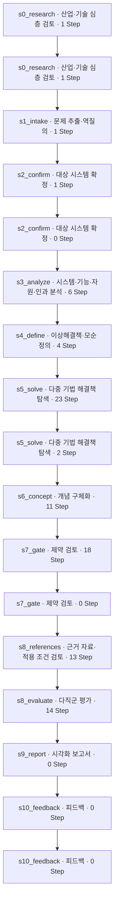

# 로테이션 구동계(서보 모터·인덱서·회전축·베어링) 개선 과제 · 실제 실행 데이터

9월 30일 특허검색 복구 후 다시 진행한 분석의 실제 저장 기록입니다. 전체 흐름에서 Stage로, Stage에서 하위 process의 입력·출력으로 읽을 수 있습니다.

| 항목 | 확인한 값 |
|---|---|
| 프로젝트 | 로테이션 구동계(서보 모터·인덱서·회전축·베어링) 개선 과제 |
| run_id | run-baa72a38ef40c8c63155ffc7a1dd25ee |
| 실행 범위 | 2026-09-30 12:50:24 KST부터 · epoch 53–58 |
| 조회 시 상태 | COMPLETED |
| 모드 | DEEP |
| 분석 실행 당시 서버 코드 | 5ce8ec233b3d58d2005530a4e9b3113f5fc235f2 |
| 완료 후 비용정정 계산 코드 | 3fd16f06180d533f682956a010331063cd636cf9 |
| 비용정정 시각 KST | 2026-09-30 14:13:07 |
| Stage 이벤트 범위 | 46305–47278 |
| 실제 Step | 95개 · 상속 1개 별도 |
| 실제 모델 task | 101 |
| 이번 task 원본 정산 USD | 0.971468 |
| 이번 task 정정 반영 USD | 0.390118 |
| 프로젝트 누적 USD | 3.11851 |
| 비용정정 식별자 | cost-restatement-5de95ce3a3ac35352432fca643444c15f7d199f165614991 |

Stage와 하위 process는 **분석 실행 당시 서버 코드**에 연결했습니다. 비피크 가격·실제 캐시 사용량을 적용한 비용정정은 분석 완료 후 별도 코드로 수행한 회계 추정값의 정정입니다. 이 분석이 새 가격 코드로 실행되었거나, 새 코드로 다시 추론한 것으로 표시하지 않았습니다.

이번 Step의 저장 상태는 FAILED 1건 · OK 53건 · WARN 41건입니다. 프로젝트 완료와 개별 Step의 성공 여부를 구분하며, 실패·경고 기록도 그대로 포함했습니다.

**이번 회차에 저장된 최종 사용자 피드백은 0건입니다.** 이전 회차의 피드백이 상속 입력에 남아 있어도 이번 제출로 집계하지 않습니다. 과학효과·트랙 학습을 새로 수행했다는 뜻이 아니며, 실제 검토·결정 기록은 아래 원장에서 확인합니다.

## 실제 Stage 흐름

동일 Stage가 다시 나타나면 저장된 사용자 중단·재개 또는 재시도입니다. 이번 구간에 나타나지 않는 Stage를 실행했다고 표시하지 않았습니다.

## Stage별 최종 Input/Output

| 순서 | Stage / 전체 자료 | 이번 Step | 이번 task | 출력 영역 |
|---|---|---|---|---|
| 1 | [실행 계획](stages/01-s0-bootstrap.md) | 0 | 0 | input |
| 2 | [산업·기술 심층 검토](stages/02-s0-research.md) | 2 | 2 | input |
| 3 | [문제 추출·역질의](stages/03-s1-intake.md) | 1 | 1 | input |
| 4 | [대상 시스템 확정](stages/04-s2-confirm.md) | 1 | 1 | problem |
| 5 | [시스템·기능·자원·인과 분석](stages/05-s3-analyze.md) | 6 | 10 | problem, analysis |
| 6 | [이상해결책·모순 정의](stages/06-s4-define.md) | 4 | 7 | definition |
| 7 | [다중 기법 해결책 탐색](stages/07-s5-solve.md) | 25 | 24 | solve |
| 8 | [개념 구체화](stages/08-s6-concept.md) | 11 | 11 | concepts, coherence |
| 9 | [제약 검토](stages/09-s7-gate.md) | 18 | 18 | concepts, constraints, coherence |
| 10 | [근거 자료·적용 조건 검토](stages/10-s8-references.md) | 13 | 12 | concepts, evidence, coherence |
| 11 | [다직군 평가](stages/11-s8-evaluate.md) | 14 | 15 | evaluation, selection |
| 12 | [시각화 보고서](stages/12-s9-report.md) | 0 | 0 | report, report_context, selection |
| 13 | [피드백](stages/13-s10-feedback.md) | 0 | 0 | feedback |

## 최종 저장 후보

| 해결안 | 품질 상태 | 제약 상태 |
|---|---|---|
| 부하·무부하 프로파일 분리 | REVISE | 별도 제약 판정 참조 |
| 클램프 사전 준비 동작 선행 배치 | REVISE | 별도 제약 판정 참조 |
| 부하율 피드백 기반 가변 프로파일 | REVISE | 별도 제약 판정 참조 |
| 회전축 진동·온도 실시간 계측 장 | REVISE | 별도 제약 판정 참조 |
| 고부하 접촉면 국부 윤활 강화 | REVISE | 별도 제약 판정 참조 |
| 클램프 접촉면 마찰계수 상향 | REVISE | 별도 제약 판정 참조 |
| 감속 회생 전력 재사용 경로 | REVISE | 별도 제약 판정 참조 |
| 회전축·지지체 단면 강성 보강 | REVISE | 별도 제약 판정 참조 |
| 허용 기준값 확정 선행 | REVISE | 별도 제약 판정 참조 |
| 지연 보상형 가감속 제어 | REVISE | 별도 제약 판정 참조 |

## 기록을 읽을 때

- 이번 구간의 데이터와 입력으로 참조한 과거 버전을 구분했습니다. 상속 비용은 이번 task 합계에 넣지 않습니다.
- Step의 구조 검사 통과는 기술적 검증 완료가 아닙니다. CONDITIONAL과 미확인 조건은 저장값대로 유지했습니다.
- 특허검색은 검색 Step의 쿼리별 결과와 최종 근거 연결을 각각 확인합니다. 검색 hit를 해결책 입증으로 해석하지 않습니다.
- 학습·보상은 실제 저장된 평가와 선택 원장만 표시합니다. 기록이 없으면 없다고 표시합니다.
- 함수 내부 중간값, 저장되지 않은 응답, 미래 사용자 피드백은 재구성하지 않았습니다.

## 상세 원장

| 자료 | 건수 |
|---|---|
| [모델 호출과 비용](CALLS.md) | 101 |
| [Stage·사용자 이벤트](EVENTS.md) | 351 |
| [AX 실행 이벤트](AX_EVENTS.md) | 251 |
| [트랙·보완·종료 결정](DECISIONS.md) | 15 |
| [사용자 검토](REVIEWS.md) | 0 |
| [최종 해결안 피드백](FEEDBACK.md) | 0 |
| [과학효과 적용](EFFECT_APPLICATIONS.md) | 0 |
| [과학효과 검토와 보상 근거](EFFECT_REVIEWS.md) | 0 |
| [과학효과 선정](EFFECT_SELECTIONS.md) | 0 |
| [이번 최종 피드백에서 저장한 사례](RAG.md) | 0 |

[전체 하위 처리](PROCESS_INDEX.md) · [산출물과 스냅샷](ARTIFACTS.md) · [비용정정 비교](COSTS.md) · [수집·비용 기준](PROVENANCE.md)

[샘플 목록](../README.md) · [Stage 설계](../../STAGES.md)
