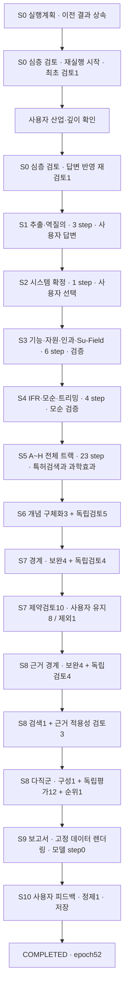

# 로테이션 구동계 + 정렬·클램프 직렬 구간 · 실제 실행 데이터

이 문서는 **완료된 가장 최근 재실행**에서 DB에 남은 입력·출력과 실제 호출 순서를 연결합니다. 처음에는 아래 흐름과 Stage 표를 보고, 필요한 단계에서 함수별 데이터로 들어가면 됩니다.

| 항목 | 확인한 값 |
|---|---|
| 프로젝트 | 로테이션 구동계 + 정렬·클램프 직렬 구간 개선 과제 |
| run_id | run-baa72a38ef40c8c63155ffc7a1dd25ee |
| 이번 범위 | 2026-09-30 06:46:54–07:58:37 KST · epoch 47–52 |
| 시작 / 완료 근거 | run_events 45932 / 46304 |
| 재실행 시작 | s0_research · S0 실행계획은 이전 결과 상속 |
| 모드 / 실행 계약 | DEEP / triz-ax-v3.1 / mode-tracks-v1 · run_contract=null |
| 완료 상태 | COMPLETED · 기술적 타당성 확정과 구분 |
| 하위 Step | 92건 · {'OK': 55, 'WARN': 37} · 상속 S0 1건 별도 |
| 실제 모델 task | 95건 · independent_verifier 16건 포함 |
| 이번 task 정산 USD | 0.760452 |
| 프로젝트 누적 USD | 7.611395 |

## 이번 문제와 최종 결과

대형 OLED용 패턴 글라스를 180도 뒤집는 설비입니다. 입력에서 확인된 현재 takt는 53초, 목표는 50초 이하이며 모터·인덱서 부하, 강성, 안정성과 Slip 방지가 제약입니다. 사용자는 구동계 단독 대신 정렬·클램프 직렬 구간까지 포함하는 시스템을 선택했습니다. 수치는 입력 관측·목표이며 이번 작업에서 새로 측정한 성능이 아닙니다.

최종 보존 후보는 **8개**입니다. 모두 품질 검토 `REVISE`, 제약 판정 `CONDITIONAL`이며 최종 selection의 `recommended`는 빈 배열입니다. 사용자 평점과 실제 채택 여부도 분리했습니다. 8개 평점이 저장됐고 `adopted`는 모두 `null`입니다.

| 해결안 | 기술 검토 / 제약 | 사용자 평점 | 채택 |
|---|---|---|---|
| 부하별 가변 가감속 프로파일 | REVISE / CONDITIONAL | 5 | 미입력 |
| 가감속 프로파일 단계적 상향 | REVISE / CONDITIONAL | 5 | 미입력 |
| 정렬 액추에이터 사전 스트로크 | REVISE / CONDITIONAL | 5 | 미입력 |
| 복귀 구간 정렬·클램프 사전 준비 | REVISE / CONDITIONAL | 5 | 미입력 |
| 가진 진동 분리형 축 결합부 | REVISE / CONDITIONAL | 3 | 미입력 |
| 베어링 윤활 점도 저감 및 회생 제동 활용 | REVISE / CONDITIONAL | 2 | 미입력 |
| 공진 이격 조건부 가속 상향 | REVISE / CONDITIONAL | 4 | 미입력 |
| 클램프 패드 유연막 분산 접촉 | REVISE / CONDITIONAL | 3 | 미입력 |

## 실제 흐름

## Stage별 최종 Input/Output

| 순서 | 단계와 전체 데이터 | 이번 Step | 이번 task | 최종 저장 산출물 |
|---|---|---|---|---|
| 1 | [실행 계획](stages/01-s0-bootstrap.md) | 0 | 0 | input |
| 2 | [산업·기술 심층 검토](stages/02-s0-research.md) | 2 | 2 | input |
| 3 | [문제 추출·역질의](stages/03-s1-intake.md) | 3 | 3 | input |
| 4 | [대상 시스템 확정](stages/04-s2-confirm.md) | 1 | 1 | problem |
| 5 | [시스템·기능·자원·인과 분석](stages/05-s3-analyze.md) | 6 | 8 | problem, analysis |
| 6 | [이상해결책·모순 정의](stages/06-s4-define.md) | 4 | 5 | definition |
| 7 | [다중 기법 해결책 탐색](stages/07-s5-solve.md) | 23 | 23 | solve |
| 8 | [개념 구체화](stages/08-s6-concept.md) | 8 | 8 | solve, concepts |
| 9 | [제약 검토](stages/09-s7-gate.md) | 18 | 18 | concepts, constraints |
| 10 | [근거 자료·적용 조건 검토](stages/10-s8-references.md) | 12 | 11 | concepts, constraints, evidence |
| 11 | [다직군 평가](stages/11-s8-evaluate.md) | 14 | 15 | evaluation, selection |
| 12 | [시각화 보고서](stages/12-s9-report.md) | 0 | 0 | coherence, selection, report_context, report |
| 13 | [피드백](stages/13-s10-feedback.md) | 1 | 1 | feedback |

## 읽을 때 구분할 점

- 최신 epoch 52만 추출하지 않았습니다. 산업 검토·역질의·시스템 선택·제약 판정·최종 피드백으로 재개한 epoch 47–52를 함께 묶었습니다.
- 이 실행은 이전 `mode-tracks-v1` 계약입니다. 현재 신규 실행의 adaptive Q 경로로 소급 설명하지 않았습니다. A/B/D → C/E/F → G/H의 실제 배치와 경계 보완을 그대로 표시했습니다.
- S7·S8 경계의 보완과 재품질검토 16개 Step은 DB에 `S6_CONCEPT`로 남아 있지만 실행 이벤트상 S7·S8에 속합니다. 두 값을 모두 보존했습니다.
- 이번 검색 Step은 S5 4개·S8 16개 쿼리 모두 `UNAVAILABLE`/0건입니다. 화면 이벤트의 특허 12건·전체 110건은 누적/재사용 상태이며, 최종 연결 근거는 0건입니다. 검색 성공이나 특허 입증으로 해석하지 않습니다.
- 독립 Step 기록이 없는 `_pick_tcs`, `_add_ideas`, 집계·해시 함수 등은 코드와 호출자 입출력을 연결했습니다. 별도의 입력·출력 로그가 있었던 것처럼 만들지 않았습니다.
- 각 Step의 **실제 기술 입력 변수와 최종 구조화 출력은 전부** 연결했습니다. 계정·인증 정보, 중복 system/user 프롬프트 전문, provider 응답 원문과 보고서 전문 중복은 게시하지 않습니다. 중간 수정 호출은 횟수·usage·해시로 추적하며 그 원문을 재구성하지 않습니다.

## 상세 자료

| 자료 | 용도 |
|---|---|
| [하위 처리 93건](PROCESS_INDEX.md) | 이번 92건 + 상속 S0의 실제 변수·결과·검증 |
| [산출물 32개 / 스냅샷 28개](ARTIFACTS.md) | Stage 완료 시점별 정확한 버전 |
| [모델 task 95건](CALLS.md) | 사용 모델·토큰·정산·입력 snapshot·원문 해시 |
| [Stage·사용자 이벤트 353건](EVENTS.md) | 중단·재개·선택·완료 |
| [AX 결정 14건](DECISIONS.md) | 트랙·검토·보완·종료 결정 |
| [AX 이벤트 237건](AX_EVENTS.md) | 저장·호출·검토·피드백 이력 |
| [최종 피드백의 RAG 사례 6건](RAG.md) | 실제 사례 본문·메타데이터·검색 가중치 |
| [수집 기준과 한계](PROVENANCE.md) | DB 출처·시간대·제외 항목·비용 단위 |

[설계 문서의 Stage 흐름](../../STAGES.md) · [샘플 목록](../README.md)
