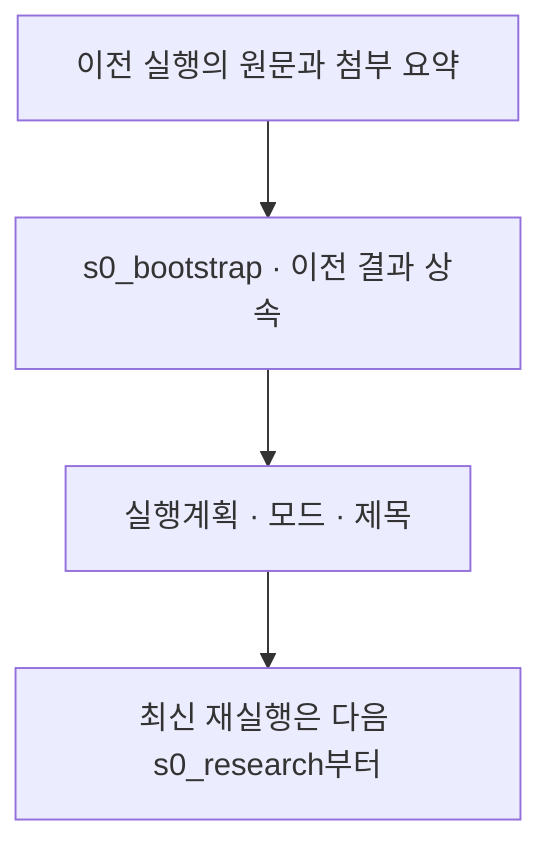

# 1. 실행 계획

[전체 실제 흐름](../README.md)

이번 재실행은 실행 계획을 새로 만들지 않고 이전 S0 기록을 상속했습니다. 상속 기록은 이 문제를 물리·기술 문제, 높은 복잡도로 분류하고 FULL 모드를 제안했지만, 이번 실제 실행 모드는 DEEP입니다. 아래 S0 입력·출력은 상속 자료이며 최신 재실행 비용과 호출 수에는 포함하지 않습니다.

코드: [`nodes.s0_bootstrap`](https://github.com/equipment0226/triz_backend/blob/606e6e5c26b21697cd71d784157eaa7477486b21/pilot/triz/nodes.py#L37) · Pipeline key: `s0_bootstrap`

## 실행과 사용자 응답

이번 재실행 구간에는 Stage 호출이 없습니다. 아래 Input/Output은 마지막 S0 Step의 상속 자료입니다.

## 최종 Input · 읽은 버전과 전달값

실제로 각 함수에 전달된 값은 아래 **하위 처리의 Input**에 모두 연결했습니다. 과거 값을 현재 값으로 덮어 계산하지 않았습니다.

## 최종 Output · Stage 완료 시점

[최종 체크포인트](../snapshots/snap-7ee82895deec4fec8a5ce6cf7ccae491.md) · epoch 38 · KST 2026-09-29 15:21:46

| 산출물 | 버전 ID | 저장 내용 |
|---|---|---|
| input | av-e9af8210d5734ab394d6bfa0a680835e | 상속 버전 · 위 S0 Step 결과 참조 |

## 하위 처리 · 실제 기록 순서

동시에 시작한 작업은 앞 작업의 종료를 기다린다는 뜻이 아닙니다. `seq`와 `step_id`를 함께 표시했습니다.

상태 열은 **Step의 구조·검증 상태**입니다. 예를 들어 gate Step이 `OK / PASS`여도 실제 제약 판정은 Output의 `CONDITIONAL` 또는 `FAIL`일 수 있습니다.

| seq | 하위 process / Input·Output | Agent / Prompt | 상태 / 판정 | 비용 USD |
|---|---|---|---|---|
| 502 | [s0_bootstrap](../processes/0502-STP-ba943100.md) | orchestrator P_S0_BOOTSTRAP | OK / PASS | 0.0009705 |

## 함수 내부 연결 · 별도 기록 여부

| 함수 | Input → Output | 저장 근거 |
|---|---|---|
| [`nodes.s0_bootstrap`](https://github.com/equipment0226/triz_backend/blob/606e6e5c26b21697cd71d784157eaa7477486b21/pilot/triz/nodes.py#L37) | 이전 회차 raw_query, attachment_summaries → 실행계획, 모드, 제목, 트랙 허용 목록 | 이번 92개 step에는 없음. 마지막 이전 실행 event45126 및 input artifact/control/plan을 상속. |

## 호출·비용 원장

이번 Stage 구간의 AX task는 **0건**입니다. 실제 정산 `actual` 합계는 **0.000000 USD**입니다. Step 수와 task 수는 검증·수정 호출 때문에 다를 수 있습니다. 상속 S0 비용은 이번 합계에서 제외했습니다.

[호출별 입력 snapshot·토큰·비용·원문 해시](../CALLS.md) · [Stage·사용자 이벤트](../EVENTS.md)
