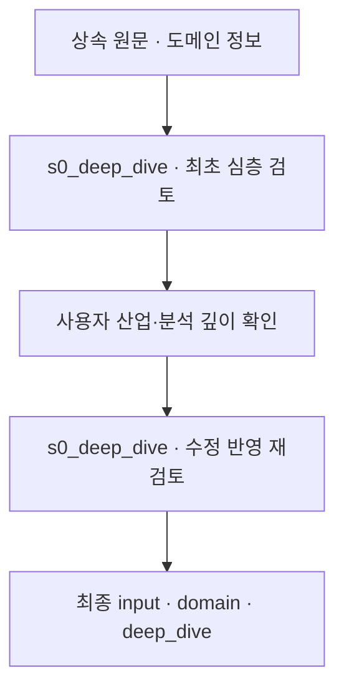

# 2. 산업·기술 심층 검토

[전체 실제 흐름](../README.md)

산업·메커니즘 심층 검토를 두 차례 수행하고 사용자 답변을 포함한 입력 artifact를 확정했습니다. 해당 artifact에는 확인 사실 12개, 경쟁 가설 4개, 이론 점검 4개, 미확인 사항 8개가 남아 있습니다. 부하율·고유진동수·구간별 소요 시간 등은 관측·답변과 미확인 조건을 구분하며, 이 단계에서 개선 성능을 측정한 것은 아닙니다.

코드: [`domain.deep_dive`](https://github.com/equipment0226/triz_backend/blob/606e6e5c26b21697cd71d784157eaa7477486b21/pilot/triz/domain.py#L129) · Pipeline key: `s0_research`

## 실행과 사용자 응답

| KST 시작 | 시작 event.id | 종료 event.id | 진행 |
|---|---|---|---|
| 2026-09-30 06:46:54 | 45932 | — | 사용자 응답 대기 |
| 2026-09-30 06:49:31 | 45950 | 45955 | 완료 |

## 최종 Input · 읽은 버전과 전달값

마지막 재개 이후 실제 task가 참조한 `input_snapshot`입니다. 경계 보완 중 버전이 바뀐 경우 여러 개가 표시됩니다. LLM 없는 재개는 해당 `stage_read_set`을 표시합니다.

| 입력 snapshot | 저장 시점 | 전체 입력 버전 목록 |
|---|---|---|
| snap-77d1bbb8d3374e44aab6472310bb4c65 | stage_read_set | [읽기](../snapshots/snap-77d1bbb8d3374e44aab6472310bb4c65.md) |

실제로 각 함수에 전달된 값은 아래 **하위 처리의 Input**에 모두 연결했습니다. 과거 값을 현재 값으로 덮어 계산하지 않았습니다.

## 최종 Output · Stage 완료 시점

[최종 체크포인트](../snapshots/snap-637dd636b5614fdb9b0958244b6bb1ae.md) · epoch 48 · KST 2026-09-30 06:49:59

| 산출물 | 버전 ID | 저장 내용 |
|---|---|---|
| input | av-da1805ee57974f8597fc5971a001282f | [전체 Output](../artifacts/input-av-da1805ee57974f8597fc5971a001282f.md) |

## 하위 처리 · 실제 기록 순서

동시에 시작한 작업은 앞 작업의 종료를 기다린다는 뜻이 아닙니다. `seq`와 `step_id`를 함께 표시했습니다.

상태 열은 **Step의 구조·검증 상태**입니다. 예를 들어 gate Step이 `OK / PASS`여도 실제 제약 판정은 Output의 `CONDITIONAL` 또는 `FAIL`일 수 있습니다.

| seq | 하위 process / Input·Output | Agent / Prompt | 상태 / 판정 | 비용 USD |
|---|---|---|---|---|
| 638 | [s0_deep_dive](../processes/0638-STP-2706d40f.md) | domain_researcher P_S0_DEEP_DIVE | OK / PASS | 0.0033252 |
| 639 | [s0_deep_dive](../processes/0639-STP-80d197c1.md) | domain_researcher P_S0_DEEP_DIVE | OK / PASS | 0.0034065 |

## 함수 내부 연결 · 별도 기록 여부

| 함수 | Input → Output | 저장 근거 |
|---|---|---|
| [`domain.deep_dive`](https://github.com/equipment0226/triz_backend/blob/606e6e5c26b21697cd71d784157eaa7477486b21/pilot/triz/domain.py#L129) | raw_query, domain, 기존 deep_dive, 사용자 보완 → deep_dive, industry_profile, domain, 검토 이력 | s0_deep_dive 2개 step 입력/출력, input artifact, deep_dive_history. 최초 검토 뒤 CLARIFY event45938. |
| [`domain.sync_contract`](https://github.com/equipment0226/triz_backend/blob/606e6e5c26b21697cd71d784157eaa7477486b21/pilot/triz/domain.py#L45) | 검토 결과 및 사용자 확인 → 문제 유형·물리 범위·산업 정보 | 독립 step row 없음. input.domain과 step output의 대응으로 확인. |

## 호출·비용 원장

이번 Stage 구간의 AX task는 **2건**입니다. 실제 정산 `actual` 합계는 **0.006733 USD**입니다. Step 수와 task 수는 검증·수정 호출 때문에 다를 수 있습니다. 상속 S0 비용은 이번 합계에서 제외했습니다.

[호출별 입력 snapshot·토큰·비용·원문 해시](../CALLS.md) · [Stage·사용자 이벤트](../EVENTS.md)
