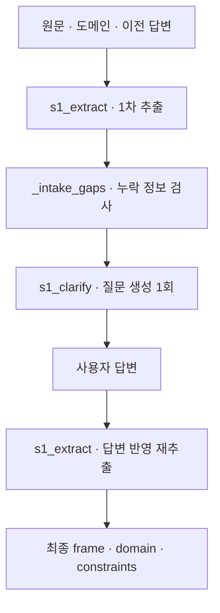

# 3. 문제 추출·역질의

[전체 실제 흐름](../README.md)

문제를 'takt 53초를 50초 이하로 줄이되 부하율·강성·안정성은 유지'하는 과제로 구조화했습니다. 추출 두 차례와 역질의 한 차례의 Step이 저장되어 있으며, 최종 입력에는 후보 특성 8개와 후보 충돌 4개가 있습니다. 정격 토크, 관성모멘트, 프로파일 파라미터, 정렬·클램프 시간, 고유진동수 등의 누락 정보는 확인된 수치로 채우지 않았습니다.

코드: [`nodes.s1_extract`](https://github.com/equipment0226/triz_backend/blob/606e6e5c26b21697cd71d784157eaa7477486b21/pilot/triz/nodes.py#L73) · Pipeline key: `s1_intake`

## 실행과 사용자 응답

| KST 시작 | 시작 event.id | 종료 event.id | 진행 |
|---|---|---|---|
| 2026-09-30 06:50:19 | 45956 | — | 사용자 응답 대기 |
| 2026-09-30 06:52:32 | 45966 | 45972 | 완료 |

## 최종 Input · 읽은 버전과 전달값

마지막 재개 이후 실제 task가 참조한 `input_snapshot`입니다. 경계 보완 중 버전이 바뀐 경우 여러 개가 표시됩니다. LLM 없는 재개는 해당 `stage_read_set`을 표시합니다.

| 입력 snapshot | 저장 시점 | 전체 입력 버전 목록 |
|---|---|---|
| snap-057b74df690c4957b6613656b36fcf38 | stage_read_set | [읽기](../snapshots/snap-057b74df690c4957b6613656b36fcf38.md) |

실제로 각 함수에 전달된 값은 아래 **하위 처리의 Input**에 모두 연결했습니다. 과거 값을 현재 값으로 덮어 계산하지 않았습니다.

## 최종 Output · Stage 완료 시점

[최종 체크포인트](../snapshots/snap-530bf632a2824745af2db86e237c95df.md) · epoch 49 · KST 2026-09-30 06:53:17

| 산출물 | 버전 ID | 저장 내용 |
|---|---|---|
| input | av-4415f0c5e3d74db09648dde3edfa65ba | [전체 Output](../artifacts/input-av-4415f0c5e3d74db09648dde3edfa65ba.md) |

## 하위 처리 · 실제 기록 순서

동시에 시작한 작업은 앞 작업의 종료를 기다린다는 뜻이 아닙니다. `seq`와 `step_id`를 함께 표시했습니다.

상태 열은 **Step의 구조·검증 상태**입니다. 예를 들어 gate Step이 `OK / PASS`여도 실제 제약 판정은 Output의 `CONDITIONAL` 또는 `FAIL`일 수 있습니다.

| seq | 하위 process / Input·Output | Agent / Prompt | 상태 / 판정 | 비용 USD |
|---|---|---|---|---|
| 640 | [s1_extract](../processes/0640-STP-2faef8a0.md) | interviewer P_S1_EXTRACT | WARN / UNVERIFIED | 0.0063708 |
| 641 | [s1_clarify](../processes/0641-STP-e0dbc382.md) | interviewer P_S1_CLARIFY | OK / PASS | 0.0022938 |
| 642 | [s1_extract](../processes/0642-STP-59592074.md) | interviewer P_S1_EXTRACT | WARN / UNVERIFIED | 0.0062058 |

## 함수 내부 연결 · 별도 기록 여부

| 함수 | Input → Output | 저장 근거 |
|---|---|---|
| [`nodes.s1_extract`](https://github.com/equipment0226/triz_backend/blob/606e6e5c26b21697cd71d784157eaa7477486b21/pilot/triz/nodes.py#L73) | raw_query, attachment_facts, clarify_history → domain, frame, constraints, 특성·모순 후보 | 해당 node의 steps.input_slice.vars와 steps.output_json, steps.verdicts. 최종 반영값은 Stage artifact. |
| [`nodes._intake_gaps`](https://github.com/equipment0226/triz_backend/blob/606e6e5c26b21697cd71d784157eaa7477486b21/pilot/triz/nodes.py#L147) | domain, frame, constraints → 누락 정보 문자열 목록 | 독립 step row 없음. s1_clarify.input vars.missing_info로 실제 사용값 확인. |
| [`nodes.s1_extract`](https://github.com/equipment0226/triz_backend/blob/606e6e5c26b21697cd71d784157eaa7477486b21/pilot/triz/nodes.py#L73) | missing_info, open_questions, frame_digest → questions 및 clarify_turns | s1_clarify 1개 step. 별도 s1_clarify 함수는 없고 s1_extract 내부 호출. |

## 호출·비용 원장

이번 Stage 구간의 AX task는 **3건**입니다. 실제 정산 `actual` 합계는 **0.014871 USD**입니다. Step 수와 task 수는 검증·수정 호출 때문에 다를 수 있습니다. 상속 S0 비용은 이번 합계에서 제외했습니다.

[호출별 입력 snapshot·토큰·비용·원문 해시](../CALLS.md) · [Stage·사용자 이벤트](../EVENTS.md)
