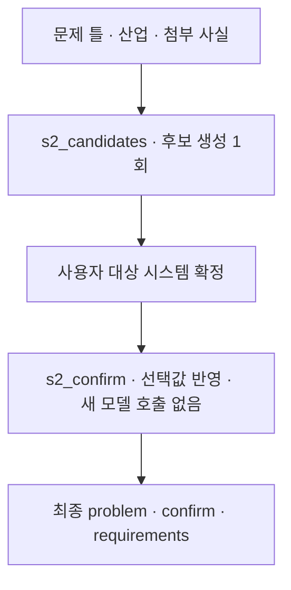

# 4. 대상 시스템 확정

[전체 실제 흐름](../README.md)

구동계 단독, 정렬·클램프를 포함한 직렬 구간, 강성·발열 계면의 세 가지 시스템 후보를 제시했습니다. 사용자는 '로테이션 구동계 + 정렬·클램프 직렬 구간'을 선택했고 user_confirmed=true로 저장되었습니다. 이후 분석은 로테이션 정지 후 정렬·클램프가 시작되는 계면까지 포함합니다.

코드: [`nodes.s2_confirm`](https://github.com/equipment0226/triz_backend/blob/606e6e5c26b21697cd71d784157eaa7477486b21/pilot/triz/nodes.py#L163) · Pipeline key: `s2_confirm`

## 실행과 사용자 응답

| KST 시작 | 시작 event.id | 종료 event.id | 진행 |
|---|---|---|---|
| 2026-09-30 06:53:39 | 45973 | — | 사용자 응답 대기 |
| 2026-09-30 07:06:31 | 45987 | 45989 | 완료 |

## 최종 Input · 읽은 버전과 전달값

마지막 재개 이후 실제 task가 참조한 `input_snapshot`입니다. 경계 보완 중 버전이 바뀐 경우 여러 개가 표시됩니다. LLM 없는 재개는 해당 `stage_read_set`을 표시합니다.

| 입력 snapshot | 저장 시점 | 전체 입력 버전 목록 |
|---|---|---|
| snap-1869b2a3c96f4bffadf87d11c3086237 | stage_read_set | [읽기](../snapshots/snap-1869b2a3c96f4bffadf87d11c3086237.md) |

실제로 각 함수에 전달된 값은 아래 **하위 처리의 Input**에 모두 연결했습니다. 과거 값을 현재 값으로 덮어 계산하지 않았습니다.

## 최종 Output · Stage 완료 시점

[최종 체크포인트](../snapshots/snap-48dde9a56a904700ba6518af3610184a.md) · epoch 50 · KST 2026-09-30 07:06:48

| 산출물 | 버전 ID | 저장 내용 |
|---|---|---|
| problem | av-011963b3da4b406aa99f3c20e1c2b1ca | [전체 Output](../artifacts/problem-av-011963b3da4b406aa99f3c20e1c2b1ca.md) |

## 하위 처리 · 실제 기록 순서

동시에 시작한 작업은 앞 작업의 종료를 기다린다는 뜻이 아닙니다. `seq`와 `step_id`를 함께 표시했습니다.

상태 열은 **Step의 구조·검증 상태**입니다. 예를 들어 gate Step이 `OK / PASS`여도 실제 제약 판정은 Output의 `CONDITIONAL` 또는 `FAIL`일 수 있습니다.

| seq | 하위 process / Input·Output | Agent / Prompt | 상태 / 판정 | 비용 USD |
|---|---|---|---|---|
| 643 | [s2_candidates](../processes/0643-STP-87544e0b.md) | system_analyst P_S2_CANDIDATES | WARN / UNVERIFIED | 0.0033768 |

## 함수 내부 연결 · 별도 기록 여부

| 함수 | Input → Output | 저장 근거 |
|---|---|---|
| [`nodes.s2_confirm`](https://github.com/equipment0226/triz_backend/blob/606e6e5c26b21697cd71d784157eaa7477486b21/pilot/triz/nodes.py#L163) | domain, restated_problem, attachment_facts → 시스템 candidates, 작동 구역·시간, 확인 질문 | 해당 node의 steps.input_slice.vars와 steps.output_json, steps.verdicts. 최종 반영값은 Stage artifact. |
| [`nodes.s2_confirm`](https://github.com/equipment0226/triz_backend/blob/606e6e5c26b21697cd71d784157eaa7477486b21/pilot/triz/nodes.py#L163) | 선택 candidate_id, operative_zone/time, amendment → confirm, target_system, user_confirmed | 재개 시 LLM step 없음. problem.confirm과 사용자 보완 정보, CONFIRM event45978/재개 event45987에서 확인. |

## 호출·비용 원장

이번 Stage 구간의 AX task는 **1건**입니다. 실제 정산 `actual` 합계는 **0.003377 USD**입니다. Step 수와 task 수는 검증·수정 호출 때문에 다를 수 있습니다. 상속 S0 비용은 이번 합계에서 제외했습니다.

[호출별 입력 snapshot·토큰·비용·원문 해시](../CALLS.md) · [Stage·사용자 이벤트](../EVENTS.md)
