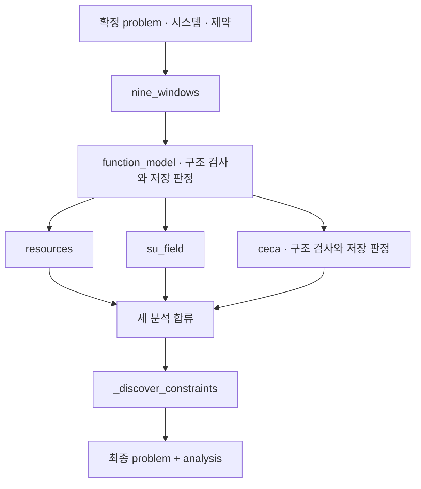

# 5. 시스템·기능·자원·인과 분석

[전체 실제 흐름](../README.md)

확정한 시스템을 9-Windows, 기능 모델, Su-Field, 자원, 인과관계, 내재 제약으로 분석했습니다. 종료 artifact에는 구성요소 16개, 기능 연결 13개, Su-Field 모델 3개, 자원 30개가 있고 consistency_issues는 빈 배열입니다. 기능 모델과 CECA에는 독립 검토 call이 있으며, 기술 가설의 검토 결과를 실측 검증 완료로 해석하지 않습니다.

코드: [`nodes.s3_analyze`](https://github.com/equipment0226/triz_backend/blob/606e6e5c26b21697cd71d784157eaa7477486b21/pilot/triz/nodes.py#L225) · Pipeline key: `s3_analyze`

## 실행과 사용자 응답

| KST 시작 | 시작 event.id | 종료 event.id | 진행 |
|---|---|---|---|
| 2026-09-30 07:07:10 | 45990 | 46012 | 완료 |

## 최종 Input · 읽은 버전과 전달값

마지막 재개 이후 실제 task가 참조한 `input_snapshot`입니다. 경계 보완 중 버전이 바뀐 경우 여러 개가 표시됩니다. LLM 없는 재개는 해당 `stage_read_set`을 표시합니다.

| 입력 snapshot | 저장 시점 | 전체 입력 버전 목록 |
|---|---|---|
| snap-48dde9a56a904700ba6518af3610184a | s2_confirm | [읽기](../snapshots/snap-48dde9a56a904700ba6518af3610184a.md) |

실제로 각 함수에 전달된 값은 아래 **하위 처리의 Input**에 모두 연결했습니다. 과거 값을 현재 값으로 덮어 계산하지 않았습니다.

## 최종 Output · Stage 완료 시점

[최종 체크포인트](../snapshots/snap-e0ba08dd32b4463c80e07f67ef45bec7.md) · epoch 50 · KST 2026-09-30 07:09:05

| 산출물 | 버전 ID | 저장 내용 |
|---|---|---|
| problem | av-011963b3da4b406aa99f3c20e1c2b1ca | [전체 Output](../artifacts/problem-av-011963b3da4b406aa99f3c20e1c2b1ca.md) |
| analysis | av-2bc340c2ccb84491beb6b27d284b2ef0 | [전체 Output](../artifacts/analysis-av-2bc340c2ccb84491beb6b27d284b2ef0.md) |

## 하위 처리 · 실제 기록 순서

동시에 시작한 작업은 앞 작업의 종료를 기다린다는 뜻이 아닙니다. `seq`와 `step_id`를 함께 표시했습니다.

상태 열은 **Step의 구조·검증 상태**입니다. 예를 들어 gate Step이 `OK / PASS`여도 실제 제약 판정은 Output의 `CONDITIONAL` 또는 `FAIL`일 수 있습니다.

| seq | 하위 process / Input·Output | Agent / Prompt | 상태 / 판정 | 비용 USD |
|---|---|---|---|---|
| 644 | [s3_nine_windows](../processes/0644-STP-e97e8b15.md) | system_analyst P_S3_NINE_WINDOWS | OK / PASS | 0.0037128 |
| 645 | [s3_function_model](../processes/0645-STP-174c4be3.md) | system_analyst P_S3_FUNCTION_MODEL | OK / PASS | 0.0091659 |
| 647 | [s3_resources](../processes/0647-STP-c3b447c6.md) | resource_analyst P_S3_RESOURCES | WARN / UNVERIFIED | 0.0056061 |
| 646 | [s3_sufield](../processes/0646-STP-546553d2.md) | sufield_specialist P_S3_SUFIELD | WARN / UNVERIFIED | 0.0024492 |
| 648 | [s3_ceca](../processes/0648-STP-55291250.md) | root_cause_analyst P_S3_CECA | OK / PASS | 0.0086772 |
| 649 | [s3_constraints](../processes/0649-STP-0c22f250.md) | constraint_analyst P_S3_CONSTRAINTS | OK / PASS | 0.0059607 |

## 함수 내부 연결 · 별도 기록 여부

| 함수 | Input → Output | 저장 근거 |
|---|---|---|
| [`nine_windows() · s3_analyze 내부`](https://github.com/equipment0226/triz_backend/blob/606e6e5c26b21697cd71d784157eaa7477486b21/pilot/triz/nodes.py#L230) | 확정 시스템, 문제 특성, 도메인 → nine_windows | 해당 node의 steps.input_slice.vars와 steps.output_json, steps.verdicts. 최종 반영값은 Stage artifact. |
| [`function_model() · s3_analyze 내부`](https://github.com/equipment0226/triz_backend/blob/606e6e5c26b21697cd71d784157eaa7477486b21/pilot/triz/nodes.py#L246) | 시스템, 기본 기능, 구역·시간 → components, function_edges, interaction_matrix, function_mermaid | 해당 node의 steps.input_slice.vars와 steps.output_json, steps.verdicts. 최종 반영값은 Stage artifact. |
| [`verify.check_function_model`](https://github.com/equipment0226/triz_backend/blob/606e6e5c26b21697cd71d784157eaa7477486b21/pilot/triz/verify.py#L190) | 기능 모델 응답 → 구조 검사 오류 목록 | 독립 step row 없음. 부모 step의 verdicts에 판정 저장. 별도 T3 호출 여부는 해당 실행 call 메타로 확정. |
| [`resources() · s3_analyze 내부`](https://github.com/equipment0226/triz_backend/blob/606e6e5c26b21697cd71d784157eaa7477486b21/pilot/triz/nodes.py#L288) | 기능모델, 확정 시스템, 작동 구역 → resources | 해당 node의 steps.input_slice.vars와 steps.output_json, steps.verdicts. 최종 반영값은 Stage artifact. |
| [`su_field() · s3_analyze 내부`](https://github.com/equipment0226/triz_backend/blob/606e6e5c26b21697cd71d784157eaa7477486b21/pilot/triz/nodes.py#L271) | 기능모델, 부정적 상호작용 → su_fields | 해당 node의 steps.input_slice.vars와 steps.output_json, steps.verdicts. 최종 반영값은 Stage artifact. |
| [`ceca() · s3_analyze 내부`](https://github.com/equipment0226/triz_backend/blob/606e6e5c26b21697cd71d784157eaa7477486b21/pilot/triz/nodes.py#L304) | 증상, 관찰 사실, 기능모델, CECA seeds → ceca | 해당 node의 steps.input_slice.vars와 steps.output_json, steps.verdicts. 최종 반영값은 Stage artifact. |
| [`verify.check_ceca`](https://github.com/equipment0226/triz_backend/blob/606e6e5c26b21697cd71d784157eaa7477486b21/pilot/triz/verify.py#L224) | CECA 응답 → 연결·근거 구조 검사 | 독립 step row 없음. 부모 verdicts와 검증 call 메타에 저장. |
| [`nodes._discover_constraints`](https://github.com/equipment0226/triz_backend/blob/606e6e5c26b21697cd71d784157eaa7477486b21/pilot/triz/nodes.py#L347) | domain, components, functions, 현재 constraints → 도메인 내재 제약, 가정 | 해당 node의 steps.input_slice.vars와 steps.output_json, steps.verdicts. 최종 반영값은 Stage artifact. |

## 호출·비용 원장

이번 Stage 구간의 AX task는 **8건**입니다. 실제 정산 `actual` 합계는 **0.035577 USD**입니다. Step 수와 task 수는 검증·수정 호출 때문에 다를 수 있습니다. 상속 S0 비용은 이번 합계에서 제외했습니다.

[호출별 입력 snapshot·토큰·비용·원문 해시](../CALLS.md) · [Stage·사용자 이벤트](../EVENTS.md)
