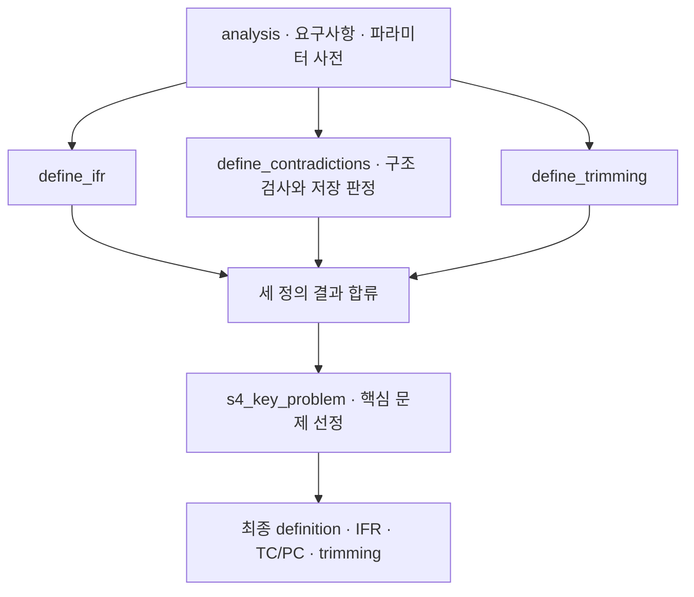

# 6. 이상해결책·모순 정의

[전체 실제 흐름](../README.md)

이상해결책과 함께 기술적 모순 6개, 물리적 모순 4개, 트리밍 후보 6개를 저장했습니다. 핵심 문제는 3개를 선택하고 5개 항목은 dropped에 남겼으며, 모순 정의에 대한 독립 검토도 기록되어 있습니다. 이후 후보가 개선측과 악화 방지측을 함께 다루는지 확인할 의무 항목은 6개입니다.

코드: [`nodes.s4_define`](https://github.com/equipment0226/triz_backend/blob/606e6e5c26b21697cd71d784157eaa7477486b21/pilot/triz/nodes.py#L388) · Pipeline key: `s4_define`

## 실행과 사용자 응답

| KST 시작 | 시작 event.id | 종료 event.id | 진행 |
|---|---|---|---|
| 2026-09-30 07:09:26 | 46013 | 46028 | 완료 |

## 최종 Input · 읽은 버전과 전달값

마지막 재개 이후 실제 task가 참조한 `input_snapshot`입니다. 경계 보완 중 버전이 바뀐 경우 여러 개가 표시됩니다. LLM 없는 재개는 해당 `stage_read_set`을 표시합니다.

| 입력 snapshot | 저장 시점 | 전체 입력 버전 목록 |
|---|---|---|
| snap-e0ba08dd32b4463c80e07f67ef45bec7 | s3_analyze | [읽기](../snapshots/snap-e0ba08dd32b4463c80e07f67ef45bec7.md) |

실제로 각 함수에 전달된 값은 아래 **하위 처리의 Input**에 모두 연결했습니다. 과거 값을 현재 값으로 덮어 계산하지 않았습니다.

## 최종 Output · Stage 완료 시점

[최종 체크포인트](../snapshots/snap-4487c9a6151141879697ca76241925e4.md) · epoch 50 · KST 2026-09-30 07:10:31

| 산출물 | 버전 ID | 저장 내용 |
|---|---|---|
| definition | av-1cb9c589494c44b0a4818055a455b84c | [전체 Output](../artifacts/definition-av-1cb9c589494c44b0a4818055a455b84c.md) |
| coherence | av-52dc28df694f41eab49c26cd7073fed0 | [전체 Output](../artifacts/coherence-av-52dc28df694f41eab49c26cd7073fed0.md) |

## 하위 처리 · 실제 기록 순서

동시에 시작한 작업은 앞 작업의 종료를 기다린다는 뜻이 아닙니다. `seq`와 `step_id`를 함께 표시했습니다.

상태 열은 **Step의 구조·검증 상태**입니다. 예를 들어 gate Step이 `OK / PASS`여도 실제 제약 판정은 Output의 `CONDITIONAL` 또는 `FAIL`일 수 있습니다.

| seq | 하위 process / Input·Output | Agent / Prompt | 상태 / 판정 | 비용 USD |
|---|---|---|---|---|
| 650 | [s4_ifr](../processes/0650-STP-8edf7496.md) | triz_master P_S4_IFR | WARN / UNVERIFIED | 0.0028989 |
| 651 | [s4_contradictions](../processes/0651-STP-04084dd2.md) | contradiction_definer P_S4_CONTRADICTIONS | OK / PASS | 0.0110067 |
| 652 | [s4_trimming](../processes/0652-STP-de5d769d.md) | trimming_specialist P_S4_TRIMMING | OK / PASS | 0.0039666 |
| 653 | [s4_key_problem](../processes/0653-STP-ecc9066d.md) | triz_master P_S4_KEY_PROBLEM | OK / PASS | 0.0033855 |

## 함수 내부 연결 · 별도 기록 여부

| 함수 | Input → Output | 저장 근거 |
|---|---|---|
| [`define_ifr() · s4_define 내부`](https://github.com/equipment0226/triz_backend/blob/606e6e5c26b21697cd71d784157eaa7477486b21/pilot/triz/nodes.py#L395) | 기본 기능, 원인, 자원, 성공 기준 → ifr | 해당 node의 steps.input_slice.vars와 steps.output_json, steps.verdicts. 최종 반영값은 Stage artifact. |
| [`define_contradictions() · s4_define 내부`](https://github.com/equipment0226/triz_backend/blob/606e6e5c26b21697cd71d784157eaa7477486b21/pilot/triz/nodes.py#L410) | 문제 틀, CECA, 파라미터 사전, 작동 구역 → technical_contradictions, physical_contradictions | 해당 node의 steps.input_slice.vars와 steps.output_json, steps.verdicts. 최종 반영값은 Stage artifact. |
| [`verify.check_contradictions`](https://github.com/equipment0226/triz_backend/blob/606e6e5c26b21697cd71d784157eaa7477486b21/pilot/triz/verify.py#L277) | 모순 응답, param_scheme → 구조·파라미터 검사 오류 | 독립 step row 없음. s4_contradictions.verdicts 및 검증 call 메타. |
| [`define_trimming() · s4_define 내부`](https://github.com/equipment0226/triz_backend/blob/606e6e5c26b21697cd71d784157eaa7477486b21/pilot/triz/nodes.py#L445) | components, functions, resources → trimming | 해당 node의 steps.input_slice.vars와 steps.output_json, steps.verdicts. 최종 반영값은 Stage artifact. |
| [`nodes.s4_define`](https://github.com/equipment0226/triz_backend/blob/606e6e5c26b21697cd71d784157eaa7477486b21/pilot/triz/nodes.py#L388) | IFR, TC/PC, trimming, 문제 틀 → key_problems | s4_key_problem step 1개. 별도 s4_key_problem 함수가 아니라 s4_define 내부 호출. |

## 호출·비용 원장

이번 Stage 구간의 AX task는 **5건**입니다. 실제 정산 `actual` 합계는 **0.021260 USD**입니다. Step 수와 task 수는 검증·수정 호출 때문에 다를 수 있습니다. 상속 S0 비용은 이번 합계에서 제외했습니다.

[호출별 입력 snapshot·토큰·비용·원문 해시](../CALLS.md) · [Stage·사용자 이벤트](../EVENTS.md)
