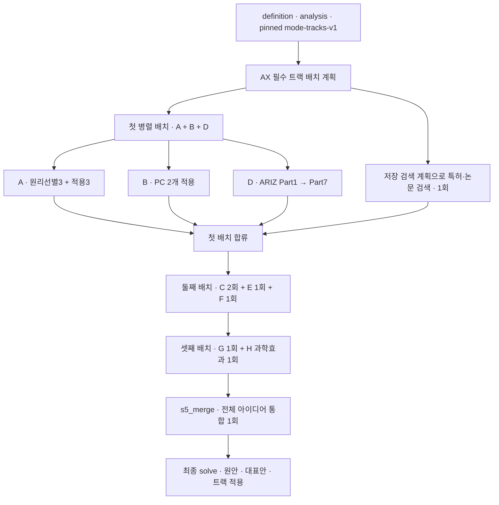

# 7. 다중 기법 해결책 탐색

[전체 실제 흐름](../README.md)

DEEP 모드에서 A~H 8개 트랙을 실행하고 통합 아이디어 10개를 만들었습니다. 저장된 application은 발명원리 17개, 분리원리 8개, 표준해 12개, 진화 트렌드 4개, FOS 3개, 과학효과 4개이며 ARIZ 7.2에는 절충 판정 경고 17개가 남아 있습니다. 이 단계의 특허 검색 4개 쿼리는 모두 UNAVAILABLE·0건이었고, 종료 후 별도로 수행한 과학효과 적용조건 점검 4개도 모두 UNKNOWN입니다.

코드: [`nodes.s5_solve`](https://github.com/equipment0226/triz_backend/blob/606e6e5c26b21697cd71d784157eaa7477486b21/pilot/triz/nodes.py#L1008) · Pipeline key: `s5_solve`

## 실행과 사용자 응답

| KST 시작 | 시작 event.id | 종료 event.id | 진행 |
|---|---|---|---|
| 2026-09-30 07:10:50 | 46029 | 46123 | 완료 |

## 최종 Input · 읽은 버전과 전달값

마지막 재개 이후 실제 task가 참조한 `input_snapshot`입니다. 경계 보완 중 버전이 바뀐 경우 여러 개가 표시됩니다. LLM 없는 재개는 해당 `stage_read_set`을 표시합니다.

| 입력 snapshot | 저장 시점 | 전체 입력 버전 목록 |
|---|---|---|
| snap-4487c9a6151141879697ca76241925e4 | s4_define | [읽기](../snapshots/snap-4487c9a6151141879697ca76241925e4.md) |

실제로 각 함수에 전달된 값은 아래 **하위 처리의 Input**에 모두 연결했습니다. 과거 값을 현재 값으로 덮어 계산하지 않았습니다.

## 최종 Output · Stage 완료 시점

[최종 체크포인트](../snapshots/snap-74a823dc8b0c470bac6070c552f5277b.md) · epoch 50 · KST 2026-09-30 07:17:34

| 산출물 | 버전 ID | 저장 내용 |
|---|---|---|
| solve | av-5787558b3bd746ab91a488cd619d84fe | [전체 Output](../artifacts/solve-av-5787558b3bd746ab91a488cd619d84fe.md) |

## 하위 처리 · 실제 기록 순서

동시에 시작한 작업은 앞 작업의 종료를 기다린다는 뜻이 아닙니다. `seq`와 `step_id`를 함께 표시했습니다.

상태 열은 **Step의 구조·검증 상태**입니다. 예를 들어 gate Step이 `OK / PASS`여도 실제 제약 판정은 Output의 `CONDITIONAL` 또는 `FAIL`일 수 있습니다.

| seq | 하위 process / Input·Output | Agent / Prompt | 상태 / 판정 | 비용 USD |
|---|---|---|---|---|
| 654 | [s5_search_retrieval](../processes/0654-STP-5c0f3ac6.md) | patent_researcher — | WARN /  | 0.0 |
| 655 | [s5_track_a_select](../processes/0655-STP-afe46119.md) | inventor_a P_S5_MATRIX_FALLBACK | OK / PASS | 0.0023076 |
| 657 | [s5_track_b](../processes/0657-STP-aa6e2b89.md) | inventor_b P_S5_TRACK_B | WARN / UNVERIFIED | 0.004593 |
| 656 | [s5_ariz_p1](../processes/0656-STP-b4a05607.md) | ariz_specialist P_S5_ARIZ_PART1 | WARN / UNVERIFIED | 0.0067524 |
| 658 | [s5_track_a](../processes/0658-STP-f422fe90.md) | inventor_a P_S5_TRACK_A | WARN / UNVERIFIED | 0.0062829 |
| 659 | [s5_track_b](../processes/0659-STP-6f538056.md) | inventor_b P_S5_TRACK_B | WARN / UNVERIFIED | 0.0045462 |
| 660 | [s5_ariz_p2](../processes/0660-STP-dc6a5452.md) | ariz_specialist P_S5_ARIZ_PART2 | OK / PASS | 0.0084495 |
| 661 | [s5_track_a_select](../processes/0661-STP-f521d3b4.md) | inventor_a P_S5_MATRIX_FALLBACK | OK / PASS | 0.0022581 |
| 662 | [s5_track_a](../processes/0662-STP-f149d0bd.md) | inventor_a P_S5_TRACK_A | WARN / UNVERIFIED | 0.0061032 |
| 663 | [s5_ariz_p3](../processes/0663-STP-b5dd6c1b.md) | ariz_specialist P_S5_ARIZ_PART3 | WARN / UNVERIFIED | 0.0091422 |
| 664 | [s5_track_a_select](../processes/0664-STP-ff0af390.md) | inventor_a P_S5_MATRIX_FALLBACK | OK / PASS | 0.0022815 |
| 665 | [s5_track_a](../processes/0665-STP-621540f9.md) | inventor_a P_S5_TRACK_A | WARN / UNVERIFIED | 0.0060258 |
| 666 | [s5_ariz_p4](../processes/0666-STP-09c6dec4.md) | ariz_specialist P_S5_ARIZ_PART4 | OK / PASS | 0.0087585 |
| 667 | [s5_ariz_p5](../processes/0667-STP-e6882719.md) | ariz_specialist P_S5_ARIZ_PART5 | OK / PASS | 0.0232059 |
| 668 | [s5_ariz_p6](../processes/0668-STP-234152f4.md) | ariz_specialist P_S5_ARIZ_PART6 | OK / PASS | 0.0108339 |
| 669 | [s5_ariz_p7](../processes/0669-STP-52c17d24.md) | ariz_specialist P_S5_ARIZ_PART7 | OK / PASS | 0.0184215 |
| 670 | [s5_track_e](../processes/0670-STP-1333457e.md) | trimming_specialist P_S5_TRACK_E | OK / PASS | 0.0069078 |
| 671 | [s5_track_c](../processes/0671-STP-3795488e.md) | standards_specialist P_S5_TRACK_C | WARN / UNVERIFIED | 0.0090882 |
| 672 | [s5_track_f](../processes/0672-STP-46504cca.md) | evolution_analyst P_S5_TRACK_F | OK / PASS | 0.0071121 |
| 673 | [s5_track_c](../processes/0673-STP-9b08c9cd.md) | standards_specialist P_S5_TRACK_C | WARN / UNVERIFIED | 0.0099846 |
| 674 | [s5_track_g](../processes/0674-STP-5a211e0b.md) | cross_domain_scout P_S5_TRACK_G | OK / PASS | 0.0068118 |
| 675 | [s5_track_h](../processes/0675-STP-cd7aca37.md) | effects_specialist P_S5_TRACK_H | OK / PASS | 0.0092718 |
| 676 | [s5_merge](../processes/0676-STP-9442b996.md) | solution_curator P_S5_MERGE | WARN / UNVERIFIED | 0.117106 |

## 함수 내부 연결 · 별도 기록 여부

| 함수 | Input → Output | 저장 근거 |
|---|---|---|
| [`coordinator.route`](https://github.com/equipment0226/triz_backend/blob/606e6e5c26b21697cd71d784157eaa7477486b21/pilot/triz/ax/coordinator.py#L166) | definition, 모드, pinned bundle, 현재 예산 → 필수 트랙 배치 계획 및 decision | coordination event46030 및 ax_decisions.payload. 실제 mode-tracks-v1 경로. |
| [`nodes._evidence`](https://github.com/equipment0226/triz_backend/blob/606e6e5c26b21697cd71d784157eaa7477486b21/pilot/triz/nodes.py#L1181) | 저장 검색 계획, 정의·기능 → 검색 상태와 근거 후보 | s5_search_retrieval step1개. 이번 구간에 s5_patent_plan 모델 호출은 없음. |
| [`evidence.discover`](https://github.com/equipment0226/triz_backend/blob/606e6e5c26b21697cd71d784157eaa7477486b21/pilot/triz/evidence.py#L46) | search_plans/cache/diagnostics, 문제·모순 → 검색 진단, evidence_candidates, search_status | retrieval.input_slice.queries/output_json.queries와 scratch 검색 데이터. 검색 원시 응답 전체의 불변 이력은 아님. |
| [`nodes._run_tracks`](https://github.com/equipment0226/triz_backend/blob/606e6e5c26b21697cd71d784157eaa7477486b21/pilot/triz/nodes.py#L1090) | 선택된 트랙 묶음 및 definition/analysis → 트랙별 적용 결과, raw_ideas, tracks_run | 독립 step row 없음. tracks events46032/46098/46111와 각 트랙 step으로 실제 실행 확인. |
| [`nodes._selected_contradiction_ids`](https://github.com/equipment0226/triz_backend/blob/606e6e5c26b21697cd71d784157eaa7477486b21/pilot/triz/nodes.py#L486) | definition.key_problems → 선택된 모순 ID 집합 | 독립 step row 없음. 호출자의 input vars/output 및 Stage artifact에서 전달값 확인. |
| [`nodes._pick_tcs`](https://github.com/equipment0226/triz_backend/blob/606e6e5c26b21697cd71d784157eaa7477486b21/pilot/triz/nodes.py#L493) | technical_contradictions, 선택 모순, limit → 트랙 A 대상 TC | 독립 step row 없음. 호출자의 input vars/output 및 Stage artifact에서 전달값 확인. |
| [`nodes._pick_pcs`](https://github.com/equipment0226/triz_backend/blob/606e6e5c26b21697cd71d784157eaa7477486b21/pilot/triz/nodes.py#L504) | physical_contradictions, 선택 모순, limit → 트랙 B 대상 PC | 독립 step row 없음. 호출자의 input vars/output 및 Stage artifact에서 전달값 확인. |
| [`nodes._required_functions`](https://github.com/equipment0226/triz_backend/blob/606e6e5c26b21697cd71d784157eaa7477486b21/pilot/triz/nodes.py#L511) | 기본 기능, 문제 기능, 핵심 모순 → 필요 기능 목록 | 독립 step row 없음. 호출자의 input vars/output 및 Stage artifact에서 전달값 확인. |
| [`nodes._track_a`](https://github.com/equipment0226/triz_backend/blob/606e6e5c26b21697cd71d784157eaa7477486b21/pilot/triz/nodes.py#L565) | TC 3개, param_name/params, 발명원리 사전 → 원리 선택3회, 원리 적용3회 | 해당 node의 steps.input_slice.vars와 steps.output_json, steps.verdicts. 최종 반영값은 Stage artifact. |
| [`nodes._track_b`](https://github.com/equipment0226/triz_backend/blob/606e6e5c26b21697cd71d784157eaa7477486b21/pilot/triz/nodes.py#L641) | PC 2개, 분리원리 사전 → 분리원리 적용2회 | 해당 node의 steps.input_slice.vars와 steps.output_json, steps.verdicts. 최종 반영값은 Stage artifact. |
| [`nodes._track_c`](https://github.com/equipment0226/triz_backend/blob/606e6e5c26b21697cd71d784157eaa7477486b21/pilot/triz/nodes.py#L677) | Su-Field 2개, 표준해 후보 → 76표준해 적용2회 | 해당 node의 steps.input_slice.vars와 steps.output_json, steps.verdicts. 최종 반영값은 Stage artifact. |
| [`nodes._track_d_ariz`](https://github.com/equipment0226/triz_backend/blob/606e6e5c26b21697cd71d784157eaa7477486b21/pilot/triz/nodes.py#L712) | 문제·자원·IFR·선행 Part 결과 → ARIZ Part1~7 각1회 및 아이디어 | 해당 node의 steps.input_slice.vars와 steps.output_json, steps.verdicts. 최종 반영값은 Stage artifact. |
| [`nodes._ariz_steps`](https://github.com/equipment0226/triz_backend/blob/606e6e5c26b21697cd71d784157eaa7477486b21/pilot/triz/nodes.py#L896) | 각 Part JSON → ARIZStep 목록 | 독립 step row 없음. 호출자의 input vars/output 및 Stage artifact에서 전달값 확인. |
| [`nodes._track_e`](https://github.com/equipment0226/triz_backend/blob/606e6e5c26b21697cd71d784157eaa7477486b21/pilot/triz/nodes.py#L900) | trimming 후보, 자원·기능 → 트리밍 적용1회 | 해당 node의 steps.input_slice.vars와 steps.output_json, steps.verdicts. 최종 반영값은 Stage artifact. |
| [`nodes._track_f`](https://github.com/equipment0226/triz_backend/blob/606e6e5c26b21697cd71d784157eaa7477486b21/pilot/triz/nodes.py#L918) | 기술 상태, trend 지식 → 진화 트렌드 적용1회 | 해당 node의 steps.input_slice.vars와 steps.output_json, steps.verdicts. 최종 반영값은 Stage artifact. |
| [`nodes._track_g`](https://github.com/equipment0226/triz_backend/blob/606e6e5c26b21697cd71d784157eaa7477486b21/pilot/triz/nodes.py#L941) | 필요 기능, 전이 산업·기능 → FOS 적용1회 | 해당 node의 steps.input_slice.vars와 steps.output_json, steps.verdicts. 최종 반영값은 Stage artifact. |
| [`nodes._track_h`](https://github.com/equipment0226/triz_backend/blob/606e6e5c26b21697cd71d784157eaa7477486b21/pilot/triz/nodes.py#L965) | 필요 기능, 저장된 효과 후보와 적용 조건 → 과학효과 적용1회 | 해당 node의 steps.input_slice.vars와 steps.output_json, steps.verdicts. 최종 반영값은 Stage artifact. |
| [`nodes._check_track_result`](https://github.com/equipment0226/triz_backend/blob/606e6e5c26b21697cd71d784157eaa7477486b21/pilot/triz/nodes.py#L993) | F/G/H 구조화 응답 → 필수 결과·적용 항목 검사 | 독립 step row 없음. 각 트랙 응답 및 ax_track_review_reasons로 반영 결과만 확인. |
| [`nodes._add_ideas`](https://github.com/equipment0226/triz_backend/blob/606e6e5c26b21697cd71d784157eaa7477486b21/pilot/triz/nodes.py#L527) | 트랙 적용 결과, source ref, title → solve.raw_ideas와 출처 ID | 독립 step row 없음. 호출자의 input vars/output 및 Stage artifact에서 전달값 확인. |
| [`nodes._merge`](https://github.com/equipment0226/triz_backend/blob/606e6e5c26b21697cd71d784157eaa7477486b21/pilot/triz/nodes.py#L1186) | 누적 raw_ideas 및 문제 맥락 → 대표 merged_ideas, 통합 결정, need_more | s5_merge 1개 step. 실제 호출은 idea_consolidation.consolidate에서 생성. |
| [`idea_consolidation.consolidate`](https://github.com/equipment0226/triz_backend/blob/606e6e5c26b21697cd71d784157eaa7477486b21/pilot/triz/idea_consolidation.py#L214) | raw idea inventory → merged_ideas, 통합 partition, idea_consolidation | s5_merge의 vars/output_json과 solve 및 scratch 통합 기록. |

## 호출·비용 원장

이번 Stage 구간의 AX task는 **23건**입니다. 실제 정산 `actual` 합계는 **0.286255 USD**입니다. Step 수와 task 수는 검증·수정 호출 때문에 다를 수 있습니다. 상속 S0 비용은 이번 합계에서 제외했습니다.

[호출별 입력 snapshot·토큰·비용·원문 해시](../CALLS.md) · [Stage·사용자 이벤트](../EVENTS.md)
