# 7. 다중 기법 해결책 탐색

[전체 실제 흐름](../README.md)

호출자: [`nodes.s5_solve()`](https://github.com/equipment0226/triz_backend/blob/5ce8ec233b3d58d2005530a4e9b3113f5fc235f2/pilot/triz/nodes.py#L1008). 함수별 실제 입력·출력은 아래 Step 기록에 연결했습니다.

| 실행 구간 시작 KST | 시작 event | 완료 event | 중단 event |
|---|---|---|---|
| 2026-09-30 13:04:26 | 46375 | — | — |
| 2026-09-30 13:14:01 | 46455 | 46468 | — |

```mermaid
flowchart TD
    I["저장 입력 snapshot / Step Input"] --> S["s5_solve"]
    S --> P0["s5_search_retrieval · 2 Step"]
    P0 --> O["최종 snapshot / Step Output"]
    S --> P1["s5_track_a_select · 3 Step"]
    P1 --> O["최종 snapshot / Step Output"]
    S --> P2["s5_ariz_p1 · 1 Step"]
    P2 --> O["최종 snapshot / Step Output"]
    S --> P3["s5_track_b · 2 Step"]
    P3 --> O["최종 snapshot / Step Output"]
    S --> P4["s5_track_a · 3 Step"]
    P4 --> O["최종 snapshot / Step Output"]
    S --> P5["s5_ariz_p2 · 1 Step"]
    P5 --> O["최종 snapshot / Step Output"]
    S --> P6["s5_ariz_p3 · 1 Step"]
    P6 --> O["최종 snapshot / Step Output"]
    S --> P7["s5_ariz_p4 · 1 Step"]
    P7 --> O["최종 snapshot / Step Output"]
    S --> P8["s5_ariz_p5 · 1 Step"]
    P8 --> O["최종 snapshot / Step Output"]
    S --> P9["s5_ariz_p6 · 1 Step"]
    P9 --> O["최종 snapshot / Step Output"]
    S --> P10["s5_ariz_p7 · 1 Step"]
    P10 --> O["최종 snapshot / Step Output"]
    S --> P11["s5_track_e · 1 Step"]
    P11 --> O["최종 snapshot / Step Output"]
    S --> P12["s5_track_c · 2 Step"]
    P12 --> O["최종 snapshot / Step Output"]
    S --> P13["s5_track_f · 1 Step"]
    P13 --> O["최종 snapshot / Step Output"]
    S --> P14["s5_track_g · 1 Step"]
    P14 --> O["최종 snapshot / Step Output"]
    S --> P15["s5_track_h · 1 Step"]
    P15 --> O["최종 snapshot / Step Output"]
    S --> P16["s5_merge · 2 Step"]
    P16 --> O["최종 snapshot / Step Output"]
```

화살표는 기록의 입력·처리·출력 관계입니다. 하위 Step 사이의 순차·병렬 실행을 새로 추정하지 않습니다. 시작 순서는 아래 표와 이벤트 원장을 따릅니다.

## 최종 Input · 마지막 재개에서 읽은 버전

| 입력 snapshot | 전체 입력 버전 |
|---|---|
| snap-5dba114002e041f6a5c116387a346dd5 | [읽기](../snapshots/snap-5dba114002e041f6a5c116387a346dd5.md) |

## 최종 Output · 완료 시점

[완료 snapshot](../snapshots/snap-950a649b414a451688bf134fbe12eeb8.md) · epoch 56 · 2026-09-30 13:16:36 KST

| 산출물 | 버전 ID | 전체 Output |
|---|---|---|
| solve | av-fe3735a99e7842c9b95a5690175943fa | [읽기](../artifacts/solve-av-fe3735a99e7842c9b95a5690175943fa.md) |

## 하위 process · 실제 시작 순서

| seq / step_id | node · 전체 Input/Output | Agent / Prompt | 상태 / 판정 | USD |
|---|---|---|---|---|
| 744 / STP-d4725775 | [s5_search_retrieval](../processes/0744-STP-d4725775.md) | patent_researcher / — | WARN /  | 0.0 |
| 745 / STP-603f6648 | [s5_track_a_select](../processes/0745-STP-603f6648.md) | inventor_a / P_S5_MATRIX_FALLBACK | OK / PASS | 0.0024843 |
| 746 / STP-9134de15 | [s5_ariz_p1](../processes/0746-STP-9134de15.md) | ariz_specialist / P_S5_ARIZ_PART1 | WARN / UNVERIFIED | 0.0072447 |
| 747 / STP-31cf6284 | [s5_track_b](../processes/0747-STP-31cf6284.md) | inventor_b / P_S5_TRACK_B | WARN / UNVERIFIED | 0.0049776 |
| 748 / STP-2cae9b7c | [s5_track_a](../processes/0748-STP-2cae9b7c.md) | inventor_a / P_S5_TRACK_A | WARN / UNVERIFIED | 0.0062763 |
| 749 / STP-a9204201 | [s5_track_b](../processes/0749-STP-a9204201.md) | inventor_b / P_S5_TRACK_B | WARN / UNVERIFIED | 0.0052635 |
| 750 / STP-c81ea983 | [s5_ariz_p2](../processes/0750-STP-c81ea983.md) | ariz_specialist / P_S5_ARIZ_PART2 | OK / PASS | 0.0085908 |
| 751 / STP-fc00e72a | [s5_track_a_select](../processes/0751-STP-fc00e72a.md) | inventor_a / P_S5_MATRIX_FALLBACK | OK / PASS | 0.0025197 |
| 752 / STP-289a7036 | [s5_track_a](../processes/0752-STP-289a7036.md) | inventor_a / P_S5_TRACK_A | WARN / UNVERIFIED | 0.0067311 |
| 753 / STP-b1ab51c7 | [s5_ariz_p3](../processes/0753-STP-b1ab51c7.md) | ariz_specialist / P_S5_ARIZ_PART3 | WARN / UNVERIFIED | 0.0097812 |
| 754 / STP-983df571 | [s5_track_a_select](../processes/0754-STP-983df571.md) | inventor_a / P_S5_MATRIX_FALLBACK | OK / PASS | 0.0024501 |
| 755 / STP-10bc35f6 | [s5_ariz_p4](../processes/0755-STP-10bc35f6.md) | ariz_specialist / P_S5_ARIZ_PART4 | OK / PASS | 0.0131604 |
| 756 / STP-c43c3a77 | [s5_track_a](../processes/0756-STP-c43c3a77.md) | inventor_a / P_S5_TRACK_A | WARN / UNVERIFIED | 0.0068877 |
| 757 / STP-d1364e8b | [s5_ariz_p5](../processes/0757-STP-d1364e8b.md) | ariz_specialist / P_S5_ARIZ_PART5 | OK / PASS | 0.0771948 |
| 758 / STP-f409bf86 | [s5_ariz_p6](../processes/0758-STP-f409bf86.md) | ariz_specialist / P_S5_ARIZ_PART6 | OK / PASS | 0.0150675 |
| 759 / STP-55457a33 | [s5_ariz_p7](../processes/0759-STP-55457a33.md) | ariz_specialist / P_S5_ARIZ_PART7 | OK / PASS | 0.0103644 |
| 760 / STP-1e1e36f5 | [s5_track_e](../processes/0760-STP-1e1e36f5.md) | trimming_specialist / P_S5_TRACK_E | OK / PASS | 0.0099951 |
| 761 / STP-324725fc | [s5_track_c](../processes/0761-STP-324725fc.md) | standards_specialist / P_S5_TRACK_C | WARN / UNVERIFIED | 0.0088407 |
| 762 / STP-89c20be9 | [s5_track_f](../processes/0762-STP-89c20be9.md) | evolution_analyst / P_S5_TRACK_F | OK / PASS | 0.0100812 |
| 763 / STP-525bc18b | [s5_track_c](../processes/0763-STP-525bc18b.md) | standards_specialist / P_S5_TRACK_C | WARN / UNVERIFIED | 0.0092529 |
| 764 / STP-83115fb3 | [s5_track_g](../processes/0764-STP-83115fb3.md) | cross_domain_scout / P_S5_TRACK_G | OK / PASS | 0.0084243 |
| 765 / STP-d780e149 | [s5_track_h](../processes/0765-STP-d780e149.md) | effects_specialist / P_S5_TRACK_H | OK / PASS | 0.0115824 |
| 766 / STP-db0f136c | [s5_merge](../processes/0766-STP-db0f136c.md) | solution_curator / P_S5_MERGE | FAILED / REVISE | 0.0426273 |
| 767 / STP-48eb0c9f | [s5_search_retrieval](../processes/0767-STP-48eb0c9f.md) | patent_researcher / — | WARN /  | 0.0 |
| 768 / STP-25eb1abb | [s5_merge](../processes/0768-STP-25eb1abb.md) | solution_curator / P_S5_MERGE | WARN / UNVERIFIED | 0.0935673 |

## 모델 호출과 비용

이번 Stage 구간에 생성된 task는 24개입니다. 실행 당시 actual 합계는 0.373378 USD, 비용정정 반영 합계는 0.141312 USD입니다. 예약액 reserve는 소비액이 아닙니다. Step와 task 사이의 직접 외래키가 없어 병렬 호출을 시간만으로 특정 Step에 붙이지 않았습니다.

[task·usage·가격 근거](../CALLS.md) · [시작·중단·재개 이벤트](../EVENTS.md)

`_pick_tcs`, `_add_ideas`, 집계·해시와 같이 독립 Step이 없는 helper의 중간값은 재구성하지 않았습니다. 호출자의 실제 전달 변수, 최종 Output, 저장 산출물로 확인할 수 있는 범위만 담았습니다.
