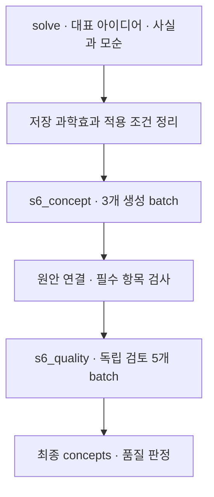

# 8. 개념 구체화

[전체 실제 흐름](../README.md)

아이디어를 개념으로 구체화한 직후의 s6_concept snapshot에는 후보 10개가 저장되어 있습니다. 이 시점의 baseline·recovery·excluded는 빈 배열이며, 뒤의 제약 검토와 보완을 거친 최종 후보 8개와 구분합니다. 이번 재실행 전체 구간에서 DB에 S6로 분류된 Step은 최초 생성 3개, 품질 검토 13개, 제약 전후 보완 8개이고, 이들은 한 번의 연속 실행이 아닙니다.

코드: [`nodes.s6_concept`](https://github.com/equipment0226/triz_backend/blob/606e6e5c26b21697cd71d784157eaa7477486b21/pilot/triz/nodes.py#L1232) · Pipeline key: `s6_concept`

## 실행과 사용자 응답

| KST 시작 | 시작 event.id | 종료 event.id | 진행 |
|---|---|---|---|
| 2026-09-30 07:18:01 | 46124 | 46146 | 완료 |

## 최종 Input · 읽은 버전과 전달값

마지막 재개 이후 실제 task가 참조한 `input_snapshot`입니다. 경계 보완 중 버전이 바뀐 경우 여러 개가 표시됩니다. LLM 없는 재개는 해당 `stage_read_set`을 표시합니다.

| 입력 snapshot | 저장 시점 | 전체 입력 버전 목록 |
|---|---|---|
| snap-79aadae8281243288bb60a7919a19408 | effect_applicability | [읽기](../snapshots/snap-79aadae8281243288bb60a7919a19408.md) |

실제로 각 함수에 전달된 값은 아래 **하위 처리의 Input**에 모두 연결했습니다. 과거 값을 현재 값으로 덮어 계산하지 않았습니다.

## 최종 Output · Stage 완료 시점

[최종 체크포인트](../snapshots/snap-5cf9be1da04042098bf9bd21706c7945.md) · epoch 50 · KST 2026-09-30 07:21:36

| 산출물 | 버전 ID | 저장 내용 |
|---|---|---|
| solve | av-8a5a069aae7740e9951e27625b697aae | [전체 Output](../artifacts/solve-av-8a5a069aae7740e9951e27625b697aae.md) |
| concepts | av-e7bdb345d9504a35bcb0ff4d88198e5d | [전체 Output](../artifacts/concepts-av-e7bdb345d9504a35bcb0ff4d88198e5d.md) |
| coherence | av-2b1d1289efda45a58b8e762312c0ff90 | [전체 Output](../artifacts/coherence-av-2b1d1289efda45a58b8e762312c0ff90.md) |

## 하위 처리 · 실제 기록 순서

동시에 시작한 작업은 앞 작업의 종료를 기다린다는 뜻이 아닙니다. `seq`와 `step_id`를 함께 표시했습니다.

상태 열은 **Step의 구조·검증 상태**입니다. 예를 들어 gate Step이 `OK / PASS`여도 실제 제약 판정은 Output의 `CONDITIONAL` 또는 `FAIL`일 수 있습니다.

| seq | 하위 process / Input·Output | Agent / Prompt | 상태 / 판정 | 비용 USD |
|---|---|---|---|---|
| 678 | [s6_concept](../processes/0678-STP-dc783d31.md) | concept_architect P_S6_CONCEPT | OK / PASS | 0.0202008 |
| 677 | [s6_concept](../processes/0677-STP-d2fcfb3d.md) | concept_architect P_S6_CONCEPT | OK / PASS | 0.0156828 |
| 679 | [s6_concept](../processes/0679-STP-134d3aa2.md) | concept_architect P_S6_CONCEPT | OK / PASS | 0.0223851 |
| 680 | [s6_quality](../processes/0680-STP-878ae922.md) | independent_auditor P_VERIFIER_GENERIC | OK / PASS | 0.0073647 |
| 681 | [s6_quality](../processes/0681-STP-7a178eea.md) | independent_auditor P_VERIFIER_GENERIC | WARN / REVISE | 0.0076092 |
| 682 | [s6_quality](../processes/0682-STP-db9ad5bd.md) | independent_auditor P_VERIFIER_GENERIC | WARN / REVISE | 0.0058083 |
| 683 | [s6_quality](../processes/0683-STP-83e658d4.md) | independent_auditor P_VERIFIER_GENERIC | WARN / REVISE | 0.015462 |
| 684 | [s6_quality](../processes/0684-STP-e44b3edf.md) | independent_auditor P_VERIFIER_GENERIC | WARN / REVISE | 0.0049776 |

## 함수 내부 연결 · 별도 기록 여부

| 함수 | Input → Output | 저장 근거 |
|---|---|---|
| [`runtime.before_stage`](https://github.com/equipment0226/triz_backend/blob/606e6e5c26b21697cd71d784157eaa7477486b21/pilot/triz/ax/runtime.py#L232) | solve.effect_apps와 현재 solve snapshot → effect_applicability와 solve snapshot | effect_applicability snapshot, 별도 step row 없음. |
| [`quality.generate_concepts`](https://github.com/equipment0226/triz_backend/blob/606e6e5c26b21697cd71d784157eaa7477486b21/pilot/triz/quality.py#L126) | 통합 아이디어, 사실·모순·자원·근거 → 초기 concepts | s6_concept 3개 step의 기술 입력과 구조화 결과. |
| [`quality.check_concept_batch`](https://github.com/equipment0226/triz_backend/blob/606e6e5c26b21697cd71d784157eaa7477486b21/pilot/triz/quality.py#L14) | 생성 batch, 배정 원안 ID → 원안 연결·필수 항목 오류 | 독립 step row 없음. s6_concept.verdicts 및 정규화 출력. |
| [`quality.normalize_concept_lineage`](https://github.com/equipment0226/triz_backend/blob/606e6e5c26b21697cd71d784157eaa7477486b21/pilot/triz/quality.py#L69) | 생성 응답, 배정 아이디어 → 정규화 source_idea_ids 및 batch 결과 | 독립 step row 없음. 저장 output_json과 s6_lineage_reviews. |
| [`quality.audit_concepts`](https://github.com/equipment0226/triz_backend/blob/606e6e5c26b21697cd71d784157eaa7477486b21/pilot/triz/quality.py#L347) | concepts, facts, 검토 rubric → 품질 판정·issues·candidate review | s6_quality 5개 step. 동일 node의 S7/S8 경계 호출은 해당 owning Stage에 별도 배치. |

## 호출·비용 원장

이번 Stage 구간의 AX task는 **8건**입니다. 실제 정산 `actual` 합계는 **0.099494 USD**입니다. Step 수와 task 수는 검증·수정 호출 때문에 다를 수 있습니다. 상속 S0 비용은 이번 합계에서 제외했습니다.

[호출별 입력 snapshot·토큰·비용·원문 해시](../CALLS.md) · [Stage·사용자 이벤트](../EVENTS.md)
