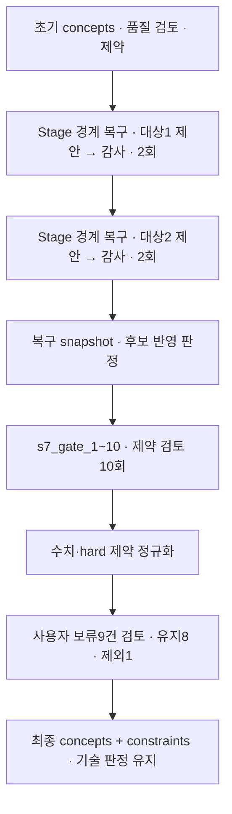

# 9. 제약 검토

[전체 실제 흐름](../README.md)

후보 10개를 제약에 대조한 원본 gate 응답은 CONDITIONAL 9개와 FAIL 1개입니다. 실패 후보를 제외한 뒤 사용자는 8개를 유지하고 1개를 제외했으며, 종료 snapshot에는 후보 8개와 제약 결과 8개가 남아 있습니다. 유지된 후보는 모두 CONDITIONAL로, 사용자 유지 결정이 미확인 조건이나 기술 판정을 PASS로 바꾸지는 않았습니다. 이 시점의 recovery는 4개이며 이후 보완을 더 거쳐 8개가 됩니다.

코드: [`nodes.s7_gate`](https://github.com/equipment0226/triz_backend/blob/606e6e5c26b21697cd71d784157eaa7477486b21/pilot/triz/nodes.py#L1244) · Pipeline key: `s7_gate`

## 실행과 사용자 응답

| KST 시작 | 시작 event.id | 종료 event.id | 진행 |
|---|---|---|---|
| 2026-09-30 07:22:07 | 46147 | — | 사용자 응답 대기 |
| 2026-09-30 07:32:06 | 46201 | 46204 | 완료 |

## 최종 Input · 읽은 버전과 전달값

마지막 재개 이후 실제 task가 참조한 `input_snapshot`입니다. 경계 보완 중 버전이 바뀐 경우 여러 개가 표시됩니다. LLM 없는 재개는 해당 `stage_read_set`을 표시합니다.

| 입력 snapshot | 저장 시점 | 전체 입력 버전 목록 |
|---|---|---|
| snap-ac5f5868c8a44072a32c15e8856e4e73 | stage_read_set | [읽기](../snapshots/snap-ac5f5868c8a44072a32c15e8856e4e73.md) |

실제로 각 함수에 전달된 값은 아래 **하위 처리의 Input**에 모두 연결했습니다. 과거 값을 현재 값으로 덮어 계산하지 않았습니다.

## 최종 Output · Stage 완료 시점

[최종 체크포인트](../snapshots/snap-fedc4ff3f684478b856a0388b9e5ba4d.md) · epoch 51 · KST 2026-09-30 07:32:27

| 산출물 | 버전 ID | 저장 내용 |
|---|---|---|
| concepts | av-b0e3902510de48e9b02e87891af05f3a | [전체 Output](../artifacts/concepts-av-b0e3902510de48e9b02e87891af05f3a.md) |
| constraints | av-a8bbcf6fe3eb491fa96001cff31d08b3 | [전체 Output](../artifacts/constraints-av-a8bbcf6fe3eb491fa96001cff31d08b3.md) |
| coherence | av-3d07d4953595484d8b569892c6cb2050 | [전체 Output](../artifacts/coherence-av-3d07d4953595484d8b569892c6cb2050.md) |

## 하위 처리 · 실제 기록 순서

동시에 시작한 작업은 앞 작업의 종료를 기다린다는 뜻이 아닙니다. `seq`와 `step_id`를 함께 표시했습니다.

상태 열은 **Step의 구조·검증 상태**입니다. 예를 들어 gate Step이 `OK / PASS`여도 실제 제약 판정은 Output의 `CONDITIONAL` 또는 `FAIL`일 수 있습니다.

| seq | 하위 process / Input·Output | Agent / Prompt | 상태 / 판정 | 비용 USD |
|---|---|---|---|---|
| 685 | [ax_repair_gap-99452800a5dc788ae3d52b55_0](../processes/0685-STP-ebe5008d.md) | effects_specialist P_AX_RECOVERY | OK / PASS | 0.0100119 |
| 686 | [s6_quality](../processes/0686-STP-c707d3fe.md) | independent_auditor P_VERIFIER_GENERIC | WARN / REVISE | 0.005958 |
| 687 | [ax_repair_gap-99452800a5dc788ae3d52b55_1](../processes/0687-STP-1a391d27.md) | effects_specialist P_AX_RECOVERY | OK / PASS | 0.0105063 |
| 688 | [s6_quality](../processes/0688-STP-362ca555.md) | independent_auditor P_VERIFIER_GENERIC | OK / PASS | 0.0058623 |
| 689 | [ax_repair_gap-ee8407b02217eddd77e4bfbd_0](../processes/0689-STP-08742341.md) | effects_specialist P_AX_RECOVERY | OK / PASS | 0.0117141 |
| 690 | [s6_quality](../processes/0690-STP-7ff7e56e.md) | independent_auditor P_VERIFIER_GENERIC | OK / PASS | 0.0058926 |
| 691 | [ax_repair_gap-ee8407b02217eddd77e4bfbd_1](../processes/0691-STP-a363be35.md) | effects_specialist P_AX_RECOVERY | OK / PASS | 0.0111213 |
| 692 | [s6_quality](../processes/0692-STP-b0494faa.md) | independent_auditor P_VERIFIER_GENERIC | OK / PASS | 0.0060633 |
| 694 | [s7_gate_2](../processes/0694-STP-e1e32e0c.md) | gatekeeper P_S7_GATEKEEPER | OK / PASS | 0.0025482 |
| 693 | [s7_gate_1](../processes/0693-STP-d056afa6.md) | gatekeeper P_S7_GATEKEEPER | OK / PASS | 0.0025686 |
| 696 | [s7_gate_4](../processes/0696-STP-46d53f89.md) | gatekeeper P_S7_GATEKEEPER | OK / PASS | 0.002574 |
| 695 | [s7_gate_3](../processes/0695-STP-e1e29499.md) | gatekeeper P_S7_GATEKEEPER | OK / PASS | 0.0025353 |
| 697 | [s7_gate_5](../processes/0697-STP-ddce579f.md) | gatekeeper P_S7_GATEKEEPER | OK / PASS | 0.0023196 |
| 698 | [s7_gate_6](../processes/0698-STP-5e1a5e63.md) | gatekeeper P_S7_GATEKEEPER | OK / PASS | 0.0024168 |
| 699 | [s7_gate_7](../processes/0699-STP-3e6bed03.md) | gatekeeper P_S7_GATEKEEPER | OK / PASS | 0.0025383 |
| 700 | [s7_gate_8](../processes/0700-STP-030a8fb8.md) | gatekeeper P_S7_GATEKEEPER | OK / PASS | 0.0024459 |
| 701 | [s7_gate_9](../processes/0701-STP-41b2ea79.md) | gatekeeper P_S7_GATEKEEPER | OK / PASS | 0.0026223 |
| 702 | [s7_gate_10](../processes/0702-STP-accde3d1.md) | gatekeeper P_S7_GATEKEEPER | OK / PASS | 0.0025053 |

## 함수 내부 연결 · 별도 기록 여부

| 함수 | Input → Output | 저장 근거 |
|---|---|---|
| [`runtime.before_stage`](https://github.com/equipment0226/triz_backend/blob/606e6e5c26b21697cd71d784157eaa7477486b21/pilot/triz/ax/runtime.py#L232) | 초기 concepts와 검토 gaps → 제약 검토 전 복구 진입 | stage_start46147 뒤 S6_CONCEPT로 저장된 8개 호출. 실제 소유 Stage는 s7_gate. |
| [`coherence_recovery.run`](https://github.com/equipment0226/triz_backend/blob/606e6e5c26b21697cd71d784157eaa7477486b21/pilot/triz/ax/coherence_recovery.py#L114) | baseline, blockers, requirements, analysis, repair schema → 보완 제안과 수용 여부·미해결 기록 | ax_repair_gap-* 4개 step + coherence_recovery:before_constraints snapshot. 제안4개가 해결안4개 추가를 의미하지 않음. |
| [`quality.audit_concepts`](https://github.com/equipment0226/triz_backend/blob/606e6e5c26b21697cd71d784157eaa7477486b21/pilot/triz/quality.py#L347) | 각 보완안, facts → 각 보완안 독립 품질 검토 | s6_quality 4개 step. DB stage는 S6_CONCEPT, stage_start 소유자는 s7_gate. |
| [`nodes._gate_fingerprint`](https://github.com/equipment0226/triz_backend/blob/606e6e5c26b21697cd71d784157eaa7477486b21/pilot/triz/nodes.py#L1238) | concepts, constraints → 제약 검토 입력 hash | 독립 step row 없음. 호출자의 input vars/output 및 Stage artifact에서 전달값 확인. |
| [`nodes.gate_batch`](https://github.com/equipment0226/triz_backend/blob/606e6e5c26b21697cd71d784157eaa7477486b21/pilot/triz/nodes.py#L1334) | 해결안 batch, 모든 constraints와 taboo → 해결안별 PASS/CONDITIONAL/FAIL, 이유·조건 | 해당 node의 steps.input_slice.vars와 steps.output_json, steps.verdicts. 최종 반영값은 Stage artifact. |
| [`verify.normalize_constraint_result`](https://github.com/equipment0226/triz_backend/blob/606e6e5c26b21697cd71d784157eaa7477486b21/pilot/triz/verify.py#L83) | 모델 gate 결과, 제약 목록 → 수치·hard 제약으로 정규화한 판정 | 독립 step row 없음. constraints.results와 constraint_normalization. |
| [`nodes.s7_gate`](https://github.com/equipment0226/triz_backend/blob/606e6e5c26b21697cd71d784157eaa7477486b21/pilot/triz/nodes.py#L1244) | 사용자 conditional accept/drop → gate_decisions, 유지·제외된 후보 | DECIDE event46200 이후 gate_decisions event46203: accept8/drop1. 재개 구간에는 새 step 없음. |

## 호출·비용 원장

이번 Stage 구간의 AX task는 **18건**입니다. 실제 정산 `actual` 합계는 **0.092213 USD**입니다. Step 수와 task 수는 검증·수정 호출 때문에 다를 수 있습니다. 상속 S0 비용은 이번 합계에서 제외했습니다.

[호출별 입력 snapshot·토큰·비용·원문 해시](../CALLS.md) · [Stage·사용자 이벤트](../EVENTS.md)
