# 9. 제약 검토

[전체 실제 흐름](../README.md)

호출자: [`nodes.s7_gate()`](https://github.com/equipment0226/triz_backend/blob/5ce8ec233b3d58d2005530a4e9b3113f5fc235f2/pilot/triz/nodes.py#L1244). 함수별 실제 입력·출력은 아래 Step 기록에 연결했습니다.

| 실행 구간 시작 KST | 시작 event | 완료 event | 중단 event |
|---|---|---|---|
| 2026-09-30 13:22:54 | 46498 | — | 46630 |
| 2026-09-30 13:29:48 | 46669 | 46675 | — |

```mermaid
flowchart TD
    I["저장 입력 snapshot / Step Input"] --> S["s7_gate"]
    S --> P0["ax_repair_gap-bd9a38e4e0b0f6aea7fe0620_0 · 1 Step"]
    P0 --> O["최종 snapshot / Step Output"]
    S --> P1["s6_quality · 4 Step"]
    P1 --> O["최종 snapshot / Step Output"]
    S --> P2["ax_repair_gap-bd9a38e4e0b0f6aea7fe0620_1 · 1 Step"]
    P2 --> O["최종 snapshot / Step Output"]
    S --> P3["ax_repair_gap-f705ac45d5656e38b0c6b5e9_0 · 1 Step"]
    P3 --> O["최종 snapshot / Step Output"]
    S --> P4["ax_repair_gap-f705ac45d5656e38b0c6b5e9_1 · 1 Step"]
    P4 --> O["최종 snapshot / Step Output"]
    S --> P5["s7_gate_1 · 1 Step"]
    P5 --> O["최종 snapshot / Step Output"]
    S --> P6["s7_gate_2 · 1 Step"]
    P6 --> O["최종 snapshot / Step Output"]
    S --> P7["s7_gate_3 · 1 Step"]
    P7 --> O["최종 snapshot / Step Output"]
    S --> P8["s7_gate_4 · 1 Step"]
    P8 --> O["최종 snapshot / Step Output"]
    S --> P9["s7_gate_5 · 1 Step"]
    P9 --> O["최종 snapshot / Step Output"]
    S --> P10["s7_gate_6 · 1 Step"]
    P10 --> O["최종 snapshot / Step Output"]
    S --> P11["s7_gate_7 · 1 Step"]
    P11 --> O["최종 snapshot / Step Output"]
    S --> P12["s7_gate_8 · 1 Step"]
    P12 --> O["최종 snapshot / Step Output"]
    S --> P13["s7_gate_9 · 1 Step"]
    P13 --> O["최종 snapshot / Step Output"]
    S --> P14["s7_gate_10 · 1 Step"]
    P14 --> O["최종 snapshot / Step Output"]
```

화살표는 기록의 입력·처리·출력 관계입니다. 하위 Step 사이의 순차·병렬 실행을 새로 추정하지 않습니다. 시작 순서는 아래 표와 이벤트 원장을 따릅니다.

## 최종 Input · 마지막 재개에서 읽은 버전

| 입력 snapshot | 전체 입력 버전 |
|---|---|
| snap-c72eaf3ce00a4881812212b692427128 | [읽기](../snapshots/snap-c72eaf3ce00a4881812212b692427128.md) |

## 최종 Output · 완료 시점

[완료 snapshot](../snapshots/snap-9be9f0ee5dba4e77aff67c21a391ffff.md) · epoch 57 · 2026-09-30 13:30:22 KST

| 산출물 | 버전 ID | 전체 Output |
|---|---|---|
| concepts | av-b7fd646519e84d81867239571062ceb6 | [읽기](../artifacts/concepts-av-b7fd646519e84d81867239571062ceb6.md) |
| constraints | av-ad2bbb6260764efbac8199fbe1491def | [읽기](../artifacts/constraints-av-ad2bbb6260764efbac8199fbe1491def.md) |
| coherence | av-52cbda8e48f64d67a0b6fa5d115a5765 | [읽기](../artifacts/coherence-av-52cbda8e48f64d67a0b6fa5d115a5765.md) |

## 하위 process · 실제 시작 순서

| seq / step_id | node · 전체 Input/Output | Agent / Prompt | 상태 / 판정 | USD |
|---|---|---|---|---|
| 780 / STP-7d84296c | [ax_repair_gap-bd9a38e4e0b0f6aea7fe0620_0](../processes/0780-STP-7d84296c.md) | effects_specialist / P_AX_RECOVERY | OK / PASS | 0.0098646 |
| 781 / STP-acce7339 | [s6_quality](../processes/0781-STP-acce7339.md) | independent_auditor / P_VERIFIER_GENERIC | WARN / REVISE | 0.0065016 |
| 782 / STP-e915faf4 | [ax_repair_gap-bd9a38e4e0b0f6aea7fe0620_1](../processes/0782-STP-e915faf4.md) | effects_specialist / P_AX_RECOVERY | OK / PASS | 0.0091734 |
| 783 / STP-721585da | [s6_quality](../processes/0783-STP-721585da.md) | independent_auditor / P_VERIFIER_GENERIC | OK / PASS | 0.0065535 |
| 784 / STP-8f4daabd | [ax_repair_gap-f705ac45d5656e38b0c6b5e9_0](../processes/0784-STP-8f4daabd.md) | effects_specialist / P_AX_RECOVERY | OK / PASS | 0.0118818 |
| 785 / STP-23e9a3a9 | [s6_quality](../processes/0785-STP-23e9a3a9.md) | independent_auditor / P_VERIFIER_GENERIC | OK / PASS | 0.008598 |
| 786 / STP-120c1bac | [ax_repair_gap-f705ac45d5656e38b0c6b5e9_1](../processes/0786-STP-120c1bac.md) | effects_specialist / P_AX_RECOVERY | OK / PASS | 0.0143106 |
| 787 / STP-ee6a01ff | [s6_quality](../processes/0787-STP-ee6a01ff.md) | independent_auditor / P_VERIFIER_GENERIC | OK / PASS | 0.0085569 |
| 788 / STP-9427bab2 | [s7_gate_1](../processes/0788-STP-9427bab2.md) | gatekeeper / P_S7_GATEKEEPER | OK / PASS | 0.0030585 |
| 789 / STP-52870462 | [s7_gate_2](../processes/0789-STP-52870462.md) | gatekeeper / P_S7_GATEKEEPER | OK / PASS | 0.0028878 |
| 790 / STP-9c0bc933 | [s7_gate_3](../processes/0790-STP-9c0bc933.md) | gatekeeper / P_S7_GATEKEEPER | OK / PASS | 0.0029811 |
| 791 / STP-2880340b | [s7_gate_4](../processes/0791-STP-2880340b.md) | gatekeeper / P_S7_GATEKEEPER | OK / PASS | 0.0029034 |
| 792 / STP-154b59cd | [s7_gate_5](../processes/0792-STP-154b59cd.md) | gatekeeper / P_S7_GATEKEEPER | OK / PASS | 0.0029121 |
| 793 / STP-a98e4f7c | [s7_gate_6](../processes/0793-STP-a98e4f7c.md) | gatekeeper / P_S7_GATEKEEPER | OK / PASS | 0.0027396 |
| 794 / STP-9e178adf | [s7_gate_7](../processes/0794-STP-9e178adf.md) | gatekeeper / P_S7_GATEKEEPER | OK / PASS | 0.0027228 |
| 795 / STP-6b354219 | [s7_gate_8](../processes/0795-STP-6b354219.md) | gatekeeper / P_S7_GATEKEEPER | OK / PASS | 0.0027546 |
| 796 / STP-8665fdb0 | [s7_gate_9](../processes/0796-STP-8665fdb0.md) | gatekeeper / P_S7_GATEKEEPER | OK / PASS | 0.0027408 |
| 797 / STP-b82a464c | [s7_gate_10](../processes/0797-STP-b82a464c.md) | gatekeeper / P_S7_GATEKEEPER | OK / PASS | 0.0027036 |

## 모델 호출과 비용

이번 Stage 구간에 생성된 task는 18개입니다. 실행 당시 actual 합계는 0.103852 USD, 비용정정 반영 합계는 0.042316 USD입니다. 예약액 reserve는 소비액이 아닙니다. Step와 task 사이의 직접 외래키가 없어 병렬 호출을 시간만으로 특정 Step에 붙이지 않았습니다.

[task·usage·가격 근거](../CALLS.md) · [시작·중단·재개 이벤트](../EVENTS.md)

`_pick_tcs`, `_add_ideas`, 집계·해시와 같이 독립 Step이 없는 helper의 중간값은 재구성하지 않았습니다. 호출자의 실제 전달 변수, 최종 Output, 저장 산출물로 확인할 수 있는 범위만 담았습니다.
