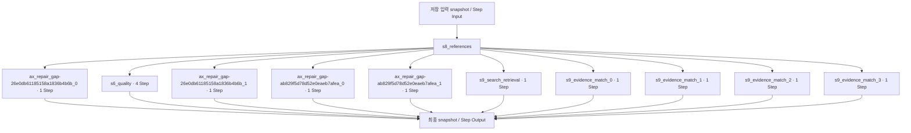

# 10. 근거 자료·적용 조건 검토

[전체 실제 흐름](../README.md)

호출자: [`nodes.s8_references()`](https://github.com/equipment0226/triz_backend/blob/5ce8ec233b3d58d2005530a4e9b3113f5fc235f2/pilot/triz/nodes.py#L1662). 함수별 실제 입력·출력은 아래 Step 기록에 연결했습니다.

| 실행 구간 시작 KST | 시작 event | 완료 event | 중단 event |
|---|---|---|---|
| 2026-09-30 13:31:05 | 46684 | 46921 | — |

화살표는 기록의 입력·처리·출력 관계입니다. 하위 Step 사이의 순차·병렬 실행을 새로 추정하지 않습니다. 시작 순서는 아래 표와 이벤트 원장을 따릅니다.

## 최종 Input · 마지막 재개에서 읽은 버전

| 입력 snapshot | 전체 입력 버전 |
|---|---|
| snap-9be9f0ee5dba4e77aff67c21a391ffff | [읽기](../snapshots/snap-9be9f0ee5dba4e77aff67c21a391ffff.md) |
| snap-379b943f2b7249068666ade186a93f7a | [읽기](../snapshots/snap-379b943f2b7249068666ade186a93f7a.md) |

## 최종 Output · 완료 시점

[완료 snapshot](../snapshots/snap-e37db405a2774f429721bf92198e2c89.md) · epoch 57 · 2026-09-30 13:43:25 KST

| 산출물 | 버전 ID | 전체 Output |
|---|---|---|
| concepts | av-e862f455d9e140b8931f7af2d7821573 | [읽기](../artifacts/concepts-av-e862f455d9e140b8931f7af2d7821573.md) |
| evidence | av-c22fc9b5f06e4004bcb62cc71b39329b | [읽기](../artifacts/evidence-av-c22fc9b5f06e4004bcb62cc71b39329b.md) |
| coherence | av-3e7b7a7734354a4cbcc3ffa6ebc19e3b | [읽기](../artifacts/coherence-av-3e7b7a7734354a4cbcc3ffa6ebc19e3b.md) |

## 하위 process · 실제 시작 순서

| seq / step_id | node · 전체 Input/Output | Agent / Prompt | 상태 / 판정 | USD |
|---|---|---|---|---|
| 798 / STP-e65b5de9 | [ax_repair_gap-26e0db61185158a1836b4b6b_0](../processes/0798-STP-e65b5de9.md) | effects_specialist / P_AX_RECOVERY | OK / PASS | 0.0120174 |
| 799 / STP-1e302e13 | [s6_quality](../processes/0799-STP-1e302e13.md) | independent_auditor / P_VERIFIER_GENERIC | OK / PASS | 0.0085635 |
| 800 / STP-2e11af7f | [ax_repair_gap-26e0db61185158a1836b4b6b_1](../processes/0800-STP-2e11af7f.md) | effects_specialist / P_AX_RECOVERY | OK / PASS | 0.0099342 |
| 801 / STP-002d0250 | [s6_quality](../processes/0801-STP-002d0250.md) | independent_auditor / P_VERIFIER_GENERIC | OK / PASS | 0.0076167 |
| 802 / STP-14c02a17 | [ax_repair_gap-ab829f5d78d52e0eaeb7afea_0](../processes/0802-STP-14c02a17.md) | effects_specialist / P_AX_RECOVERY | OK / PASS | 0.0100752 |
| 803 / STP-09f1251d | [s6_quality](../processes/0803-STP-09f1251d.md) | independent_auditor / P_VERIFIER_GENERIC | WARN / REVISE | 0.0072927 |
| 804 / STP-bfd2d873 | [ax_repair_gap-ab829f5d78d52e0eaeb7afea_1](../processes/0804-STP-bfd2d873.md) | effects_specialist / P_AX_RECOVERY | OK / PASS | 0.0102456 |
| 805 / STP-f85b77fe | [s6_quality](../processes/0805-STP-f85b77fe.md) | independent_auditor / P_VERIFIER_GENERIC | OK / PASS | 0.007347 |
| 806 / STP-a1cef78f | [s9_search_retrieval](../processes/0806-STP-a1cef78f.md) | patent_researcher / — | WARN /  | 0.0 |
| 807 / STP-461665dc | [s9_evidence_match_0](../processes/0807-STP-461665dc.md) | patent_researcher / P_EVIDENCE_MATCH | OK / PASS | 0.0078177 |
| 808 / STP-5bbf98ea | [s9_evidence_match_1](../processes/0808-STP-5bbf98ea.md) | patent_researcher / P_EVIDENCE_MATCH | OK / PASS | 0.0066681 |
| 809 / STP-fd4331ca | [s9_evidence_match_2](../processes/0809-STP-fd4331ca.md) | patent_researcher / P_EVIDENCE_MATCH | OK / PASS | 0.0068121 |
| 810 / STP-029afaa7 | [s9_evidence_match_3](../processes/0810-STP-029afaa7.md) | patent_researcher / P_EVIDENCE_MATCH | OK / PASS | 0.0057114 |

## 모델 호출과 비용

이번 Stage 구간에 생성된 task는 12개입니다. 실행 당시 actual 합계는 0.100108 USD, 비용정정 반영 합계는 0.041854 USD입니다. 예약액 reserve는 소비액이 아닙니다. Step와 task 사이의 직접 외래키가 없어 병렬 호출을 시간만으로 특정 Step에 붙이지 않았습니다.

[task·usage·가격 근거](../CALLS.md) · [시작·중단·재개 이벤트](../EVENTS.md)

`_pick_tcs`, `_add_ideas`, 집계·해시와 같이 독립 Step이 없는 helper의 중간값은 재구성하지 않았습니다. 호출자의 실제 전달 변수, 최종 Output, 저장 산출물로 확인할 수 있는 범위만 담았습니다.
