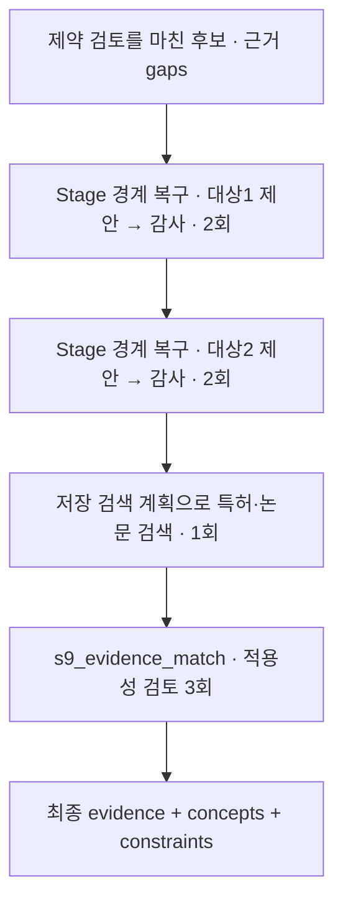

# 10. 근거 자료·적용 조건 검토

[전체 실제 흐름](../README.md)

제약 후 보완까지 반영된 후보 8개에 대해 근거 검색과 적용성 매칭을 수행했습니다. 이번 단계의 특허 검색 16개 쿼리는 모두 UNAVAILABLE·0건이고, 최종 evidence는 sources 0개·mappings 0개·gaps 8개입니다. 이벤트에 남은 누적 검색 건수와 이번 후보에 실제 연결된 근거 수를 구분해야 합니다.

코드: [`nodes.s8_references`](https://github.com/equipment0226/triz_backend/blob/606e6e5c26b21697cd71d784157eaa7477486b21/pilot/triz/nodes.py#L1662) · Pipeline key: `s8_references`

## 실행과 사용자 응답

| KST 시작 | 시작 event.id | 종료 event.id | 진행 |
|---|---|---|---|
| 2026-09-30 07:32:55 | 46205 | 46239 | 완료 |

## 최종 Input · 읽은 버전과 전달값

마지막 재개 이후 실제 task가 참조한 `input_snapshot`입니다. 경계 보완 중 버전이 바뀐 경우 여러 개가 표시됩니다. LLM 없는 재개는 해당 `stage_read_set`을 표시합니다.

| 입력 snapshot | 저장 시점 | 전체 입력 버전 목록 |
|---|---|---|
| snap-fedc4ff3f684478b856a0388b9e5ba4d | s7_gate | [읽기](../snapshots/snap-fedc4ff3f684478b856a0388b9e5ba4d.md) |
| snap-7231f58fa80a4136829ac2930ab655d6 | coherence_recovery:after_constraints | [읽기](../snapshots/snap-7231f58fa80a4136829ac2930ab655d6.md) |

실제로 각 함수에 전달된 값은 아래 **하위 처리의 Input**에 모두 연결했습니다. 과거 값을 현재 값으로 덮어 계산하지 않았습니다.

## 최종 Output · Stage 완료 시점

[최종 체크포인트](../snapshots/snap-a3e819359d8144efae7fd943812a96ac.md) · epoch 51 · KST 2026-09-30 07:37:44

| 산출물 | 버전 ID | 저장 내용 |
|---|---|---|
| concepts | av-f87b49192c164f969e931e9e8660b7a4 | [전체 Output](../artifacts/concepts-av-f87b49192c164f969e931e9e8660b7a4.md) |
| constraints | av-04ff51006a3e4b639cb85bfdc57346e6 | [전체 Output](../artifacts/constraints-av-04ff51006a3e4b639cb85bfdc57346e6.md) |
| evidence | av-cd107f5e5c8941d7b4e6f9e15cf4e3d2 | [전체 Output](../artifacts/evidence-av-cd107f5e5c8941d7b4e6f9e15cf4e3d2.md) |
| coherence | av-03c8ece38f8543f989d9c637ee499fbe | [전체 Output](../artifacts/coherence-av-03c8ece38f8543f989d9c637ee499fbe.md) |

## 하위 처리 · 실제 기록 순서

동시에 시작한 작업은 앞 작업의 종료를 기다린다는 뜻이 아닙니다. `seq`와 `step_id`를 함께 표시했습니다.

상태 열은 **Step의 구조·검증 상태**입니다. 예를 들어 gate Step이 `OK / PASS`여도 실제 제약 판정은 Output의 `CONDITIONAL` 또는 `FAIL`일 수 있습니다.

| seq | 하위 process / Input·Output | Agent / Prompt | 상태 / 판정 | 비용 USD |
|---|---|---|---|---|
| 703 | [ax_repair_gap-80693d8f5a5d25a6d2dfa098_0](../processes/0703-STP-583c4e9c.md) | effects_specialist P_AX_RECOVERY | OK / PASS | 0.0096594 |
| 704 | [s6_quality](../processes/0704-STP-e0e257ce.md) | independent_auditor P_VERIFIER_GENERIC | WARN / REVISE | 0.0057252 |
| 705 | [ax_repair_gap-80693d8f5a5d25a6d2dfa098_1](../processes/0705-STP-94f8aba6.md) | effects_specialist P_AX_RECOVERY | OK / PASS | 0.0102906 |
| 706 | [s6_quality](../processes/0706-STP-9762d548.md) | independent_auditor P_VERIFIER_GENERIC | WARN / REVISE | 0.0055776 |
| 707 | [ax_repair_gap-23e4763bd7081652230dfb23_0](../processes/0707-STP-56e22e2f.md) | effects_specialist P_AX_RECOVERY | OK / PASS | 0.0102738 |
| 708 | [s6_quality](../processes/0708-STP-8902abc2.md) | independent_auditor P_VERIFIER_GENERIC | OK / PASS | 0.0060405 |
| 709 | [ax_repair_gap-23e4763bd7081652230dfb23_1](../processes/0709-STP-cea0e0f8.md) | effects_specialist P_AX_RECOVERY | OK / PASS | 0.0099558 |
| 710 | [s6_quality](../processes/0710-STP-85ba7c8b.md) | independent_auditor P_VERIFIER_GENERIC | OK / PASS | 0.0055959 |
| 711 | [s9_search_retrieval](../processes/0711-STP-e0d306a2.md) | patent_researcher — | WARN /  | 0.0 |
| 712 | [s9_evidence_match_0](../processes/0712-STP-2ff14bf1.md) | patent_researcher P_EVIDENCE_MATCH | OK / PASS | 0.0066273 |
| 713 | [s9_evidence_match_1](../processes/0713-STP-3614dc2d.md) | patent_researcher P_EVIDENCE_MATCH | OK / PASS | 0.0084456 |
| 714 | [s9_evidence_match_2](../processes/0714-STP-377bf78e.md) | patent_researcher P_EVIDENCE_MATCH | OK / PASS | 0.0056748 |

## 함수 내부 연결 · 별도 기록 여부

| 함수 | Input → Output | 저장 근거 |
|---|---|---|
| [`runtime.before_stage`](https://github.com/equipment0226/triz_backend/blob/606e6e5c26b21697cd71d784157eaa7477486b21/pilot/triz/ax/runtime.py#L232) | 제약 검토 이후 현재 후보·미해결 gaps → 근거 검토 전 복구 진입 | stage_start46205 뒤 S6_CONCEPT 8개 호출. 실제 소유 Stage는 s8_references. |
| [`coherence_recovery.run`](https://github.com/equipment0226/triz_backend/blob/606e6e5c26b21697cd71d784157eaa7477486b21/pilot/triz/ax/coherence_recovery.py#L114) | baseline, blockers, requirements, analysis → 보완 제안 및 수용/미해결 이력 | ax_repair_gap-* 4개 step와 coherence_recovery:after_constraints snapshot. |
| [`quality.audit_concepts`](https://github.com/equipment0226/triz_backend/blob/606e6e5c26b21697cd71d784157eaa7477486b21/pilot/triz/quality.py#L347) | 보완 제안 → 독립 품질 판정 | s6_quality 4개 step. DB stage S6_CONCEPT와 owning Stage s8_references를 함께 표기. |
| [`nodes._applied_principles`](https://github.com/equipment0226/triz_backend/blob/606e6e5c26b21697cd71d784157eaa7477486b21/pilot/triz/nodes.py#L1633) | 실제 저장 원리·표준해·효과 적용 → 근거 탐색용 적용 목록 | 독립 row 없음. 이번 검색계획 신규 step도 없음. 저장 검색계획 및 evidence match 입력과 최종 source_ref로 사용값 확인 가능한 범위만 설명. |
| [`evidence.discover`](https://github.com/equipment0226/triz_backend/blob/606e6e5c26b21697cd71d784157eaa7477486b21/pilot/triz/evidence.py#L46) | 저장 search_plans/cache/diagnostics 및 현재 후보 → 검색 진단·후보 자료 | s9_search_retrieval 1개. 이번 구간 s9_evidence_plan 신규 호출 없음. |
| [`evidence.attach`](https://github.com/equipment0226/triz_backend/blob/606e6e5c26b21697cd71d784157eaa7477486b21/pilot/triz/evidence.py#L157) | 검색 후보와 현재 해결안 작동 원리 → EvidenceCard, mappings, gaps, 적용 조건 | s9_evidence_match_0~2 3개 step와 evidence/concepts/constraints artifact. |

## 호출·비용 원장

이번 Stage 구간의 AX task는 **11건**입니다. 실제 정산 `actual` 합계는 **0.083871 USD**입니다. Step 수와 task 수는 검증·수정 호출 때문에 다를 수 있습니다. 상속 S0 비용은 이번 합계에서 제외했습니다.

[호출별 입력 snapshot·토큰·비용·원문 해시](../CALLS.md) · [Stage·사용자 이벤트](../EVENTS.md)
