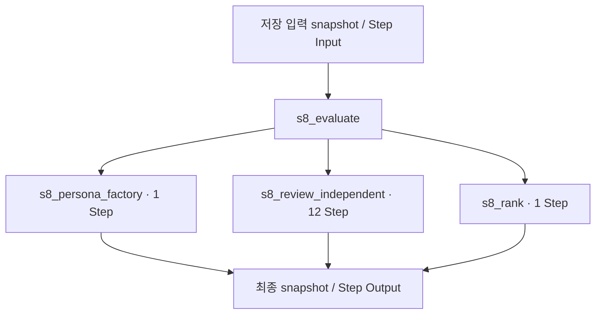

# 11. 다직군 평가

[전체 실제 흐름](../README.md)

호출자: [`nodes.s8_evaluate()`](https://github.com/equipment0226/triz_backend/blob/5ce8ec233b3d58d2005530a4e9b3113f5fc235f2/pilot/triz/nodes.py#L1505). 함수별 실제 입력·출력은 아래 Step 기록에 연결했습니다.

| 실행 구간 시작 KST | 시작 event | 완료 event | 중단 event |
|---|---|---|---|
| 2026-09-30 13:44:01 | 46926 | 47078 | — |

화살표는 기록의 입력·처리·출력 관계입니다. 하위 Step 사이의 순차·병렬 실행을 새로 추정하지 않습니다. 시작 순서는 아래 표와 이벤트 원장을 따릅니다.

## 최종 Input · 마지막 재개에서 읽은 버전

| 입력 snapshot | 전체 입력 버전 |
|---|---|
| snap-e37db405a2774f429721bf92198e2c89 | [읽기](../snapshots/snap-e37db405a2774f429721bf92198e2c89.md) |

## 최종 Output · 완료 시점

[완료 snapshot](../snapshots/snap-87f043e157904c50b4ed98403b6062b3.md) · epoch 57 · 2026-09-30 13:55:41 KST

| 산출물 | 버전 ID | 전체 Output |
|---|---|---|
| evaluation | av-4db00d266d2949db850f27bae8428c67 | [읽기](../artifacts/evaluation-av-4db00d266d2949db850f27bae8428c67.md) |
| selection | av-5584b014787346fba356e45979925c1e | [읽기](../artifacts/selection-av-5584b014787346fba356e45979925c1e.md) |

## 하위 process · 실제 시작 순서

| seq / step_id | node · 전체 Input/Output | Agent / Prompt | 상태 / 판정 | USD |
|---|---|---|---|---|
| 811 / STP-197884fd | [s8_persona_factory](../processes/0811-STP-197884fd.md) | role_router / P_PERSONA_FACTORY | OK / PASS | 0.0036174 |
| 812 / STP-31f25af6 | [s8_review_independent](../processes/0812-STP-31f25af6.md) | persona::PER-d6f883a3 / P_S8_REVIEW | WARN / UNVERIFIED | 0.0121578 |
| 813 / STP-55f99884 | [s8_review_independent](../processes/0813-STP-55f99884.md) | persona::PER-2d75a330 / P_S8_REVIEW | WARN / UNVERIFIED | 0.0123309 |
| 814 / STP-f87d76ab | [s8_review_independent](../processes/0814-STP-f87d76ab.md) | persona::PER-d8a7a4d0 / P_S8_REVIEW | WARN / UNVERIFIED | 0.0120426 |
| 815 / STP-0517e697 | [s8_review_independent](../processes/0815-STP-0517e697.md) | persona::PER-faa167d5 / P_S8_REVIEW | WARN / UNVERIFIED | 0.0116583 |
| 816 / STP-d502940a | [s8_review_independent](../processes/0816-STP-d502940a.md) | persona::PER-d6f883a3 / P_S8_REVIEW | WARN / UNVERIFIED | 0.0108171 |
| 817 / STP-b3b5cfd2 | [s8_review_independent](../processes/0817-STP-b3b5cfd2.md) | persona::PER-d8a7a4d0 / P_S8_REVIEW | WARN / UNVERIFIED | 0.0105207 |
| 818 / STP-49d27218 | [s8_review_independent](../processes/0818-STP-49d27218.md) | persona::PER-2d75a330 / P_S8_REVIEW | WARN / UNVERIFIED | 0.0102642 |
| 819 / STP-1e3b72ec | [s8_review_independent](../processes/0819-STP-1e3b72ec.md) | persona::PER-faa167d5 / P_S8_REVIEW | WARN / UNVERIFIED | 0.0104724 |
| 820 / STP-3dec6b7b | [s8_review_independent](../processes/0820-STP-3dec6b7b.md) | persona::PER-626efe29 / P_S8_REVIEW | WARN / UNVERIFIED | 0.0103215 |
| 821 / STP-654bd5ef | [s8_review_independent](../processes/0821-STP-654bd5ef.md) | persona::PER-cbf8bdb3 / P_S8_REVIEW | WARN / UNVERIFIED | 0.0117948 |
| 822 / STP-e0b2df13 | [s8_review_independent](../processes/0822-STP-e0b2df13.md) | persona::PER-626efe29 / P_S8_REVIEW | WARN / UNVERIFIED | 0.0102732 |
| 823 / STP-e1514a7c | [s8_review_independent](../processes/0823-STP-e1514a7c.md) | persona::PER-cbf8bdb3 / P_S8_REVIEW | WARN / UNVERIFIED | 0.0107073 |
| 824 / STP-a594cc12 | [s8_rank](../processes/0824-STP-a594cc12.md) | portfolio_manager / P_S8_RANK | OK / PASS | 0.0153912 |

## 모델 호출과 비용

이번 Stage 구간에 생성된 task는 15개입니다. 실행 당시 actual 합계는 0.152377 USD, 비용정정 반영 합계는 0.054553 USD입니다. 예약액 reserve는 소비액이 아닙니다. Step와 task 사이의 직접 외래키가 없어 병렬 호출을 시간만으로 특정 Step에 붙이지 않았습니다.

[task·usage·가격 근거](../CALLS.md) · [시작·중단·재개 이벤트](../EVENTS.md)

`_pick_tcs`, `_add_ideas`, 집계·해시와 같이 독립 Step이 없는 helper의 중간값은 재구성하지 않았습니다. 호출자의 실제 전달 변수, 최종 Output, 저장 산출물로 확인할 수 있는 범위만 담았습니다.
