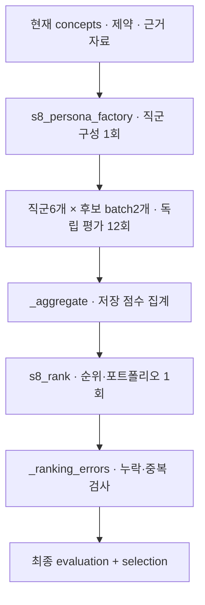

# 11. 다직군 평가

[전체 실제 흐름](../README.md)

검토자 6명을 구성해 직군별로 후보를 두 묶음으로 나누어 독립 검토하고 후보 8개의 순위와 로드맵을 만들었습니다. 상위 세 후보는 가감속 프로파일 단계적 상향, 부하별 가변 가감속 프로파일, 공진 이격 조건부 가속 상향입니다. 최종 selection은 recommended 0개·conditional 8개·PARTIAL이고, 후보별 quality_status는 모두 REVISE입니다. 순위가 있다는 사실은 시험이나 제약 검증을 통과했다는 뜻이 아닙니다.

코드: [`nodes.s8_evaluate`](https://github.com/equipment0226/triz_backend/blob/606e6e5c26b21697cd71d784157eaa7477486b21/pilot/triz/nodes.py#L1505) · Pipeline key: `s8_evaluate`

## 실행과 사용자 응답

| KST 시작 | 시작 event.id | 종료 event.id | 진행 |
|---|---|---|---|
| 2026-09-30 07:38:11 | 46240 | 46289 | 완료 |

## 최종 Input · 읽은 버전과 전달값

마지막 재개 이후 실제 task가 참조한 `input_snapshot`입니다. 경계 보완 중 버전이 바뀐 경우 여러 개가 표시됩니다. LLM 없는 재개는 해당 `stage_read_set`을 표시합니다.

| 입력 snapshot | 저장 시점 | 전체 입력 버전 목록 |
|---|---|---|
| snap-a3e819359d8144efae7fd943812a96ac | s8_references | [읽기](../snapshots/snap-a3e819359d8144efae7fd943812a96ac.md) |

실제로 각 함수에 전달된 값은 아래 **하위 처리의 Input**에 모두 연결했습니다. 과거 값을 현재 값으로 덮어 계산하지 않았습니다.

## 최종 Output · Stage 완료 시점

[최종 체크포인트](../snapshots/snap-9e56415fa138459e8d7fd4f2b0224aab.md) · epoch 51 · KST 2026-09-30 07:42:14

| 산출물 | 버전 ID | 저장 내용 |
|---|---|---|
| evaluation | av-2993e53e0aad4bd0911034d2d78d4d5a | [전체 Output](../artifacts/evaluation-av-2993e53e0aad4bd0911034d2d78d4d5a.md) |
| selection | av-4dfbe87665f3492fb5910b3834cf2c5f | [전체 Output](../artifacts/selection-av-4dfbe87665f3492fb5910b3834cf2c5f.md) |

## 하위 처리 · 실제 기록 순서

동시에 시작한 작업은 앞 작업의 종료를 기다린다는 뜻이 아닙니다. `seq`와 `step_id`를 함께 표시했습니다.

상태 열은 **Step의 구조·검증 상태**입니다. 예를 들어 gate Step이 `OK / PASS`여도 실제 제약 판정은 Output의 `CONDITIONAL` 또는 `FAIL`일 수 있습니다.

| seq | 하위 process / Input·Output | Agent / Prompt | 상태 / 판정 | 비용 USD |
|---|---|---|---|---|
| 715 | [s8_persona_factory](../processes/0715-STP-4b38652a.md) | role_router P_PERSONA_FACTORY | OK / PASS | 0.0031344 |
| 716 | [s8_review_independent](../processes/0716-STP-4b75fe30.md) | persona::PER-d9a432eb P_S8_REVIEW | WARN / UNVERIFIED | 0.0095187 |
| 717 | [s8_review_independent](../processes/0717-STP-d8ee8b50.md) | persona::PER-8ccfa343 P_S8_REVIEW | WARN / UNVERIFIED | 0.009213 |
| 718 | [s8_review_independent](../processes/0718-STP-7ed398b8.md) | persona::PER-e11ad79c P_S8_REVIEW | WARN / UNVERIFIED | 0.0089673 |
| 719 | [s8_review_independent](../processes/0719-STP-667b56ea.md) | persona::PER-cc70cff8 P_S8_REVIEW | WARN / UNVERIFIED | 0.0180753 |
| 720 | [s8_review_independent](../processes/0720-STP-2618d71d.md) | persona::PER-8ccfa343 P_S8_REVIEW | WARN / UNVERIFIED | 0.0069171 |
| 721 | [s8_review_independent](../processes/0721-STP-d9d7a870.md) | persona::PER-d9a432eb P_S8_REVIEW | WARN / UNVERIFIED | 0.0069144 |
| 722 | [s8_review_independent](../processes/0722-STP-6d983e86.md) | persona::PER-e11ad79c P_S8_REVIEW | WARN / UNVERIFIED | 0.0067158 |
| 723 | [s8_review_independent](../processes/0723-STP-bc1b417c.md) | persona::PER-cc70cff8 P_S8_REVIEW | WARN / UNVERIFIED | 0.006693 |
| 724 | [s8_review_independent](../processes/0724-STP-b3cf260e.md) | persona::PER-42b4c415 P_S8_REVIEW | WARN / UNVERIFIED | 0.0078948 |
| 725 | [s8_review_independent](../processes/0725-STP-96e56bc1.md) | persona::PER-917f1fc2 P_S8_REVIEW | WARN / UNVERIFIED | 0.0092196 |
| 726 | [s8_review_independent](../processes/0726-STP-7ed87a9c.md) | persona::PER-42b4c415 P_S8_REVIEW | WARN / UNVERIFIED | 0.0067917 |
| 727 | [s8_review_independent](../processes/0727-STP-df1c8062.md) | persona::PER-917f1fc2 P_S8_REVIEW | WARN / UNVERIFIED | 0.0069285 |
| 728 | [s8_rank](../processes/0728-STP-0d1d3ef5.md) | portfolio_manager P_S8_RANK | OK / PASS | 0.0057798 |

## 함수 내부 연결 · 별도 기록 여부

| 함수 | Input → Output | 저장 근거 |
|---|---|---|
| [`personas.build_personas`](https://github.com/equipment0226/triz_backend/blob/606e6e5c26b21697cd71d784157eaa7477486b21/pilot/triz/personas.py#L39) | 도메인, 문제, 해결안, 평가 차원 → reviewer personas | s8_persona_factory step1개. 실제 저장 직군6개; 각 직군은 후보 batch2개씩 평가. |
| [`meeting.evaluate`](https://github.com/equipment0226/triz_backend/blob/606e6e5c26b21697cd71d784157eaa7477486b21/pilot/triz/meeting.py#L333) | concepts, constraints, evidence, reviewer 역할·dimension → ReviewerScore, 개념별 의견·검토 기록 | s8_review_independent 12개 step. initial/exchange/final 토론 경로가 아닌 독립검토 기록. |
| [`nodes._aggregate`](https://github.com/equipment0226/triz_backend/blob/606e6e5c26b21697cd71d784157eaa7477486b21/pilot/triz/nodes.py#L1525) | 직군별 score·confidence·dimension/veto → ConceptEvaluation 총점·차원 점수 | 독립 step row 없음. evaluation.evaluations와 s8_rank의 실제 vars 입력에 집계 결과 저장. |
| [`nodes._rank`](https://github.com/equipment0226/triz_backend/blob/606e6e5c26b21697cd71d784157eaa7477486b21/pilot/triz/nodes.py#L1587) | 집계 점수, 후보, 제약·근거 검토 → 랭킹·포트폴리오·로드맵 | 해당 node의 steps.input_slice.vars와 steps.output_json, steps.verdicts. 최종 반영값은 Stage artifact. |
| [`nodes._ranking_errors`](https://github.com/equipment0226/triz_backend/blob/606e6e5c26b21697cd71d784157eaa7477486b21/pilot/triz/nodes.py#L1573) | 모델 ranking 결과, expected concept IDs → 누락·중복 검사 목록 | 독립 step row 없음. s8_rank.verdicts와 최종 output_json. |

## 호출·비용 원장

이번 Stage 구간의 AX task는 **15건**입니다. 실제 정산 `actual` 합계는 **0.112769 USD**입니다. Step 수와 task 수는 검증·수정 호출 때문에 다를 수 있습니다. 상속 S0 비용은 이번 합계에서 제외했습니다.

[호출별 입력 snapshot·토큰·비용·원문 해시](../CALLS.md) · [Stage·사용자 이벤트](../EVENTS.md)
