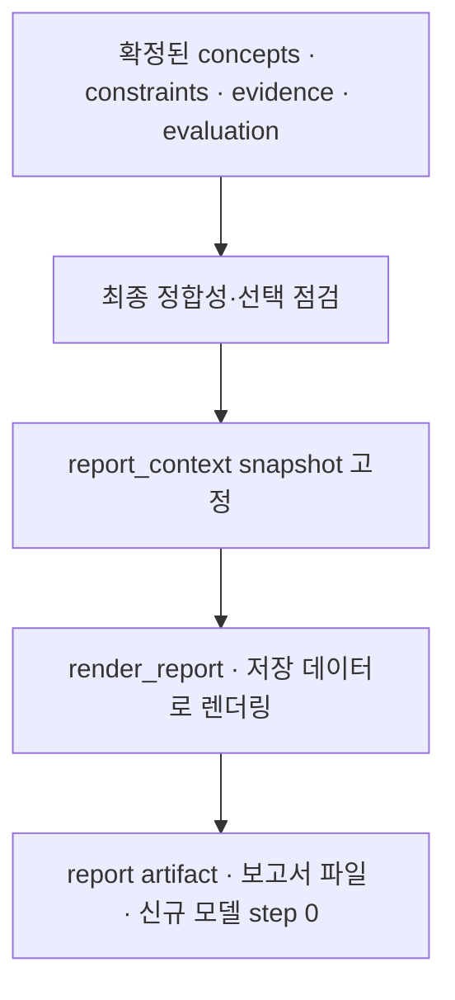

# 12. 시각화 보고서

[전체 실제 흐름](../README.md)

확정된 분석·제약·근거·평가·selection snapshot을 보고서로 렌더링하고 report artifact를 저장했습니다. 별도 LLM Step은 없지만 Stage 종료와 보고서 저장 이벤트가 있어 생성 실행을 확인할 수 있습니다. 보고서 전문은 앞의 산출물과 중복되므로 이 문서에서는 저장된 버전 ID와 해시로 연결합니다.

코드: [`nodes.s9_report`](https://github.com/equipment0226/triz_backend/blob/606e6e5c26b21697cd71d784157eaa7477486b21/pilot/triz/nodes.py#L1668) · Pipeline key: `s9_report`

## 실행과 사용자 응답

| KST 시작 | 시작 event.id | 종료 event.id | 진행 |
|---|---|---|---|
| 2026-09-30 07:42:39 | 46290 | 46293 | 완료 |

## 최종 Input · 읽은 버전과 전달값

보고서는 별도 LLM 호출 없이, 평가 완료 snapshot에서 선택·보고서 맥락을 고정한 뒤 `ax_report_snapshot_id`를 읽어 렌더링했습니다. 아래 두 저장본이 그 연결입니다.

| 입력 snapshot | 저장 시점 | 전체 입력 버전 목록 |
|---|---|---|
| snap-9e56415fa138459e8d7fd4f2b0224aab | s8_evaluate | [읽기](../snapshots/snap-9e56415fa138459e8d7fd4f2b0224aab.md) |
| snap-3e7bf6228d8c493d9ced98991287bf98 | report_context | [읽기](../snapshots/snap-3e7bf6228d8c493d9ced98991287bf98.md) |

실제로 각 함수에 전달된 값은 아래 **하위 처리의 Input**에 모두 연결했습니다. 과거 값을 현재 값으로 덮어 계산하지 않았습니다.

## 최종 Output · Stage 완료 시점

[최종 체크포인트](../snapshots/snap-41ca8f7ce9484568b130ff09276d4620.md) · epoch 51 · KST 2026-09-30 07:43:38

| 산출물 | 버전 ID | 저장 내용 |
|---|---|---|
| coherence | av-03c8ece38f8543f989d9c637ee499fbe | [전체 Output](../artifacts/coherence-av-03c8ece38f8543f989d9c637ee499fbe.md) |
| selection | av-4dfbe87665f3492fb5910b3834cf2c5f | [전체 Output](../artifacts/selection-av-4dfbe87665f3492fb5910b3834cf2c5f.md) |
| report_context | av-fea07164dc5041d4a7c0a765829ae407 | [전체 Output](../artifacts/report_context-av-fea07164dc5041d4a7c0a765829ae407.md) |
| report | av-930bb2bc8cf245be82ec07c0e2678202 | [전체 Output](../artifacts/report-av-930bb2bc8cf245be82ec07c0e2678202.md) |

## 하위 처리 · 실제 기록 순서

동시에 시작한 작업은 앞 작업의 종료를 기다린다는 뜻이 아닙니다. `seq`와 `step_id`를 함께 표시했습니다.

상태 열은 **Step의 구조·검증 상태**입니다. 예를 들어 gate Step이 `OK / PASS`여도 실제 제약 판정은 Output의 `CONDITIONAL` 또는 `FAIL`일 수 있습니다.

독립 Step row 없이 결정론 처리와 스냅샷 저장을 수행했습니다.

## 함수 내부 연결 · 별도 기록 여부

| 함수 | Input → Output | 저장 근거 |
|---|---|---|
| [`runtime.before_stage`](https://github.com/equipment0226/triz_backend/blob/606e6e5c26b21697cd71d784157eaa7477486b21/pilot/triz/ax/runtime.py#L232) | 최종 후보·제약·평가·근거 snapshot → 최종 selection/coherence/report_context | report_context snapshot 및 ax_report_snapshot_id. 별도 agent step 없음. |
| [`render.render_report`](https://github.com/equipment0226/triz_backend/blob/606e6e5c26b21697cd71d784157eaa7477486b21/pilot/triz/render.py#L378) | 고정된 report snapshot 및 template → report.markdown, narrative, 도식 참조 | report artifact와 report event46292. AX 경로에서는 s9_narrative 신규 LLM step 없음. |
| [`render.save`](https://github.com/equipment0226/triz_backend/blob/606e6e5c26b21697cd71d784157eaa7477486b21/pilot/triz/render.py#L475) | report markdown → 보고서 파일 | DB 산출물은 report artifact, 파일 저장은 보조 결과. 파일을 새 모델 산출물로 보지 않음. |

## 호출·비용 원장

이번 Stage 구간의 AX task는 **0건**입니다. 실제 정산 `actual` 합계는 **0.000000 USD**입니다. Step 수와 task 수는 검증·수정 호출 때문에 다를 수 있습니다. 상속 S0 비용은 이번 합계에서 제외했습니다.

[호출별 입력 snapshot·토큰·비용·원문 해시](../CALLS.md) · [Stage·사용자 이벤트](../EVENTS.md)
