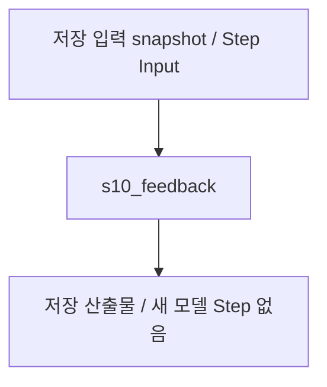

# 13. 피드백

[전체 실제 흐름](../README.md)

호출자: [`nodes.s10_feedback()`](https://github.com/equipment0226/triz_backend/blob/5ce8ec233b3d58d2005530a4e9b3113f5fc235f2/pilot/triz/nodes.py#L1757). 함수별 실제 입력·출력은 아래 Step 기록에 연결했습니다.

| 실행 구간 시작 KST | 시작 event | 완료 event | 중단 event |
|---|---|---|---|
| 2026-09-30 14:00:52 | 47126 | — | 47161 |
| 2026-09-30 14:06:21 | 47269 | 47276 | — |

화살표는 기록의 입력·처리·출력 관계입니다. 하위 Step 사이의 순차·병렬 실행을 새로 추정하지 않습니다. 시작 순서는 아래 표와 이벤트 원장을 따릅니다.

## 최종 Input · 마지막 재개에서 읽은 버전

| 입력 snapshot | 전체 입력 버전 |
|---|---|
| snap-6b73a729657440ee99a9f845d2b90693 | [읽기](../snapshots/snap-6b73a729657440ee99a9f845d2b90693.md) |

## 최종 Output · 완료 시점

[완료 snapshot](../snapshots/snap-440b573371d94951b0a44e28c3db3abf.md) · epoch 58 · 2026-09-30 14:06:56 KST

| 산출물 | 버전 ID | 전체 Output |
|---|---|---|
| feedback | av-88c0fdf7108743e990fb193a41299641 | [읽기](../artifacts/feedback-av-88c0fdf7108743e990fb193a41299641.md) |

## 하위 process · 실제 시작 순서

| seq / step_id | node · 전체 Input/Output | Agent / Prompt | 상태 / 판정 | USD |
|---|---|---|---|---|

## 모델 호출과 비용

이번 Stage 구간에 생성된 task는 0개입니다. 실행 당시 actual 합계는 0.000000 USD, 비용정정 반영 합계는 0.000000 USD입니다. 예약액 reserve는 소비액이 아닙니다. Step와 task 사이의 직접 외래키가 없어 병렬 호출을 시간만으로 특정 Step에 붙이지 않았습니다.

[task·usage·가격 근거](../CALLS.md) · [시작·중단·재개 이벤트](../EVENTS.md)

`_pick_tcs`, `_add_ideas`, 집계·해시와 같이 독립 Step이 없는 helper의 중간값은 재구성하지 않았습니다. 호출자의 실제 전달 변수, 최종 Output, 저장 산출물로 확인할 수 있는 범위만 담았습니다.
