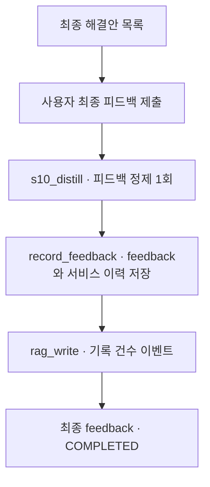

# 13. 피드백

[전체 실제 흐름](../README.md)

후보 8개에 대한 실제 사용자 점수는 5·5·4·5·5·3·3·2점으로 평균 4.0입니다. 모든 adopted 값은 null이고 의견 문장은 비어 있으므로 채택·실행 완료로 해석하지 않습니다. 피드백 정제 Step과 실제 RAG 사례 6건의 저장을 확인했지만, 이 추출본에는 학습 보상 테이블이나 승격된 모델 가중치가 없어 Q 재학습·다른 문제 적용 완료까지 단정하지 않습니다.

코드: [`nodes.s10_feedback`](https://github.com/equipment0226/triz_backend/blob/606e6e5c26b21697cd71d784157eaa7477486b21/pilot/triz/nodes.py#L1753) · Pipeline key: `s10_feedback`

## 실행과 사용자 응답

| KST 시작 | 시작 event.id | 종료 event.id | 진행 |
|---|---|---|---|
| 2026-09-30 07:44:04 | 46294 | — | 사용자 응답 대기 |
| 2026-09-30 07:57:38 | 46297 | 46303 | 완료 |

## 최종 Input · 읽은 버전과 전달값

마지막 재개 이후 실제 task가 참조한 `input_snapshot`입니다. 경계 보완 중 버전이 바뀐 경우 여러 개가 표시됩니다. LLM 없는 재개는 해당 `stage_read_set`을 표시합니다.

| 입력 snapshot | 저장 시점 | 전체 입력 버전 목록 |
|---|---|---|
| snap-ab9f74e25b044c86a2e227b43c6157ff | stage_read_set | [읽기](../snapshots/snap-ab9f74e25b044c86a2e227b43c6157ff.md) |

실제로 각 함수에 전달된 값은 아래 **하위 처리의 Input**에 모두 연결했습니다. 과거 값을 현재 값으로 덮어 계산하지 않았습니다.

## 최종 Output · Stage 완료 시점

[최종 체크포인트](../snapshots/snap-f6d53363d6714c2c8f15d3d5a4c70178.md) · epoch 52 · KST 2026-09-30 07:58:22

| 산출물 | 버전 ID | 저장 내용 |
|---|---|---|
| feedback | av-0d55982984a84cf581a386c864043cd4 | [전체 Output](../artifacts/feedback-av-0d55982984a84cf581a386c864043cd4.md) |

[실제로 저장된 후속 RAG 사례 6개](../RAG.md) · [feedback_logs의 사용자 점수 8개](../PROVENANCE.md)

## 하위 처리 · 실제 기록 순서

동시에 시작한 작업은 앞 작업의 종료를 기다린다는 뜻이 아닙니다. `seq`와 `step_id`를 함께 표시했습니다.

상태 열은 **Step의 구조·검증 상태**입니다. 예를 들어 gate Step이 `OK / PASS`여도 실제 제약 판정은 Output의 `CONDITIONAL` 또는 `FAIL`일 수 있습니다.

| seq | 하위 process / Input·Output | Agent / Prompt | 상태 / 판정 | 비용 USD |
|---|---|---|---|---|
| 729 | [s10_distill](../processes/0729-STP-b5bdeb3a.md) | rag_writer P_S10_FEEDBACK_DISTILL | OK / PASS | 0.004032 |

## 함수 내부 연결 · 별도 기록 여부

| 함수 | Input → Output | 저장 근거 |
|---|---|---|
| [`nodes.s10_feedback`](https://github.com/equipment0226/triz_backend/blob/606e6e5c26b21697cd71d784157eaa7477486b21/pilot/triz/nodes.py#L1753) | 현재 해결안 목록 → FEEDBACK 요청 | interrupt event46296. 대기 후 stage_start46297로 재개. |
| [`nodes.s10_feedback`](https://github.com/equipment0226/triz_backend/blob/606e6e5c26b21697cd71d784157eaa7477486b21/pilot/triz/nodes.py#L1753) | 문제·모순 digest, 제출 solution_feedback → distilled feedback | s10_distill step1개. 함수는 s10_feedback 내부 agent 호출. |
| [`nodes.record_feedback`](https://github.com/equipment0226/triz_backend/blob/606e6e5c26b21697cd71d784157eaa7477486b21/pilot/triz/nodes.py#L1717) | solution_feedback, overall_rating, distill → feedback artifact, feedback_logs, RAG 기록 | 함수 자체 별도 step 없음. feedback artifact와 feedback_logs, rag_write event. legacy run의 저장 계약 기준으로만 학습 연결 설명. |

## 호출·비용 원장

이번 Stage 구간의 AX task는 **1건**입니다. 실제 정산 `actual` 합계는 **0.004032 USD**입니다. Step 수와 task 수는 검증·수정 호출 때문에 다를 수 있습니다. 상속 S0 비용은 이번 합계에서 제외했습니다.

[호출별 입력 snapshot·토큰·비용·원문 해시](../CALLS.md) · [Stage·사용자 이벤트](../EVENTS.md)
