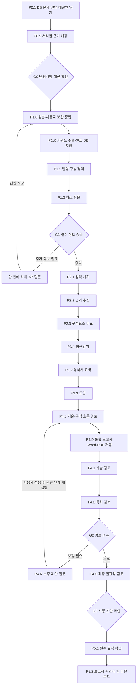

# Patent 작성 프로세스 v2

TRIZ와 같이 **단계 정의 → 프롬프트 레지스트리 → 체크포인트 실행 → MCP → n8n** 구조로 구성한다.
새 사건은 AUTOMATIC 모드로 생성한다. 기존 사건과 명시적 GUIDED 모드는 이전 중간 승인 방식으로 계속 실행할 수 있다.

결과는 **통합 보고서**다. 웹에서 본문·청구항·요약·도면을 읽고, 같은 저장 버전의 Word/PDF를 각각 다운로드한다. ZIP 묶음은 이전 API 호환용으로만 남아 있으며 기본 화면에서는 사용하지 않는다.

인용 불일치는 `evidence_clarification.py`가 원문·인용·분석 내용을 묶어 G1/G2 사용자 확인으로 전환한다. `evidence-resolutions`는 현재 확인 버전에 묶인 보완/미확인/제외 결정을 저장하고, 잘못된 인용을 사용자 제공 정보로 대체하거나 해당 분석을 제거한다. 같은 분석 모델을 다시 호출하지 않고 다음 작성 단계로 진행한다. 사용자 보완으로 독립 검토 PASS를 만들지 않으며, 미확인 문맥 검토는 후속 독립 검토·보정 대상으로 남는다. 후보, 기존 원문 버전, 사용자 결정과 보완 결과는 모두 이력에 보존한다.

## 파일별 책임

| 위치 | 책임 |
| --- | --- |
| `config/process.json` | P0~P5, Gate, Subprocess, 입출력, MCP 도구, 프롬프트 이름, 연결 조건 |
| `config/templates/kr_general.json` | 저장된 초안 서식, 문서별 항목, TRIZ DB 정보 매핑 경로 |
| `prompts/*.md` | 단계별 작성·질문·독립 검토 프롬프트 |
| `prompts_registry.py` | 프롬프트 파일 로딩, 역할별 검토 프롬프트 선택 |
| `authoring.py` | 수정 해결안·사실·키워드·문맥 검토의 typed schema, 인용과 연결 근거 검증 |
| `report.py` | 동일 보고서 모델에서 웹 본문·한글 Word·PDF·도면 생성 |
| `workflow.py` | 서식·프로세스·프롬프트 버전 고정, DB 문맥 매핑, 노드 상태 조회 |
| `pipeline.py` | 실행 순서, Gate 판단, 질문 대기, 검토 및 최종 확인 |
| `service.py` | 사건 변경, 예산, 작업 티켓 발급·실행, 버전 무효화 |
| `intake.py`, `legacy.py` | 변경분 확인 및 소유자 권한으로 기존 TRIZ DB 읽기 |
| `runtime.py` | DB 작업 큐 감시, n8n 전달 재시도, 로컬 실행 |
| `dispatch.py` | n8n → 저장된 티켓 조회 → MCP 실행 → 다음 노드 응답 |
| `mcp.py`, `api.py` | 인증된 MCP 및 웹/API 진입점 |
| `repository.py`, `domain.py` | 저장소 및 데이터 계약 |
| `forms.py`, `form_registry.py`, `assets/official/` | 출력 패키지와 기존 공식 참조 서식 |
| `rules.py`, `coverage.py`, `review_evidence.py`, `observations.py` | 규칙·범위·인용 근거 검증 |

공식 참조 서식과 초안 템플릿은 구분된다. 이 변경에서 법적 서식의 최신성 또는 공식 편집기 적합성을 새로 인증하지 않는다.

## 노드 흐름



Gate의 이름은 프로세스 노드 ID다. 이전 사건의 `G1`/`G2` 승인 레코드 이름과는 별개다.
AUTOMATIC에서는 작성 중에 승인을 생성하지 않는다. 마지막 G3에서 사용자가 현재 문서 해시를 확인한 뒤 발명정보·청구범위 승인 레코드를 함께 저장한다.
최종 확인 전에도 초안은 웹에 저장되며 편집할 수 있다. 편집 적용 시 관련 산출물·검토만 무효화하고 자동 재개한다.
검토 실패나 근거 부족을 자동으로 PASS 처리하지 않는다. 검토 보정안 적용, 부족한 사실, 최종 확인에서만 사용자 개입이 필요하다.

## 문서 작성 계약과 DB 문맥

### 단계별 구조화 분석 전달

1. `synthesized_solution`: 원본 해결안과 사용자 보완을 비교한다. 수정 해결안, 동작 원리, 변경 전후, `facts`(ID·분류·상태·근거 인용·판단 이유), 모순/미해결 이슈를 저장한다. 근거의 artifact·JSON pointer·정확한 excerpt를 검증한다. 작성에 필요한 모순이 미해결이면 키워드 추출 전에 사용자 질문으로 멈춘다.
2. `drafting_keywords`: 수정 해결안의 fact ID에서 용어·정의·동의어·추출 이유·사용 section ID를 도출한다. 정의되지 않은 fact ID나 section ID는 거부한다.
3. 후속 발명·검색·청구·명세·도면 단계는 노드에 선언된 구조화 입력만 전달받는다. `features.source_ids`는 수정 해결안 fact ID, `sections.source_ids`는 fact/keyword ID로 검증한다. 원본 전체를 모든 단계에 반복 전달하지 않는다.
4. `document_coherence`: 문제–해결, 작동–효과, 청구항 뒷받침, 용어 일관성, 문맥 흐름, 도면 정합성을 각각 PASS/FAIL/UNKNOWN으로 판단한다. 실패와 미확인은 보정 입력으로 전달되며 최종 Gate를 통과하지 못한다.
5. 보고서는 초안으로 저장되어 검토 이슈가 있어도 읽고 다운로드할 수 있다. 승인이나 검증 완료를 자동으로 표시하지 않는다.

프롬프트는 TRIZ처럼 역할·입력 변수·수행 규칙·출력 JSON 계약을 가진다. `{{변수}}`는 provider 입력 JSON의 필드에 연결되며, 사용자 원문을 system instruction에 삽입하지 않는다. 전체 프롬프트 레지스트리는 사건에 고정하지만, 매 호출에는 해당 노드의 프롬프트와 작은 `drafting_template`만 보낸다.

### 별도 키워드 DB 추적

`patent_draft_keywords` 테이블에 `(version_id, keyword_id)`별로 `case_id`, `term`, `category`, `source_version_id`, 정의·동의어·fact IDs·사용 항목·추출 이유를 저장한다. 키워드 artifact 저장과 같은 트랜잭션으로 기록한다.
원본/사용자 보완 변경 시 수정 해결안부터 키워드와 후속 문서를 재생성하며 이전 행을 삭제하지 않는다. API `GET /api/patent/cases/{case_id}/keywords`는 소유자에게만 현재/과거 버전과 부모 해결안 버전을 반환한다.
각 작업 티켓과 artifact에는 입력 버전 목록, 부모 버전, 노드 ID, 프롬프트 해시, 워크플로 해시가 남는다.

### 저장 보고서

`report` artifact에 고정 양식의 제목·출원인/발명자·본문·청구항·요약·도면과 원본 버전 목록, content hash를 저장한다. Word/PDF/도면 파일은 소유자 전용 asset으로 보관한다.
`GET /api/patent/cases/{case_id}/report/docx`와 `/report/pdf`는 이미 생성된 파일을 반환하며 모델을 재호출하지 않는다. `version_id`로 저장 보고서 버전을 지정할 수 있다.
한글 PDF는 TrueType 글꼴을 포함하며 CJK 줄바꿈을 사용한다([ReportLab 글꼴](https://docs.reportlab.com/reportlab/userguide/ch3_fonts/), [문단 설정](https://docs.reportlab.com/reportlab/userguide/ch6_paragraphs/)). Docker는 `fonts-nanum`을 설치한다. 다른 환경은 `PATENT_REPORT_FONT`에 한글 TTF 경로를 지정한다.

사건 생성 시 원본 해결안, 문제, 도메인, 제약조건, 시스템 확인, 분석, 문제 정의, 과거 질의응답, 첨부 추출 내용, 선택 해결안의 제약 검사를 소유자 권한으로 읽는다.
다른 아이디어·실행 내부 scratch·비용·세션 정보는 작성 문맥에 포함하지 않는다.
서식과 프롬프트, 프로세스 정의도 immutable artifact로 고정한다. 운영 중 파일 변경이 진행 중 사건의 작성 조건을 바꾸지 않는다.
`section_mapping`에 항목별 원본 경로와 값이 남으며, 변경분 답변이 원본보다 우선한다. 기존 제안은 측정 사실로 승격하지 않는다.
출원인 개인정보 등 알 수 없는 항목은 초안에서 미확인으로 유지하고 최종 검토에서 확인한다.

## n8n 및 MCP 실행

배포 전 추가 테이블 migration을 실행한다. 기존 TRIZ 테이블은 변경하지 않는다:

```powershell
$env:PYTHONPATH='pilot'
.venv/Scripts/python.exe pilot/scripts/patent_draft_migrate.py --apply
```

1. `config/runtime.env.example`을 참고하여 기존 모델·예산·접근 설정을 유지한다.
2. `PATENT_ORCHESTRATOR=n8n`, `PATENT_N8N_WEBHOOK_URL`, `PATENT_MCP_URL`, `PATENT_SERVICE_TOKEN`을 설정한다.
3. `PATENT_ENABLED`, `PATENT_DISPATCH_ENABLED`, `PATENT_WORKER_ENABLED`, `PATENT_MCP_ENABLED`를 실행 환경에 맞게 활성화한다.
4. `deploy/n8n/patent-workflow.json`을 가져온다. Webhook과 HTTP Request 노드들에 `Authorization: Bearer <PATENT_SERVICE_TOKEN>` Header Auth credential을 연결한다. n8n의 `TRIZ_API_URL`은 backend 주소다.
5. 테스트 후 워크플로를 활성화한다. 가져오기 파일은 기본 비활성 상태이며 비밀키를 포함하지 않는다.

각 Subprocess는 n8n에서도 별도 이름의 실행 노드로 나타난다. 노드 notes에 입출력·MCP 도구·단계별 프롬프트가 있다.
G0 이전 DB 조회·매핑은 사건 생성 트랜잭션에서 실행한다. n8n은 서버가 발급한 작업만 전달하며, 다음 노드 및 Gate 결정은 `pipeline.py`가 소유한다.
Switch 노드는 [n8n 공식 소스의 rules 구조](https://github.com/n8n-io/n8n/blob/master/packages/nodes-base/nodes/Switch/V3/SwitchV3.node.ts)를 따른다.
작업 티켓은 DB에서 재조회하므로 n8n이 프롬프트나 입력 버전을 임의로 바꾸지 않는다. 같은 티켓 재전송은 중복 과금을 발생시키지 않는다.
전달 실패는 큐에 남고 60초 임대 후 재전달한다. 이미 실행 중이거나 비용이 불명확한 모델 호출은 별도 상태로 관리한다.

프로세스나 프롬프트 변경 후 n8n 정의를 다시 생성한다:

```powershell
$env:PYTHONPATH='pilot'
.venv/Scripts/python.exe pilot/scripts/export_patent_workflow.py
```

로컬 테스트는 `PATENT_ORCHESTRATOR=local`로 동일한 티켓·Gate 엔진을 사용한다. n8n 실서비스 import/인증/MCP 연결 확인은 별도 배포 검증 항목이다.

DeepSeek V4 입력 한도는 `input_tokens.py`에서 공식 토크나이저로 전체 system/user 메시지(프롬프트·스키마·근거·검토 대상 포함)를 계산한다. V4/V4.1 계산 중 큰 값에 대화 형식 여유분을 더한다. 원문을 자르거나 요약하지 않으며, UTF-8 바이트 수를 토큰 수로 취급하지 않는다. 토크나이저는 `tokenizers/manifest.json`의 고정 버전·해시로 배포하고 실행 중 다운로드하지 않는다. 실제 과금은 공급자 usage를 사용하고 입력량 계산 내역은 provider receipt에 저장한다. 알 수 없는 모델은 보수적 byte bound를 유지한다. 검사 실패는 호출 전 중지하여 비용을 청구하지 않고 필수 검토 예산을 복구한다.
